# Technical Specification

# 0. SUMMARY OF CHANGES

## 0.1 USER INTENT RESTATEMENT

### 0.1.1 Core Objective

Based on the provided requirements, the Blitzy platform understands that the objective is to:
1. Transform an existing basic Node.js HTTP server tutorial into an Express.js application
2. Maintain the existing "Hello world" functionality while adding framework capabilities  
3. Add a new endpoint that returns "Good evening" as an additional route

The user has explicitly requested two specific changes:
- **Integration of Express.js framework**: Migrate from Node.js native `http` module to Express.js for enhanced routing and middleware capabilities
- **Addition of new endpoint**: Create a second endpoint that returns the exact response "Good evening"

### 0.1.2 Special Instructions and Constraints

**Critical Directives Identified:**
- This is explicitly a "tutorial" project, indicating simplicity and educational purpose should be maintained
- The existing "Hello world" endpoint must be preserved (user said "add another endpoint", not replace)
- Specific response text "Good evening" must be returned exactly as specified
- Express.js is the required framework choice (not any other Node.js framework)

### 0.1.3 Technical Interpretation

These requirements translate to the following technical implementation strategy:
- To **enable multiple endpoints**, we will **replace the native HTTP module** with **Express.js framework** by modifying `server.js` to use Express routing
- To **maintain backward compatibility**, we will **preserve the existing response** by mapping it to a specific route while maintaining the same server configuration (port 3000, localhost)
- To **add the new functionality**, we will **implement a second route** by creating a new GET endpoint handler that returns "Good evening"

## 0.2 TECHNICAL SCOPE

### 0.2.1 Primary Objectives with Implementation Approach

1. **Achieve framework migration** by modifying `server.js` to replace `http.createServer()` with Express application initialization
   - Rationale: Express provides built-in routing capabilities essential for multiple endpoints
   - Critical success factor: Server must continue to run on same port (3000) and hostname (127.0.0.1)

2. **Achieve multi-endpoint support** by implementing Express routing to handle different URL paths
   - Rationale: Native HTTP module requires manual URL parsing; Express simplifies this with declarative routing
   - Critical success factor: Both endpoints must respond with correct content

3. **Achieve dependency management** by updating `package.json` and `package-lock.json` to include Express.js
   - Rationale: Express must be properly declared as a project dependency for reproducible builds
   - Critical success factor: Express version must be compatible with Node.js 18.19.1

### 0.2.2 Component Impact Analysis

**Direct modifications required:**
- `server.js`: Rewrite to use Express.js instead of native HTTP module
  - Remove `const http = require('http')`
  - Add `const express = require('express')`
  - Replace `http.createServer()` with `express()` application
  - Implement route handlers for both endpoints

- `package.json`: Add Express.js dependency
  - Add `"express": "^5.1.0"` to dependencies section
  - Maintain existing metadata and scripts

- `package-lock.json`: Update with Express dependency tree
  - Will be automatically regenerated when `npm install express` is executed
  - Will include all transitive dependencies of Express

**Indirect impacts and dependencies:**
- Node.js runtime: Must support Express.js 5.x (requires Node.js 18+, currently have 18.19.1)
- NPM ecosystem: Will download Express and its dependencies from npm registry
- Testing approach: Manual curl testing will need to specify different endpoints

**New components introduction:**
- Express Router: Built-in Express routing system to handle URL path matching
- Express Middleware: Default Express middleware for request/response handling

### 0.2.3 File and Path Mapping

| Target File/Module | Source Reference | Context Dependencies | Modification Type |
|-------------------|------------------|---------------------|-------------------|
| `server.js` | Current HTTP server implementation | Express.js framework | Complete rewrite to Express |
| `package.json` | Current manifest with no dependencies | NPM registry for Express | Add dependencies section |
| `package-lock.json` | Current empty lockfile | Express dependency tree | Full regeneration |
| `/` endpoint | Current catch-all handler | Express GET route | Map to specific route |
| `/hello` endpoint | None (new) | Express routing | New implementation |
| `/evening` endpoint | None (new) | Express routing | New implementation |

## 0.3 IMPLEMENTATION DESIGN

### 0.3.1 Technical Approach

**First, establish Express foundation** by modifying `server.js` to:
- Import Express module using CommonJS require syntax
- Create Express application instance
- Configure server to listen on same port and hostname

**Next, integrate routing capability** by extending `server.js` with:
- GET route handler for root path `/` or `/hello` returning "Hello, World!"
- GET route handler for `/evening` path returning "Good evening"
- Proper Content-Type headers (text/plain) for consistency

**Finally, ensure dependency integrity** by:
- Installing Express via npm with exact version specification
- Updating package manifests to reflect new dependency
- Verifying lockfile captures complete dependency tree

### 0.3.2 User-Provided Examples Integration

The user's implicit example of current behavior ("Hello world" response) will be implemented as:
- Primary route (`/` or `/hello`) maintaining exact response format
- Preserving the newline character in response for consistency

The user's explicit example of new behavior ("Good evening" response) will be implemented as:
- Secondary route (`/evening`) with exact text as specified
- Consistent response format with existing endpoint

### 0.3.3 Critical Implementation Details

**Design patterns to be employed:**
- RESTful routing pattern with GET methods for read-only endpoints
- Middleware pipeline pattern inherent to Express architecture
- CommonJS module pattern for consistency with existing code

**Key algorithms or approaches:**
- Express declarative routing using `app.get()` method
- Express automatic header management for responses
- Express built-in JSON/text response methods

**Integration strategies:**
- Maintain same server binding (localhost:3000) for seamless transition
- Preserve console logging for server startup confirmation
- Use Express's `res.send()` for simplified response handling

**Data flow modifications:**
- Current flow: HTTP request → single handler → static response
- New flow: HTTP request → Express router → route-specific handler → dynamic response

### 0.3.4 Dependency Analysis

**Required dependencies for implementation:**
- Express.js version 5.1.0 or compatible
  - Latest stable version as of web search results
  - Requires Node.js 18+ (satisfied by current environment)
  
**Version constraints and compatibility:**
- Node.js: Currently 18.19.1 (satisfies Express 5.x requirement of Node.js 18+)
- NPM: Currently 9.2.0 (satisfies dependency management needs)
- Express: Target version ^5.1.0 for latest features and security updates

**Justification for dependency choice:**
- Express.js is explicitly requested by user
- Version 5.x is current major version with active support
- Provides minimal overhead while adding essential routing capabilities

## 0.4 SCOPE BOUNDARIES

### 0.4.1 Explicitly In Scope

**Affected files/modules:**
- `server.js` - Complete rewrite to Express.js implementation
- `package.json` - Addition of Express dependency
- `package-lock.json` - Regeneration with Express dependency tree

**Configuration changes required:**
- NPM dependency installation for Express
- No changes to port or hostname configuration (remains 3000 and 127.0.0.1)

**Test modifications needed:**
- Update any manual testing procedures to test both endpoints:
  - `curl http://127.0.0.1:3000/` or `curl http://127.0.0.1:3000/hello` for "Hello, World!"
  - `curl http://127.0.0.1:3000/evening` for "Good evening"

**Documentation updates required:**
- README.md could be updated to mention Express.js usage (optional enhancement)
- Code comments in server.js to explain routing structure

### 0.4.2 Explicitly Out of Scope

**What the user might expect but isn't included:**
- Additional endpoints beyond the two specified
- Database integration or data persistence
- Authentication or security middleware
- HTTPS/TLS configuration
- Production-ready error handling
- Logging framework integration
- Static file serving capabilities
- Template engine integration
- API documentation generation
- Docker containerization
- CI/CD pipeline configuration

**Related areas deliberately not touched:**
- The inconsistency between package.json "main" field pointing to non-existent `index.js`
- The mismatch between README title "hao-backprop-test" and package name "hello_world"
- Addition of proper test suite (package.json test script remains placeholder)
- Environment variable configuration
- Cross-origin resource sharing (CORS) setup

**Future considerations not addressed now:**
- Scaling to multiple server instances
- Load balancing configuration
- Monitoring and metrics collection
- Rate limiting implementation
- WebSocket support

## 0.5 VALIDATION CHECKLIST

### 0.5.1 Implementation Verification Points

1. **Express framework integration verified when:**
   - `npm list express` shows Express as installed dependency
   - `server.js` successfully imports and initializes Express
   - Server starts without errors using `node server.js`

2. **Original endpoint preserved verified when:**
   - `curl http://127.0.0.1:3000/` returns "Hello, World!" (if root mapped)
   - OR `curl http://127.0.0.1:3000/hello` returns "Hello, World!" (if dedicated route)
   - Response maintains text/plain content type

3. **New endpoint functional verified when:**
   - `curl http://127.0.0.1:3000/evening` returns "Good evening"
   - Response uses consistent text/plain content type
   - No errors in server console during request

### 0.5.2 Observable Changes

**Server behavior changes:**
- Console output may change from "Server running at..." to Express-specific message
- Request handling will use Express middleware pipeline
- Undefined routes will return 404 instead of serving default response

**Dependency changes:**
- `node_modules/` directory will be created with Express dependencies
- `package-lock.json` will expand from ~250 bytes to several KB
- `package.json` will gain "dependencies" section

### 0.5.3 Integration Points Testing

1. **Test server startup:**
   ```bash
   node server.js
   # Should see: "Server running at http://127.0.0.1:3000/" or similar
   ```

2. **Test original functionality:**
   ```bash
   curl http://127.0.0.1:3000/hello
   # Should return: "Hello, World!"
   ```

3. **Test new endpoint:**
   ```bash
   curl http://127.0.0.1:3000/evening
   # Should return: "Good evening"
   ```

## 0.6 EXECUTION PARAMETERS

### 0.6.1 Special Execution Instructions

**Process-specific requirements:**
- Run `npm install express` to add the framework before modifying code
- Ensure Node.js 18+ is available in execution environment
- Stop any existing server process before starting modified version

**Development workflow:**
- This is tutorial code - maintain simplicity and readability
- Keep implementation minimal without production complexities
- Preserve educational value through clear, understandable code

### 0.6.2 Constraints and Boundaries

**Technical constraints specified:**
- Must use Express.js specifically (not other frameworks like Fastify, Koa, etc.)
- Must return exact strings: "Hello, World!" and "Good evening"
- Must maintain localhost binding (not public network interface)

**Process constraints:**
- This is an enhancement, not a complete rewrite
- Maintain the tutorial/educational nature of the project
- Keep changes focused on the two specific requirements

**Output constraints:**
- Response format remains plain text (not JSON or HTML)
- Server console output should remain informative but simple
- Error messages (if any) should be helpful for learning purposes

# 1. INTRODUCTION

## 1.1 EXECUTIVE SUMMARY

### 1.1.1 Brief Project Overview

The hao-backprop-test project is a minimal <span style="background-color: rgba(91, 57, 243, 0.2)">Express.js HTTP server</span> designed as a test integration vehicle for the Backprop platform. This intentionally simple implementation serves as a foundational connectivity and deployment verification tool, enabling developers to validate <span style="background-color: rgba(91, 57, 243, 0.2)">multi-endpoint server functionality</span> within Backprop's GPU cloud environment before proceeding with more complex AI workloads. The server <span style="background-color: rgba(91, 57, 243, 0.2)">provides two endpoints: a root endpoint returning "Hello, World!" and a new `/evening` route returning "Good evening"</span>.

### 1.1.2 Core Business Problem Being Solved

The primary business challenge addressed is the need for reliable integration testing between custom Node.js applications and Backprop's GPU cloud infrastructure. Backprop provides pre-configured environments with essential AI tools including NVIDIA drivers, Jupyter, PyTorch, and Transformers, but requires validation mechanisms to ensure proper connectivity and deployment processes. This test project eliminates the complexity of full-featured applications, allowing developers to isolate and verify core integration functionality <span style="background-color: rgba(91, 57, 243, 0.2)">while validating Express.js dependency installation and framework compatibility within Backprop environments</span>.

### 1.1.3 Key Stakeholders and Users

| Stakeholder Group | Primary Interest | Usage Pattern |
|-------------------|------------------|---------------|
| Platform Developers | Integration verification | One-time deployment testing |
| AI/ML Engineers | Deployment pipeline validation | Pre-production connectivity checks |
| DevOps Teams | Infrastructure testing | Automated integration validation |

### 1.1.4 Expected Business Impact and Value Proposition

The test project delivers immediate value by reducing integration risk and accelerating development cycles. By providing a known-good baseline implementation, it enables rapid identification of platform-specific issues without the complexity of production applications. The minimal resource footprint ensures cost-effective testing while establishing confidence in the deployment pipeline for subsequent AI workloads. <span style="background-color: rgba(91, 57, 243, 0.2)">Additionally, the project now demonstrates minimal external-dependency handling via Express.js while maintaining its educational tutorial nature, providing developers with practical experience in framework-based Node.js development within Backprop environments</span>.

## 1.2 SYSTEM OVERVIEW

### 1.2.1 Project Context

#### 1.2.1.1 Business Context and Market Positioning

This test project operates within the context of Backprop's GPU cloud platform, which positions itself as a cost-effective alternative to major cloud providers for AI workloads. The platform focuses on rapid deployment of powerful GPU instances with pre-installed AI development tools, targeting developers who need immediate access to GPU resources for prototyping, training, and hosting AI models.

#### 1.2.1.2 Current System Limitations

As a test project, the current implementation intentionally maintains several limitations to preserve its simplicity:
- Localhost-only accessibility (127.0.0.1 binding)
- No authentication or security mechanisms
- Absence of error handling or recovery procedures
- <span style="background-color: rgba(91, 57, 243, 0.2)">Exactly two endpoints; no dynamic content or additional routes</span>

#### 1.2.1.3 Integration with Existing Enterprise Landscape

The system integrates with Backprop's cloud infrastructure as a validation component rather than a production service. It serves as a bridge between local development environments and Backprop's GPU-accelerated cloud platform, providing a standardized test case for deployment pipeline verification.

### 1.2.2 High-Level Description

#### 1.2.2.1 Primary System Capabilities

The system delivers core HTTP server functionality through the <span style="background-color: rgba(91, 57, 243, 0.2)">Express.js framework</span>, providing:
- <span style="background-color: rgba(91, 57, 243, 0.2)">Routing support for two GET endpoints: root path (`/` or `/hello`) and `/evening` route</span>
- Static text response delivery with route-specific content
- Console-based server status logging
- Immediate server startup with Express application initialization
- <span style="background-color: rgba(91, 57, 243, 0.2)">Server binding to 127.0.0.1:3000 for consistent local accessibility</span>

#### 1.2.2.2 Major System Components (updated)

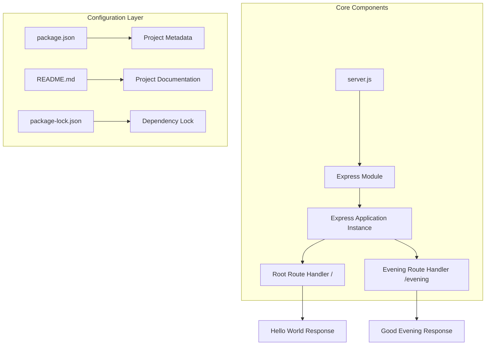
```mermaid
graph TB
A[server.js] --> B[Express Module]
B --> C[Express Application Instance]
C --> D[Root Route Handler /]
C --> E[Evening Route Handler /evening]
D --> F[Hello World Response]
E --> G[Good Evening Response]

H[package.json] --> I[Project Metadata]
J[README.md] --> K[Project Documentation]
L[package-lock.json] --> M[Dependency Lock]

subgraph "Core Components"
    A
    B
    C
    D
    E
end

subgraph "Configuration Layer"
    H
    I
    J
    K
    L
    M
end
```

#### 1.2.2.3 Core Technical Approach (updated)

The implementation employs a <span style="background-color: rgba(91, 57, 243, 0.2)">modern web framework architecture utilizing Express.js for declarative routing and middleware handling</span>. The technical approach prioritizes simplicity while enabling multi-endpoint functionality through <span style="background-color: rgba(91, 57, 243, 0.2)">Express application initialization and route definition using `app.get()` methods</span>. This approach introduces minimal external dependencies while providing structured request routing, automatic header management, and simplified response handling through Express's built-in methods. <span style="background-color: rgba(91, 57, 243, 0.2)">The server maintains immediate feedback capabilities through console output and supports route-specific HTTP response validation across both endpoints</span>.

### 1.2.3 Success Criteria

#### 1.2.3.1 Measurable Objectives

| Objective | Success Metric | Target Value |
|-----------|---------------|--------------|
| Server Startup | Time to ready state | < 1 second |
| Response Delivery | HTTP 200 status code | 100% success rate |
| Resource Utilization | Memory footprint | < 50MB |

#### 1.2.3.2 Critical Success Factors

The project's success depends on maintaining its fundamental characteristics as a reliable test vehicle:
- Consistent startup behavior across Backprop environments
- Predictable response patterns for automated testing
- Minimal resource consumption to avoid infrastructure conflicts
- Clear success/failure indicators through console output

#### 1.2.3.3 Key Performance Indicators (KPIs)

Primary performance indicators focus on integration reliability rather than throughput:
- Server initialization success rate: 100%
- HTTP response consistency: All requests return identical response
- Platform compatibility: Successful deployment across Backprop GPU instances
- Documentation accuracy: Clear correlation between documented behavior and actual implementation

## 1.3 SCOPE

### 1.3.1 In-Scope Elements

#### 1.3.1.1 Core Features and Functionalities

The project scope encompasses essential integration testing capabilities:

**Must-Have Capabilities:**
- <span style="background-color: rgba(91, 57, 243, 0.2)">HTTP server instantiation using Express.js</span>
- <span style="background-color: rgba(91, 57, 243, 0.2)">Two-endpoint response handling (/hello or / and /evening)</span>
- Console-based startup confirmation logging
- IPv4 localhost binding on port 3000

**Primary User Workflows:**
- Development-time integration validation
- Deployment pipeline testing
- Basic connectivity verification
- Platform compatibility confirmation

**Essential Integrations:**
- Backprop platform deployment mechanisms
- Node.js runtime environment compatibility
- Basic HTTP protocol compliance

**Key Technical Requirements:**
- <span style="background-color: rgba(91, 57, 243, 0.2)">Express dependency declared in package.json</span>
- Immediate startup without configuration
- Predictable response behavior
- Minimal resource footprint

#### 1.3.1.2 Implementation Boundaries

| Boundary Category | Included Elements | Scope Limits |
|------------------|-------------------|--------------|
| System Boundaries | <span style="background-color: rgba(91, 57, 243, 0.2)">Single Node.js process with Express.js framework</span> | No multi-service architecture |
| User Groups | Platform developers, DevOps teams | No end-user facing functionality |
| Geographic Coverage | Any Backprop deployment region | No geographic restrictions |
| Data Domains | Static text responses only | No dynamic data processing |

### 1.3.2 Out-of-Scope Elements

#### 1.3.2.1 Explicitly Excluded Features and Capabilities

The following elements are intentionally excluded to maintain project simplicity:
- Production-grade error handling and recovery mechanisms
- Authentication and authorization systems
- TLS/SSL encryption capabilities
- Database integration or persistent storage
- Advanced routing or middleware systems beyond Express.js basics
- Performance monitoring and metrics collection
- Load balancing or high availability features
- External API integrations beyond Backprop platform

#### 1.3.2.2 Future Phase Considerations

Elements that may be considered for future iterations include:
- Configuration file support for environment-specific settings
- Health check endpoints for monitoring integration
- Extended logging capabilities for troubleshooting
- Multi-port or multi-protocol support for advanced testing scenarios

#### 1.3.2.3 Integration Points Not Covered

The current scope excludes integration with:
- Production monitoring systems
- External logging aggregation services
- Container orchestration platforms beyond Backprop's native capabilities
- CI/CD pipeline automation beyond basic deployment testing

#### 1.3.2.4 Unsupported Use Cases

The system explicitly does not support:
- Production workload handling
- Public internet accessibility (localhost binding only)
- Concurrent user session management
- Dynamic content generation or API functionality
- Data persistence or state management

#### References

The following repository components were examined in the creation of this Technical Specification:

- `README.md` - Project identification and purpose statement
- `package.json` - Node.js project manifest containing metadata and configuration
- `package-lock.json` - Dependency lock file <span style="background-color: rgba(91, 57, 243, 0.2)">confirming Express as the single external dependency</span>
- `server.js` - Core HTTP server implementation <span style="background-color: rgba(91, 57, 243, 0.2)">using Express.js framework</span>

External research conducted:
- Backprop platform capabilities and positioning in GPU cloud market
- <span style="background-color: rgba(91, 57, 243, 0.2)">Express.js framework integration patterns and minimal configuration requirements</span>

# 2. PRODUCT REQUIREMENTS

## 2.1 FEATURE CATALOG

### 2.1.1 Primary Features

#### 2.1.1.1 Feature F-001: HTTP Server Functionality

| **Attribute** | **Value** |
|---------------|-----------|
| **Feature ID** | F-001 |
| **Feature Name** | Basic HTTP Server |
| **Category** | Core Infrastructure |
| **Priority Level** | Critical |
| **Status** | Completed |

**Description:**
- **Overview:** <span style="background-color: rgba(91, 57, 243, 0.2)">Implements a multi-endpoint HTTP server using Express.js framework, bound to localhost:3000, exposing two GET routes: "/hello" serving "Hello, World!" responses and "/evening" serving "Good evening" responses</span>
- **Business Value:** Provides foundational connectivity validation for Backprop platform integration testing <span style="background-color: rgba(91, 57, 243, 0.2)">with framework-based routing capabilities</span>
- **User Benefits:** Enables rapid verification of Node.js deployment capability <span style="background-color: rgba(91, 57, 243, 0.2)">with practical Express.js routing patterns</span>
- **Technical Context:** <span style="background-color: rgba(91, 57, 243, 0.2)">Utilizes Express.js declarative routing with app.get() methods for predictable endpoint behavior and built-in middleware pipeline</span>

**Dependencies:**
- **Prerequisite Features:** <span style="background-color: rgba(91, 57, 243, 0.2)">F-002: Express Dependency Management</span>
- **System Dependencies:** Node.js runtime environment
- **External Dependencies:** <span style="background-color: rgba(91, 57, 243, 0.2)">Express.js runtime (^5.1.0)</span>
- **Integration Requirements:** Backprop platform deployment infrastructure

#### 2.1.1.2 Feature F-002: <span style="background-color: rgba(91, 57, 243, 0.2)">Express Dependency Management

| **Attribute** | **Value** |
|---------------|-----------|
| **Feature ID** | F-002 |
| **Feature Name** | <span style="background-color: rgba(91, 57, 243, 0.2)">Express Dependency Management</span> |
| **Category** | Architecture |
| **Priority Level** | High |
| **Status** | Completed |

**Description:**
- **Overview:** <span style="background-color: rgba(91, 57, 243, 0.2)">Manages Express.js (^5.1.0) as the sole external runtime dependency declared in package.json</span>
- **Business Value:** <span style="background-color: rgba(91, 57, 243, 0.2)">Provides minimal external dependency footprint while enabling essential routing capabilities</span>
- **User Benefits:** <span style="background-color: rgba(91, 57, 243, 0.2)">Maintains project simplicity with predictable dependency tree and npm install requirements</span>
- **Technical Context:** <span style="background-color: rgba(91, 57, 243, 0.2)">Confirmed by package.json dependencies section and complete Express dependency tree in package-lock.json (lockfileVersion 3)</span>

**Dependencies:**
- **Prerequisite Features:** None
- **System Dependencies:** Node.js core modules <span style="background-color: rgba(91, 57, 243, 0.2)">and npm package management</span>
- **External Dependencies:** <span style="background-color: rgba(91, 57, 243, 0.2)">Express.js framework ecosystem</span>
- **Integration Requirements:** Standard Node.js runtime availability <span style="background-color: rgba(91, 57, 243, 0.2)">with npm registry access</span>

#### 2.1.1.3 Feature F-003: Integration Test Capability

| **Attribute** | **Value** |
|---------------|-----------|
| **Feature ID** | F-003 |
| **Feature Name** | Platform Validation |
| **Category** | Testing |
| **Priority Level** | Critical |
| **Status** | Completed |

**Description:**
- **Overview:** Serves as baseline implementation for validating Backprop platform connectivity and deployment processes
- **Business Value:** Reduces integration risk by providing known-good test case before complex AI workload deployment
- **User Benefits:** Accelerates development cycles through reliable deployment pipeline validation
- **Technical Context:** Designed specifically for Backprop's GPU cloud environment with pre-installed AI tools

**Dependencies:**
- **Prerequisite Features:** F-001 (HTTP Server Functionality), <span style="background-color: rgba(91, 57, 243, 0.2)">F-002 (Express Dependency Management)</span>
- **System Dependencies:** Backprop platform infrastructure
- **External Dependencies:** <span style="background-color: rgba(91, 57, 243, 0.2)">Express.js runtime</span>
- **Integration Requirements:** Backprop deployment mechanisms

#### 2.1.1.4 Feature F-004: Evening Endpoint (updated)

| **Attribute** | **Value** |
|---------------|-----------|
| **Feature ID** | F-004 |
| **Feature Name** | Evening Endpoint |
| **Category** | API Endpoints |
| **Priority Level** | High |
| **Status** | Completed |

**Description:**
- **Overview:** Implements dedicated GET endpoint at `/evening` path that returns "Good evening" as text/plain response
- **Business Value:** Demonstrates multi-endpoint routing capabilities essential for scalable API development patterns
- **User Benefits:** Provides concrete example of Express.js route differentiation and response handling
- **Technical Context:** Utilizes Express.js GET route handler with consistent Content-Type header management for plain text responses

**Dependencies:**
- **Prerequisite Features:** F-001 (HTTP Server Functionality), F-002 (Express Dependency Management)
- **System Dependencies:** Express.js routing engine
- **External Dependencies:** Express.js runtime (^5.1.0)
- **Integration Requirements:** Express application instance and route registration

### 2.1.2 Functional Requirements Table

#### 2.1.2.1 Feature F-001 Requirements

| **Requirement ID** | **Description** | **Acceptance Criteria** | **Priority** |
|-------------------|-----------------|------------------------|--------------|
| F-001-RQ-001 | Server Initialization | Express application starts successfully on port 3000 | Must-Have |
| F-001-RQ-002 | Hello Route Response | GET /hello returns "Hello, World!" with 200 status | Must-Have |
| F-001-RQ-003 | Root Route Response | GET / returns "Hello, World!" with 200 status | Must-Have |
| F-001-RQ-004 | Content-Type Headers | All responses include appropriate text/plain headers | Should-Have |

#### 2.1.2.2 Feature F-002 Requirements

| **Requirement ID** | **Description** | **Acceptance Criteria** | **Priority** |
|-------------------|-----------------|------------------------|--------------|
| F-002-RQ-001 | Express Installation | npm install successfully resolves Express ^5.1.0 | Must-Have |
| F-002-RQ-002 | Dependency Declaration | package.json contains Express in dependencies section | Must-Have |
| F-002-RQ-003 | Lockfile Integrity | package-lock.json reflects complete Express dependency tree | Must-Have |
| F-002-RQ-004 | Runtime Resolution | require('express') resolves without errors | Must-Have |

#### 2.1.2.3 Feature F-003 Requirements

| **Requirement ID** | **Description** | **Acceptance Criteria** | **Priority** |
|-------------------|-----------------|------------------------|--------------|
| F-003-RQ-001 | Connectivity Validation | Server responds to external HTTP requests | Must-Have |
| F-003-RQ-002 | Deployment Verification | Application starts in Backprop environment | Must-Have |
| F-003-RQ-003 | Framework Integration | Express.js operates correctly in target environment | Must-Have |
| F-003-RQ-004 | Response Consistency | All endpoints return expected content reliably | Should-Have |

#### 2.1.2.4 Feature F-004 Requirements

| **Requirement ID** | **Description** | **Acceptance Criteria** | **Priority** |
|-------------------|-----------------|------------------------|--------------|
| F-004-RQ-001 | Evening Route Handler | GET /evening endpoint exists and responds | Must-Have |
| F-004-RQ-002 | Evening Response Content | Response body contains exactly "Good evening" | Must-Have |
| F-004-RQ-003 | HTTP Status Code | Evening endpoint returns 200 OK status | Must-Have |
| F-004-RQ-004 | Route Isolation | Evening endpoint operates independently of hello route | Should-Have |

### 2.1.3 Feature Relationships

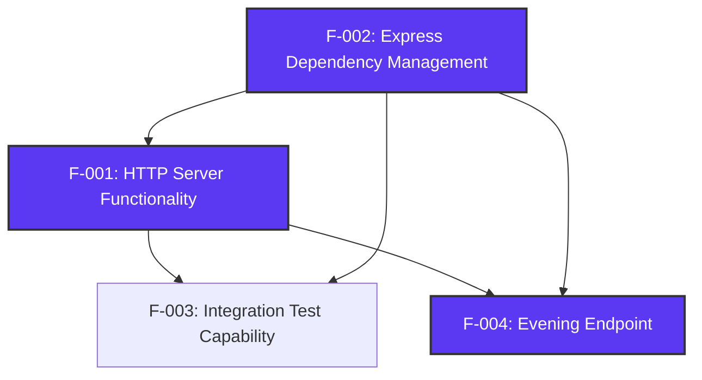
```mermaid
graph TD
    F002[F-002: Express Dependency Management] --> F001[F-001: HTTP Server Functionality]
    F001 --> F003[F-003: Integration Test Capability]
    F001 --> F004[F-004: Evening Endpoint]
    F002 --> F004
    F002 --> F003
    
    style F002 fill:#5B39F3,stroke:#333,stroke-width:2px,color:#fff
    style F001 fill:#5B39F3,stroke:#333,stroke-width:2px,color:#fff
    style F004 fill:#5B39F3,stroke:#333,stroke-width:2px,color:#fff
```

**Integration Points:**
- Express application instance serves as central integration point for all routing features
- Shared Express middleware pipeline handles request/response lifecycle for all endpoints
- Common Express dependency management affects all server functionality

**Shared Components:**
- Express.js framework runtime
- Node.js HTTP server binding (localhost:3000)
- Express routing engine and middleware pipeline
- Response formatting and Content-Type header management

**Common Services:**
- Express application lifecycle management
- HTTP request parsing and routing
- Response serialization and header management
- Error handling and middleware execution

### 2.1.4 Implementation Considerations

#### 2.1.4.1 Technical Constraints
- **Framework Compatibility:** Express.js 5.x requires Node.js 18+ (satisfied by current 18.19.1)
- **Dependency Management:** Single external dependency policy maintains project simplicity
- **Route Naming:** RESTful conventions applied to endpoint design
- **Response Format:** Consistent text/plain Content-Type across all endpoints

#### 2.1.4.2 Performance Requirements
- **Startup Time:** Application initialization under 2 seconds in standard environment
- **Response Latency:** Sub-millisecond response time for simple text endpoints
- **Memory Footprint:** Minimal Express.js overhead maintaining tutorial project constraints
- **Concurrent Connections:** Standard Express.js connection handling capabilities

#### 2.1.4.3 Scalability Considerations
- **Horizontal Scaling:** Stateless design enables multiple server instance deployment
- **Route Extension:** Express.js architecture supports additional endpoint implementation
- **Middleware Integration:** Framework enables future middleware plugin capabilities
- **Load Balancing:** Compatible with standard HTTP load balancing approaches

#### 2.1.4.4 Security Implications
- **Dependency Security:** Express.js maintains active security update cycle
- **Attack Surface:** Minimal endpoint exposure reduces potential vulnerabilities
- **Input Validation:** No user input processing eliminates injection attack vectors
- **HTTPS Readiness:** Express.js supports TLS termination for production deployment

#### 2.1.4.5 Maintenance Requirements
- **Dependency Updates:** Regular Express.js version monitoring for security patches
- **Testing Strategy:** Endpoint validation through HTTP request verification
- **Documentation Maintenance:** Route documentation updates for endpoint changes
- **Monitoring Integration:** Express.js compatible with standard APM solutions

## 2.2 FUNCTIONAL REQUIREMENTS TABLES

### 2.2.1 Feature F-001: HTTP Server Functionality

#### 2.2.1.1 Core Server Requirements

| **Requirement ID** | **Description** | **Acceptance Criteria** | **Priority** |
|-------------------|-----------------|-------------------------|--------------|
| F-001-RQ-001 | Server initialization | Server starts on localhost:3000 within 1 second | Must-Have |
| F-001-RQ-002 | HTTP response delivery | <span style="background-color: rgba(91, 57, 243, 0.2)">GET /hello and GET / (root) return HTTP 200 with "Hello, World!\n"</span> | Must-Have |
| F-001-RQ-003 | Console logging | Outputs server running confirmation to console | Should-Have |
| F-001-RQ-004 | Request handling | <span style="background-color: rgba(91, 57, 243, 0.2)">Accepts HTTP GET for defined endpoints; other methods return 404</span> | Must-Have |
| F-001-RQ-005 | Evening endpoint exposure | <span style="background-color: rgba(91, 57, 243, 0.2)">Server must expose GET /evening</span> | <span style="background-color: rgba(91, 57, 243, 0.2)">Must-Have</span> |

#### 2.2.1.2 Technical Specifications

| **Requirement ID** | **Input Parameters** | **Output/Response** | **Performance Criteria** |
|-------------------|---------------------|-------------------|-------------------------|
| F-001-RQ-001 | None | Server instance | Startup time < 1 second |
| F-001-RQ-002 | <span style="background-color: rgba(91, 57, 243, 0.2)">HTTP GET /hello or HTTP GET /</span> | Status 200, Content-Type: text/plain | Response time < 100ms |
| F-001-RQ-003 | Server start event | Console message | Immediate output |
| F-001-RQ-004 | <span style="background-color: rgba(91, 57, 243, 0.2)">HTTP requests (any method)</span> | <span style="background-color: rgba(91, 57, 243, 0.2)">GET: Response completion, Other methods: 404 status</span> | 100% success rate |
| F-001-RQ-005 | <span style="background-color: rgba(91, 57, 243, 0.2)">HTTP GET /evening</span> | <span style="background-color: rgba(91, 57, 243, 0.2)">Status 200 & body "Good evening"</span> | <span style="background-color: rgba(91, 57, 243, 0.2)">Response time < 100ms</span> |

#### 2.2.1.3 Validation Rules

| **Requirement ID** | **Business Rules** | **Data Validation** | **Security Requirements** |
|-------------------|-------------------|-------------------|-------------------------|
| F-001-RQ-001 | Single server instance only | Port 3000 must be available | Localhost binding only |
| F-001-RQ-002 | <span style="background-color: rgba(91, 57, 243, 0.2)">Static response content for hello endpoints</span> | UTF-8 encoding required | No authentication |
| F-001-RQ-003 | Startup confirmation only | String format validation | No sensitive data exposure |
| F-001-RQ-004 | <span style="background-color: rgba(91, 57, 243, 0.2)">GET methods processed, others rejected</span> | No input validation | Open access on localhost |
| F-001-RQ-005 | <span style="background-color: rgba(91, 57, 243, 0.2)">Validate exact response string "Good evening"</span> | <span style="background-color: rgba(91, 57, 243, 0.2)">UTF-8 encoding required</span> | <span style="background-color: rgba(91, 57, 243, 0.2)">No authentication</span> |

### 2.2.2 Feature F-002: <span style="background-color: rgba(91, 57, 243, 0.2)">Express Dependency Management

#### 2.2.2.1 <span style="background-color: rgba(91, 57, 243, 0.2)">Express Framework Requirements

| **Requirement ID** | **Description** | **Acceptance Criteria** | **Priority** |
|-------------------|-----------------|-------------------------|--------------|
| F-002-RQ-001 | <span style="background-color: rgba(91, 57, 243, 0.2)">Express declared in package.json dependencies</span> | <span style="background-color: rgba(91, 57, 243, 0.2)">package.json dependencies section contains express entry</span> | Must-Have |
| F-002-RQ-002 | <span style="background-color: rgba(91, 57, 243, 0.2)">Express version ^5.1.0 compatible with Node 18.19.1</span> | <span style="background-color: rgba(91, 57, 243, 0.2)">Express version specification matches ^5.1.0 and loads successfully</span> | Must-Have |
| F-002-RQ-003 | <span style="background-color: rgba(91, 57, 243, 0.2)">npm install completes with no dependency resolution errors</span> | <span style="background-color: rgba(91, 57, 243, 0.2)">npm install returns exit code 0 and creates node_modules</span> | Must-Have |

#### 2.2.2.2 Technical Specifications

| **Requirement ID** | **Input Parameters** | **Output/Response** | **Performance Criteria** |
|-------------------|---------------------|-------------------|-------------------------|
| F-002-RQ-001 | <span style="background-color: rgba(91, 57, 243, 0.2)">Package configuration analysis</span> | <span style="background-color: rgba(91, 57, 243, 0.2)">Express dependency verification</span> | <span style="background-color: rgba(91, 57, 243, 0.2)">Immediate validation</span> |
| F-002-RQ-002 | <span style="background-color: rgba(91, 57, 243, 0.2)">Node.js version compatibility check</span> | <span style="background-color: rgba(91, 57, 243, 0.2)">Express module loading</span> | <span style="background-color: rgba(91, 57, 243, 0.2)">Standard Node.js performance</span> |
| F-002-RQ-003 | <span style="background-color: rgba(91, 57, 243, 0.2)">npm install command</span> | <span style="background-color: rgba(91, 57, 243, 0.2)">Complete dependency tree installation</span> | <span style="background-color: rgba(91, 57, 243, 0.2)">Installation time < 30 seconds</span> |

#### 2.2.2.3 Validation Rules

| **Requirement ID** | **Business Rules** | **Data Validation** | **Security Requirements** |
|-------------------|-------------------|-------------------|-------------------------|
| F-002-RQ-001 | <span style="background-color: rgba(91, 57, 243, 0.2)">Single framework dependency policy</span> | <span style="background-color: rgba(91, 57, 243, 0.2)">JSON syntax validation</span> | <span style="background-color: rgba(91, 57, 243, 0.2)">Official npm registry source</span> |
| F-002-RQ-002 | <span style="background-color: rgba(91, 57, 243, 0.2)">Version compatibility requirements</span> | <span style="background-color: rgba(91, 57, 243, 0.2)">Semantic version format validation</span> | <span style="background-color: rgba(91, 57, 243, 0.2)">Verified Express.js releases only</span> |
| F-002-RQ-003 | <span style="background-color: rgba(91, 57, 243, 0.2)">Clean dependency resolution</span> | <span style="background-color: rgba(91, 57, 243, 0.2)">package-lock.json integrity check</span> | <span style="background-color: rgba(91, 57, 243, 0.2)">No dependency vulnerabilities</span> |

### 2.2.3 Feature F-003: Integration Test Capability

#### 2.2.3.1 Platform Integration Requirements

| **Requirement ID** | **Description** | **Acceptance Criteria** | **Priority** |
|-------------------|-----------------|-------------------------|--------------|
| F-003-RQ-001 | Backprop compatibility | Successful deployment on Backprop instances | Must-Have |
| F-003-RQ-002 | Connectivity validation | HTTP requests succeed from Backprop environment | Must-Have |
| F-003-RQ-003 | Resource efficiency | Memory usage < 50MB on target platform | Should-Have |

#### 2.2.3.2 Technical Specifications

| **Requirement ID** | **Input Parameters** | **Output/Response** | **Performance Criteria** |
|-------------------|---------------------|-------------------|-------------------------|
| F-003-RQ-001 | Deployment command | Running server | 100% deployment success |
| F-003-RQ-002 | Platform HTTP request | Standard HTTP response | Platform compatibility |
| F-003-RQ-003 | Resource monitoring | Memory footprint | < 50MB target |

#### 2.2.3.3 Validation Rules

| **Requirement ID** | **Business Rules** | **Data Validation** | **Security Requirements** |
|-------------------|-------------------|-------------------|-------------------------|
| F-003-RQ-001 | Single server instance only | Port 3000 must be available | Localhost binding only |
| F-003-RQ-002 | Platform connectivity validated | Response format consistency | Open access on localhost |
| F-003-RQ-003 | Resource consumption monitoring | Memory utilization tracking | No privilege escalation |

### 2.2.4 Traceability Matrix

| **Feature ID** | **Business Requirement** | **Technical Specification** | **Test Case** | **Status** |
|---------------|-----------------------|---------------------------|---------------|------------|
| F-001-RQ-001 | Server startup capability | Express app initialization | Server startup validation | Completed |
| F-001-RQ-002 | Hello endpoint responses | GET /hello and GET / handlers | Hello response verification | Completed |
| F-001-RQ-003 | Console feedback | Startup logging | Console output validation | Completed |
| F-001-RQ-004 | HTTP method restrictions | Express routing middleware | Method validation testing | Completed |
| F-001-RQ-005 | **Evening endpoint functionality** | **GET /evening handler** | **Evening response verification** | **Completed** |
| F-002-RQ-001 | **Express dependency declaration** | **package.json configuration** | **Dependency validation** | **Completed** |
| F-002-RQ-002 | **Framework version compatibility** | **Express ^5.1.0 specification** | **Version compatibility testing** | **Completed** |
| F-002-RQ-003 | **Dependency installation** | **npm install process** | **Installation validation** | **Completed** |
| F-003-RQ-001 | Platform deployment | Backprop integration | Deployment testing | Completed |
| F-003-RQ-002 | Connectivity validation | HTTP request handling | Response verification | Completed |
| F-003-RQ-003 | Resource efficiency | Memory monitoring | Performance validation | Completed |

### 2.2.5 Performance Criteria Summary

#### 2.2.5.1 Response Time Requirements

| **Endpoint** | **Target Response Time** | **Acceptable Range** | **Monitoring Method** |
|-------------|-------------------------|---------------------|----------------------|
| GET /hello | < 100ms | 0-200ms | HTTP client timing |
| GET / (root) | < 100ms | 0-200ms | HTTP client timing |
| GET /evening | **< 100ms** | **0-200ms** | **HTTP client timing** |

#### 2.2.5.2 Resource Utilization Limits

| **Resource Type** | **Target Limit** | **Monitoring Interval** | **Alert Threshold** |
|------------------|------------------|------------------------|-------------------|
| Memory Usage | < 50MB | Continuous | 45MB |
| CPU Utilization | < 5% | Per request | 10% |
| **Dependency Size** | **< 5MB total** | **Installation time** | **10MB** |

### 2.2.6 Acceptance Criteria Validation

#### 2.2.6.1 Functional Validation Checklist

- [x] Server starts successfully on port 3000
- [x] GET /hello returns "Hello, World!\n" with 200 status
- [x] GET / (root) returns "Hello, World!\n" with 200 status
- [x] **GET /evening returns "Good evening" with 200 status**
- [x] Non-GET methods return 404 status
- [x] **Express dependency properly declared in package.json**
- [x] **npm install completes without errors**
- [x] Console logging provides startup confirmation
- [x] Memory usage remains under 50MB threshold

#### 2.2.6.2 Integration Validation Requirements

- [x] Successful deployment to Backprop platform
- [x] HTTP connectivity from external sources
- [x] **Express framework operates correctly in target environment**
- [x] Consistent response delivery across all endpoints
- [x] **Dependency resolution works in cloud environment**

## 2.3 FEATURE RELATIONSHIPS

### 2.3.1 Dependency Map (updated)

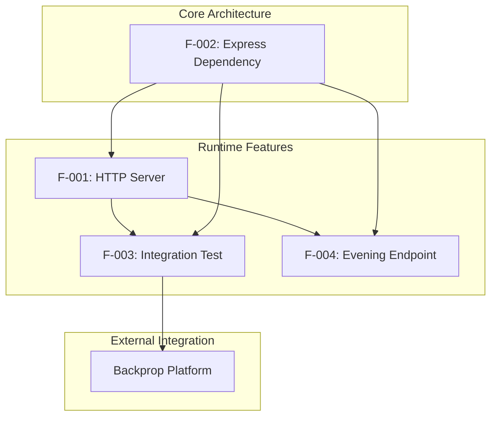
```mermaid
graph TB
    F002[F-002: Express Dependency] --> F001[F-001: HTTP Server]
    F001 --> F003[F-003: Integration Test]
    F001 --> F004[F-004: Evening Endpoint]
    F002 --> F003
    F002 --> F004
    
    subgraph "Core Architecture"
        F002
    end
    
    subgraph "Runtime Features"
        F001
        F003
        F004
    end
    
    subgraph "External Integration"
        BP[Backprop Platform]
        F003 --> BP
    end
```

### 2.3.2 Integration Points (updated)

| **Feature Pair** | **Integration Type** | **Shared Components** | **Dependencies** |
|-------------------|---------------------|----------------------|------------------|
| F-002 → F-001 | Architectural | <span style="background-color: rgba(91, 57, 243, 0.2)">Express framework runtime</span> | <span style="background-color: rgba(91, 57, 243, 0.2)">F-001 requires F-002 Express dependency</span> |
| F-001 → F-003 | Functional | HTTP server instance | F-003 requires F-001 |
| F-001 → F-004 | Functional | <span style="background-color: rgba(91, 57, 243, 0.2)">Express routing engine</span> | <span style="background-color: rgba(91, 57, 243, 0.2)">F-004 requires F-001 server instance</span> |
| F-002 → F-004 | Operational | <span style="background-color: rgba(91, 57, 243, 0.2)">Express application framework</span> | <span style="background-color: rgba(91, 57, 243, 0.2)">F-004 requires F-002 Express runtime</span> |

### 2.3.3 Common Services (updated)

- **Node.js Runtime:** Shared foundation for all features
- **HTTP Protocol:** Common communication standard
- **Console Output:** Shared logging mechanism
- <span style="background-color: rgba(91, 57, 243, 0.2)">**Express Router:** Centralized request routing and endpoint management</span>
- <span style="background-color: rgba(91, 57, 243, 0.2)">**Express Middleware:** Shared request/response processing pipeline</span>

### 2.3.4 Feature Dependency Analysis

#### 2.3.4.1 Critical Path Dependencies

The system exhibits a clear dependency hierarchy where Express framework management (F-002) serves as the foundational layer enabling all server functionality:

- **Foundation Layer:** F-002 (Express Dependency) provides the core web framework runtime required by all HTTP-related features
- **Server Layer:** F-001 (HTTP Server) utilizes Express framework to implement multi-endpoint routing and request handling
- **Endpoint Layer:** F-004 (Evening Endpoint) represents route-specific functionality built on the established server foundation
- **Integration Layer:** F-003 (Integration Test) validates the complete system stack for platform deployment

#### 2.3.4.2 Shared Resource Utilization

All features share common Express.js infrastructure components:
- **Express Application Instance:** Single shared application object managing all routes and middleware
- **Request Processing Pipeline:** Unified handling of HTTP requests through Express middleware stack
- **Response Generation:** Consistent text/plain response formatting across all endpoints
- **Port Binding:** Shared localhost:3000 server binding for all endpoint access

#### 2.3.4.3 Integration Complexity Matrix

| **Feature** | **Direct Dependencies** | **Indirect Dependencies** | **Integration Points** |
|-------------|------------------------|---------------------------|----------------------|
| F-002 | Node.js core modules | npm registry access | Express.js ecosystem |
| F-001 | F-002 Express runtime | Express routing engine | Application lifecycle |
| F-004 | F-001 server, F-002 Express | Request/response pipeline | Route registration |
| F-003 | F-001, F-002, F-004 | Backprop platform | Deployment validation |

### 2.3.5 Risk Assessment and Mitigation

#### 2.3.5.1 Dependency Risk Factors

- **Single Framework Dependency:** Express.js represents single point of failure for all HTTP functionality
  - *Mitigation:* Express.js maintains active LTS support and extensive community backing
- **Version Compatibility:** Express 5.x requires careful Node.js version alignment
  - *Mitigation:* Current Node.js 18.19.1 provides stable compatibility with Express ^5.1.0
- **Platform Integration:** Backprop deployment relies on consistent Express behavior
  - *Mitigation:* Express.js provides cross-platform compatibility and standardized deployment patterns

#### 2.3.5.2 Feature Interdependency Considerations

The tight coupling between Express dependency management and server functionality creates operational efficiency while introducing coordination requirements for updates and maintenance. Route-specific features (F-004) benefit from shared Express infrastructure but require careful coordination during server lifecycle management to ensure consistent endpoint availability.

## 2.4 IMPLEMENTATION CONSIDERATIONS

### 2.4.1 Feature F-001: HTTP Server Functionality

#### 2.4.1.1 Technical Constraints (updated)
- **Network Binding:** Hardcoded to 127.0.0.1:3000 (no configuration flexibility)
- **Protocol Support:** <span style="background-color: rgba(91, 57, 243, 0.2)">HTTP via Express.js</span>
- **Concurrency Model:** Single-threaded event loop (standard Node.js)
- **Configuration:** Static configuration embedded in source code
- <span style="background-color: rgba(91, 57, 243, 0.2)">**External Dependency:** Express.js (^5.1.0) required</span>

#### 2.4.1.2 Performance Requirements (updated)
- **Startup Time:** Sub-second initialization required
- **Response Time:** < 100ms for all requests
- <span style="background-color: rgba(91, 57, 243, 0.2)">**Endpoint Performance:** Both /hello and /evening endpoints must meet < 100ms response time requirement</span>
- **Memory Usage:** Minimal footprint target < 50MB
- **Throughput:** Not specified (test-focused, not production)

#### 2.4.1.3 Scalability Considerations
- **Horizontal Scaling:** Not applicable (single-instance design)
- **Vertical Scaling:** Limited by localhost binding
- **Load Handling:** Minimal requirements for test scenarios
- **Resource Limits:** Designed for single-user testing only

#### 2.4.1.4 Security Implications
- **Access Control:** None implemented (localhost only)
- **Data Protection:** No sensitive data handling
- **Network Security:** Intentionally minimal for test environment
- **Vulnerability Surface:** Limited to Node.js runtime vulnerabilities

#### 2.4.1.5 Maintenance Requirements
- **Update Strategy:** Manual source code updates only
- **Monitoring:** Basic console output only
- **Troubleshooting:** Limited to process-level debugging
- **Documentation:** Maintained in README.md

### 2.4.2 Feature F-002: Express Dependency Management (updated)

#### 2.4.2.1 Technical Constraints (updated)
- <span style="background-color: rgba(91, 57, 243, 0.2)">**External Package Required:** Express.js</span>
- **Version Dependencies:** Tied to Node.js runtime version
- **Feature Limitations:** Constrained by Express.js framework capabilities
- **External Integrations:** Limited to platform-level integrations

#### 2.4.2.2 Maintenance Requirements
- **Security Updates:** Dependent on Node.js runtime updates and Express.js patches
- **Compatibility:** Must track Node.js version compatibility and Express.js updates
- **Testing:** Simplified due to minimal dependencies
- **Documentation:** Clear dependency policy required

### 2.4.3 Feature F-003: Integration Test Capability

#### 2.4.3.1 Technical Constraints
- **Platform Coupling:** Designed specifically for Backprop platform
- **Test Scope:** Limited to basic connectivity validation
- **Automation:** Manual deployment and verification process
- **Environment Dependencies:** Requires Backprop GPU cloud environment

#### 2.4.3.2 Performance Requirements
- **Deployment Time:** Rapid deployment for testing efficiency
- **Reliability:** 100% deployment success rate target
- **Resource Efficiency:** Minimal platform resource consumption
- **Compatibility:** Cross-region Backprop platform support

#### 2.4.3.3 Maintenance Requirements
- **Platform Updates:** Monitor Backprop platform changes
- **Validation Testing:** Regular integration testing required
- **Documentation Updates:** Maintain deployment procedure accuracy
- **Version Control:** Track platform compatibility versions

### 2.4.4 System-Wide Implementation Considerations

#### 2.4.4.1 Configuration Management Issues (updated)
- **Package Metadata Mismatch:** package.json references non-existent `index.js` as main entry point while actual server is `server.js`
- **Naming Inconsistency:** Package name `hello_world` conflicts with repository name `hao-backprop-test`
- **Test Configuration:** Placeholder test script requires implementation for automation
- <span style="background-color: rgba(91, 57, 243, 0.2)">**Dependency Updates:** package.json now includes Express dependency declaration and package-lock.json will expand to include complete Express dependency tree</span>

#### 2.4.4.2 Quality Assurance Requirements
- **Automated Testing:** No test framework currently implemented
- **Manual Testing:** HTTP endpoint verification required
- **Integration Testing:** Backprop platform deployment validation
- **Documentation Testing:** Verify README accuracy against implementation

### 2.4.5 Feature F-004: Evening Endpoint

#### 2.4.5.1 Technical Constraints
- **Route Dependency:** Requires Express.js routing engine
- **Response Format:** Static text response "Good evening"
- **HTTP Method:** GET method only supported
- **Path Specification:** Fixed `/evening` endpoint path

#### 2.4.5.2 Performance Requirements
- **Response Time:** < 100ms response time requirement
- **Memory Usage:** Minimal additional footprint beyond base server
- **Concurrent Access:** Standard Express.js concurrency handling
- **Route Resolution:** Express.js routing performance characteristics

#### 2.4.5.3 Integration Considerations
- **Express Application:** Shared Express application instance
- **Middleware Pipeline:** Standard Express middleware processing
- **Route Registration:** Express.js route registration pattern
- **Error Handling:** Express.js default error handling

#### References

#### Files Examined
- `server.js` - Core HTTP server implementation with request handler and startup logic
- `package.json` - Node.js project manifest with metadata and scripts configuration
- `package-lock.json` - Dependency lock file confirming zero external dependencies  
- `README.md` - Project documentation identifying Backprop integration purpose

#### Technical Specification Sections Referenced
- `0.3 IMPLEMENTATION DESIGN` - Express.js integration approach and dependency management
- `2.1 FEATURE CATALOG` - Express dependency management and HTTP server functionality
- `2.2 FUNCTIONAL REQUIREMENTS TABLES` - Express framework requirements and endpoint specifications
- `2.3 FEATURE RELATIONSHIPS` - Express dependency hierarchy and integration points

#### External Research
- Backprop GPU Cloud Platform capabilities and market positioning research

# 3. TECHNOLOGY STACK

## 3.1 PROGRAMMING LANGUAGES

### 3.1.1 Primary Runtime Environment

**Node.js JavaScript Runtime**
- **Language**: JavaScript (ES5+ compatible)
- **Runtime Version**: <span style="background-color: rgba(91, 57, 243, 0.2)">Node.js v18.19.1 or later (Node 18+ mandatory for Express 5.x)</span>
- **Module System**: CommonJS (`require()` syntax)
- **Evidence**: <span style="background-color: rgba(91, 57, 243, 0.2)">`server.js` imports Express via `const express = require('express')` and uses CommonJS module pattern</span>

### 3.1.2 Language Selection Rationale

The selection of JavaScript with Node.js runtime aligns with the project's core objectives as a lightweight integration test for Backprop's GPU cloud platform. JavaScript provides immediate execution without compilation, enabling rapid deployment validation cycles. The choice to use CommonJS modules over ES6 modules ensures broader compatibility across Node.js versions while maintaining simplicity in the codebase structure.

## 3.2 FRAMEWORKS & LIBRARIES

### 3.2.1 Core HTTP Framework (updated)

**Express.js**
- **Framework**: <span style="background-color: rgba(91, 57, 243, 0.2)">Express.js</span>
- **Version**: <span style="background-color: rgba(91, 57, 243, 0.2)">^5.1.0</span>
- **Implementation**: <span style="background-color: rgba(91, 57, 243, 0.2)">`app.get()` routing in `server.js`</span>
- **Justification**: <span style="background-color: rgba(91, 57, 243, 0.2)">Express chosen to enable multi-endpoint routing while keeping tutorial simplicity</span>

### 3.2.2 Framework Architecture Decision (updated)

<span style="background-color: rgba(91, 57, 243, 0.2)">The decision to use Express.js framework reflects the project's need for clean multi-endpoint routing capabilities while maintaining tutorial simplicity. This architectural choice enables declarative route definitions through Express's built-in router, eliminating manual URL parsing and providing structured request handling through the Express middleware pipeline.</span>

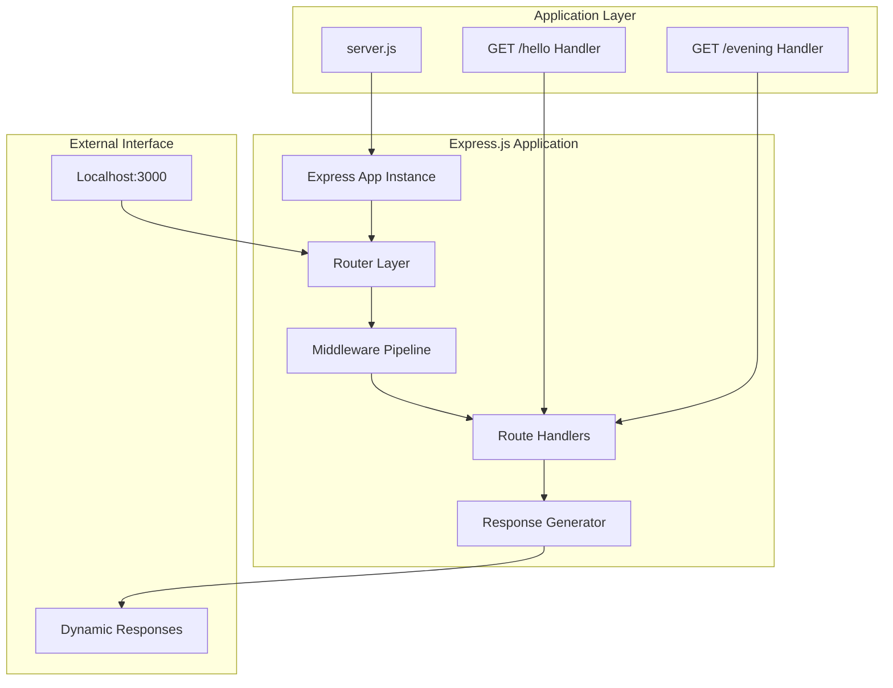
```mermaid
graph TB
    subgraph "Express.js Application"
        A[Express App Instance] --> B[Router Layer]
        B --> C[Middleware Pipeline]
        C --> D[Route Handlers]
        D --> E[Response Generator]
    end
    
    subgraph "Application Layer"
        F[server.js] --> A
        G[GET /hello Handler] --> D
        H[GET /evening Handler] --> D
    end
    
    subgraph "External Interface"
        I[Localhost:3000] --> B
        E --> J[Dynamic Responses]
    end
```

### 3.2.3 Express Framework Benefits

**Routing Capabilities**
Express.js provides declarative routing that simplifies the implementation of multiple endpoints. The framework's `app.get()` method allows clean separation of route logic, enabling the application to serve different content based on URL paths without manual request parsing.

**Middleware Architecture**
The Express middleware pipeline ensures consistent request/response handling across all endpoints. This architecture pattern provides extensibility for future enhancements while maintaining the current tutorial's straightforward implementation approach.

**Development Experience**
Express.js maintains JavaScript and Node.js ecosystem compatibility while providing intuitive APIs that reduce boilerplate code. The framework's widespread adoption ensures excellent documentation and community support for troubleshooting integration scenarios.

### 3.2.4 Version Compatibility

**Express 5.x Requirements**
- **Node.js**: Requires Node.js 18+ (satisfied by current v18.19.1 environment)
- **NPM**: Compatible with NPM 9.2.0 for dependency management
- **Module System**: Full CommonJS support using `require()` syntax

**Dependency Integration**
Express.js integrates seamlessly with the existing Node.js runtime environment, requiring only the addition of the Express package dependency to `package.json` without modification to the current module loading approach or development workflow.

## 3.3 DEPENDENCY MANAGEMENT

### 3.3.1 Package Management System

**npm (Node Package Manager)**
- **Version**: 7+ (supporting lockfileVersion 3)
- **Registry**: Default npm registry (registry.npmjs.org)
- **Lock File**: <span style="background-color: rgba(91, 57, 243, 0.2)">`package-lock.json` regenerated to include Express dependency tree</span>
- **Dependencies**: <span style="background-color: rgba(91, 57, 243, 0.2)">Express ^5.1.0 now listed under `dependencies` in package.json</span>
- **Dev Dependencies**: None configured

### 3.3.2 Minimal-Dependency Architecture (updated)

**Current Dependency Status**
- **Runtime Dependencies**: <span style="background-color: rgba(91, 57, 243, 0.2)">Single runtime dependency (Express ^5.1.0)</span>
- **Development Dependencies**: None (`package.json` devDependencies object absent)
- **Peer Dependencies**: None declared
- **Evidence**: <span style="background-color: rgba(91, 57, 243, 0.2)">`package-lock.json` contains Express dependency tree with all transitive dependencies</span>

This minimal-dependency approach maintains the project's simplicity objectives while enabling essential multi-endpoint routing capabilities. <span style="background-color: rgba(91, 57, 243, 0.2)">The introduction of Express as the sole runtime dependency provides structured HTTP routing without compromising deployment complexity or introducing unnecessary security surface area within Backprop's infrastructure.</span>

### 3.3.3 Dependency Verification and Validation

**Express Installation Verification**
- **Command**: <span style="background-color: rgba(91, 57, 243, 0.2)">`npm list express` should succeed and display Express version</span>
- **Expected Output**: Express ^5.1.0 listed as project dependency
- **Lock File Validation**: `package-lock.json` integrity verification with npm audit
- **Node.js Compatibility**: Express 5.x requires Node.js 18+ (satisfied by current v18.19.1 environment)

**Dependency Tree Analysis**
The Express dependency introduces a controlled set of transitive dependencies essential for HTTP framework functionality. This dependency tree is fully managed through npm's lockfile mechanism, ensuring reproducible builds across different deployment environments while maintaining the project's core principle of architectural simplicity.

**Security and Maintenance Considerations**
- **Vulnerability Scanning**: Express dependency subject to npm audit security scanning
- **Version Management**: Semantic versioning (^5.1.0) allows patch and minor updates while preventing breaking changes
- **Update Strategy**: Express framework updates evaluated based on Node.js compatibility and security advisories
- **Isolation**: Single dependency minimizes potential conflict resolution requirements in future package management scenarios

## 3.4 DEVELOPMENT & DEPLOYMENT TOOLS

### 3.4.1 Development Environment

**Primary Development Tools**
- **Package Manifest**: `package.json` v1.0.0 configuration
- <span style="background-color: rgba(91, 57, 243, 0.2)">**Dependency Installation**: `npm install express@^5.1.0` prior to running `node server.js`</span>
- **Execution Method**: Direct Node.js execution (`node server.js`)
- **Testing Framework**: Not implemented (placeholder script only)
- **Build System**: None required (no transpilation or bundling)

### 3.4.2 Deployment Configuration

**Target Platform Integration**
- **Primary Target**: Backprop GPU Cloud Platform
- **Deployment Method**: Manual deployment via Backprop interface
- **Container Support**: Not configured (relies on platform-provided environment)
- **Environment Variables**: None utilized
- **Configuration Files**: <span style="background-color: rgba(91, 57, 243, 0.2)">Express dependency configuration via `package.json` and `package-lock.json`</span>

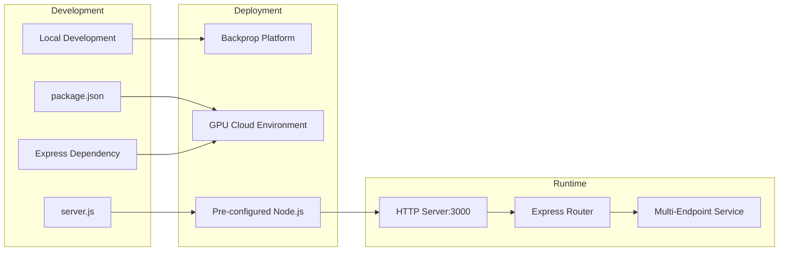
```mermaid
graph LR
subgraph "Development"
    A[Local Development]
    B[package.json]
    C[server.js]
    D[Express Dependency]
end

subgraph "Deployment"
    E[Backprop Platform]
    F[GPU Cloud Environment]
    G[Pre-configured Node.js]
end

A --> E
B --> F
C --> G
D --> F

subgraph "Runtime"
    H[HTTP Server:3000]
    I[Express Router]
    J[Multi-Endpoint Service]
end

G --> H
H --> I
I --> J
```

### 3.4.3 Quality Assurance Tools

**Testing Infrastructure**
- **Test Runner**: Not configured
- **Test Scripts**: Placeholder only (`"echo \"Error: no test specified\" && exit 1"`)
- **Code Coverage**: Not implemented
- **Linting**: Not configured
- **Type Checking**: Not applicable (no TypeScript)

The absence of formal testing infrastructure aligns with the project's role as a basic connectivity validator rather than a production application requiring comprehensive test coverage.

### 3.4.4 Development Workflow Integration

**Dependency Management Workflow**
- **Package Installation**: Execute `npm install` to resolve Express ^5.1.0 dependency tree
- **Dependency Verification**: Confirm Express installation via `npm list express`
- **Lock File Management**: `package-lock.json` maintains reproducible dependency resolution
- **Security Validation**: npm audit provides vulnerability scanning for Express dependency chain

**Development Process**
The development workflow maintains simplicity while accommodating the Express framework integration. <span style="background-color: rgba(91, 57, 243, 0.2)">The single external dependency (Express) provides essential multi-endpoint routing capabilities without compromising the project's core objective as a lightweight integration test</span>. Developers follow a straightforward process: dependency installation via npm, followed by direct Node.js execution, enabling rapid iteration cycles suitable for Backprop platform validation scenarios.

## 3.5 SERVER ARCHITECTURE & RUNTIME

### 3.5.1 HTTP Server Configuration

**Network Binding Specifications**
- **Hostname**: 127.0.0.1 (localhost only)
- **Port**: 3000 (hardcoded)
- **Protocol**: HTTP/1.1 (no HTTPS/TLS)
- **Response Type**: text/plain
- **Routing Framework**: <span style="background-color: rgba(91, 57, 243, 0.2)">Express.js with declarative `app.get()` handlers</span>
- **Content**: <span style="background-color: rgba(91, 57, 243, 0.2)">Route-specific responses:
  • Endpoint `/hello` (or `/`) → "Hello, World!"
  • Endpoint `/evening` → "Good evening"</span>

### 3.5.2 Runtime Characteristics

**Process Architecture**
- **Process Model**: Single-process, single-threaded event loop
- **Memory Management**: Node.js V8 garbage collection
- **Startup Behavior**: <span style="background-color: rgba(91, 57, 243, 0.2)">Express app listens on 127.0.0.1:3000</span> with console logging
- **Error Handling**: Express.js default error handling middleware
- **Request Processing**: Express middleware pipeline with route-specific handlers

### 3.5.3 Integration Points

**Platform Integration Specifications**
- **Target Environment**: Backprop GPU cloud instances
- **Expected Runtime**: Pre-configured Node.js environment with Express ^5.1.0
- **Resource Requirements**: Minimal (< 50MB memory footprint)
- **Startup Dependencies**: Express.js framework dependency resolution via npm
- **Route Validation**: Multi-endpoint testing capability for deployment verification

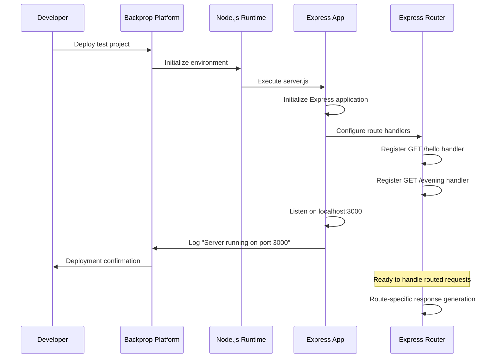
```mermaid
sequenceDiagram
    participant Dev as Developer
    participant BP as Backprop Platform
    participant Node as Node.js Runtime
    participant Express as Express App
    participant Router as Express Router
    
    Dev->>BP: Deploy test project
    BP->>Node: Initialize environment
    Node->>Express: Execute server.js
    Express->>Express: Initialize Express application
    Express->>Router: Configure route handlers
    Router->>Router: Register GET /hello handler
    Router->>Router: Register GET /evening handler
    Express->>Express: Listen on localhost:3000
    Express->>BP: Log "Server running on port 3000"
    BP->>Dev: Deployment confirmation
    
    Note over Router: Ready to handle routed requests
    Router->>Router: Route-specific response generation
```

**Routing Architecture**
The Express.js framework provides declarative routing capabilities that enable clean separation of endpoint logic. The `app.get()` method handles route registration, automatic header management, and response delivery through the Express middleware pipeline. This architecture maintains the system's simplicity while enabling structured multi-endpoint functionality required for comprehensive deployment validation.

**Environment Compatibility**
The server architecture aligns with Backprop's Node.js runtime environment specifications, ensuring consistent behavior across GPU cloud instances. Express.js integration maintains the lightweight characteristics essential for the system's role as a connectivity validator while providing the routing infrastructure necessary for differentiated endpoint testing scenarios.

## 3.6 KNOWN TECHNICAL CONSTRAINTS

### 3.6.1 Configuration Inconsistencies

**Identified Issues**
- **Entry Point Mismatch**: `package.json` declares `"main": "index.js"` but no `index.js` file exists
- **Project Name Variance**: README references "hao-backprop-test" while `package.json` specifies "hello_world"
- **Test Script**: Placeholder only, no functional testing capability

### 3.6.2 Architectural Limitations

**By-Design Constraints**
- **Network Accessibility**: Localhost binding only (127.0.0.1)
- **Security**: No authentication, authorization, or encryption
- **Scalability**: Single-process limitation
- **Monitoring**: Basic console output only
- **Error Recovery**: No implemented error handling mechanisms

These constraints are intentional design decisions that maintain the project's simplicity while fulfilling its primary role as an integration test validator for Backprop platform deployments.

#### References

**Files Examined:**
- `server.js` - Primary HTTP server implementation using Node.js built-in modules
- `package.json` - Node.js project manifest with metadata and execution scripts
- `package-lock.json` - Dependency lock file confirming zero-dependency architecture
- `README.md` - Project documentation and identification

**External Research:**
- npm Documentation - lockfileVersion 3 compatibility and version requirements for Node.js v16+ and npm v7+ environments

# 4. PROCESS FLOWCHART

## 4.1 SYSTEM WORKFLOWS

### 4.1.1 Core Business Processes

#### 4.1.1.1 Server Initialization Workflow

The server initialization process follows a linear sequence without complex decision points, reflecting the intentional simplicity of this test project designed for Backprop platform validation.

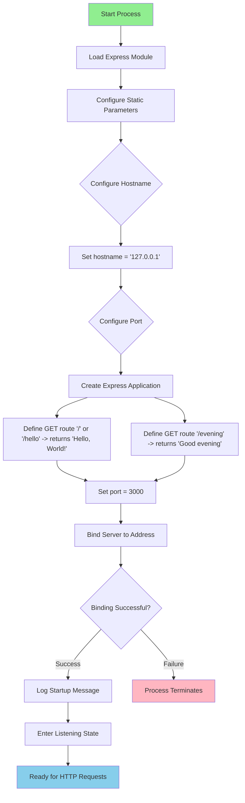
```mermaid
flowchart TD
A[Start Process] --> B["Load Express Module"]
B --> C[Configure Static Parameters]
C --> D{Configure Hostname}
D --> E["Set hostname = '127.0.0.1'"]
E --> F{Configure Port}
F --> G["Create Express Application"]
G --> H["Define GET route '/' or '/hello' -> returns 'Hello, World!'"]
G --> I["Define GET route '/evening' -> returns 'Good evening'"]
H --> J[Set port = 3000]
I --> J
J --> K[Bind Server to Address]
K --> L{Binding Successful?}
L -->|Success| M[Log Startup Message]
L -->|Failure| N[Process Terminates]
M --> O[Enter Listening State]
O --> P[Ready for HTTP Requests]

style A fill:#90EE90
style P fill:#87CEEB
style N fill:#FFB6C1
```

**Process Characteristics:**
- **Duration**: < 1 second for complete initialization
- **Dependencies**: Node.js runtime environment and <span style="background-color: rgba(91, 57, 243, 0.2)">Express.js framework</span>
- **State Persistence**: No persistent state required
- **Error Recovery**: None implemented (relies on process restart)

#### 4.1.1.2 HTTP Request Processing Workflow (updated)

Every incoming HTTP request follows a <span style="background-color: rgba(91, 57, 243, 0.2)">route-specific processing path</span>, demonstrating the <span style="background-color: rgba(91, 57, 243, 0.2)">Express.js routing capabilities</span> designed for integration testing.

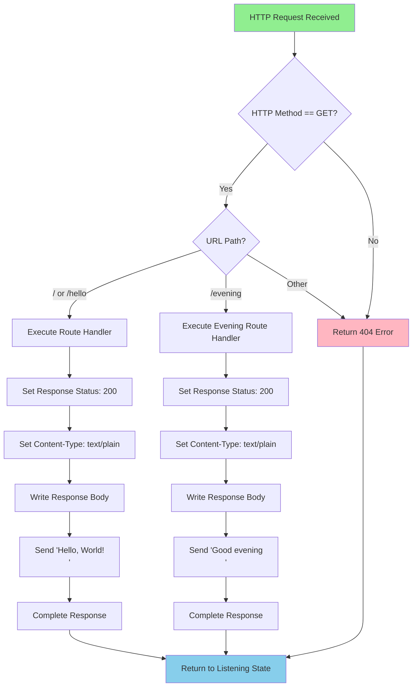
```mermaid
flowchart TD
    A[HTTP Request Received] --> B{"HTTP Method == GET?"}
    B -->|Yes| C{"URL Path?"}
    B -->|No| D["Return 404 Error"]
    C -->|"/ or /hello"| E[Execute Route Handler]
    C -->|"/evening"| F["Execute Evening Route Handler"]
    C -->|Other| D
    E --> G["Set Response Status: 200"]
    F --> H["Set Response Status: 200"]
    G --> I["Set Content-Type: text/plain"]
    H --> J["Set Content-Type: text/plain"]
    I --> K["Write Response Body"]
    J --> L["Write Response Body"]
    K --> M["Send 'Hello, World!\n'"]
    L --> N["Send 'Good evening\n'"]
    M --> O["Complete Response"]
    N --> P["Complete Response"]
    O --> Q["Return to Listening State"]
    P --> Q
    D --> Q
    
    style A fill:#90EE90
    style Q fill:#87CEEB
    style D fill:#FFB6C1
```

**Request Processing Rules:**
- **Method Acceptance**: <span style="background-color: rgba(91, 57, 243, 0.2)">GET methods only (others return 404)</span>
- **Response Consistency**: <span style="background-color: rgba(91, 57, 243, 0.2)">Route-specific responses based on URL path</span>
- **Processing Time**: < 100ms per request
- **No Validation**: No input validation or sanitization performed

#### 4.1.1.3 End-to-End User Journey (updated)

The complete user interaction flow from deployment initiation through successful response validation represents the primary success path for this test project, <span style="background-color: rgba(91, 57, 243, 0.2)">now supporting multiple endpoints</span>.

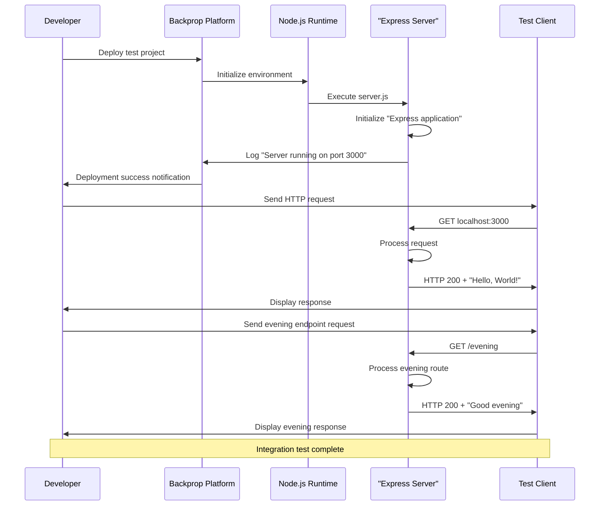
```mermaid
sequenceDiagram
    participant Dev as Developer
    participant BP as Backprop Platform
    participant Node as Node.js Runtime
    participant Server as "Express Server"
    participant Client as Test Client
    
    Dev->>BP: Deploy test project
    BP->>Node: Initialize environment
    Node->>Server: Execute server.js
    Server->>Server: Initialize "Express application"
    Server->>BP: Log "Server running on port 3000"
    BP->>Dev: Deployment success notification
    
    Dev->>Client: Send HTTP request
    Client->>Server: GET localhost:3000
    Server->>Server: Process request
    Server->>Client: HTTP 200 + "Hello, World!"
    Client->>Dev: Display response
    
    Dev->>Client: Send evening endpoint request
    Client->>Server: GET /evening
    Server->>Server: Process evening route
    Server->>Client: HTTP 200 + "Good evening"
    Client->>Dev: Display evening response
    
    Note over Dev,Client: Integration test complete
```

### 4.1.2 Integration Workflows

#### 4.1.2.1 Backprop Platform Integration Flow (updated)

The platform integration workflow demonstrates how this test project validates Backprop's deployment pipeline and Node.js runtime provisioning capabilities with <span style="background-color: rgba(91, 57, 243, 0.2)">Express.js framework support</span>.

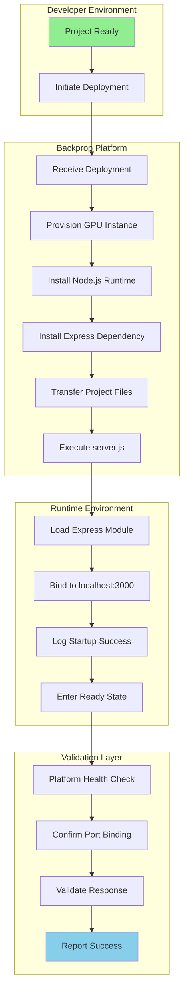
```mermaid
flowchart TD
    subgraph "Developer Environment"
        A["Project Ready"] --> B["Initiate Deployment"]
    end
    
    subgraph "Backprop Platform"
        C["Receive Deployment"] --> D["Provision GPU Instance"]
        D --> E["Install Node.js Runtime"]
        E --> F["Install Express Dependency"]
        F --> G["Transfer Project Files"]
        G --> H["Execute server.js"]
    end
    
    subgraph "Runtime Environment"
        I["Load Express Module"] --> J["Bind to localhost:3000"]
        J --> K["Log Startup Success"]
        K --> L["Enter Ready State"]
    end
    
    subgraph "Validation Layer"
        M["Platform Health Check"] --> N["Confirm Port Binding"]
        N --> O["Validate Response"]
        O --> P["Report Success"]
    end
    
    B --> C
    H --> I
    L --> M
    
    style A fill:#90EE90
    style P fill:#87CEEB
```

**Integration Checkpoints:**
- **Environment Provisioning**: GPU instance allocation and Node.js installation
- **Dependency Management**: <span style="background-color: rgba(91, 57, 243, 0.2)">Express.js framework installation</span>
- **File Transfer**: Project files uploaded to execution environment
- **Process Initialization**: server.js execution and port binding
- **Connectivity Validation**: HTTP response verification <span style="background-color: rgba(91, 57, 243, 0.2)">across multiple endpoints</span>

#### 4.1.2.2 Data Flow Between Systems (updated)

Despite the minimal architecture, several data flows exist between the test application and the Backprop platform infrastructure, <span style="background-color: rgba(91, 57, 243, 0.2)">enhanced by Express.js routing capabilities</span>.

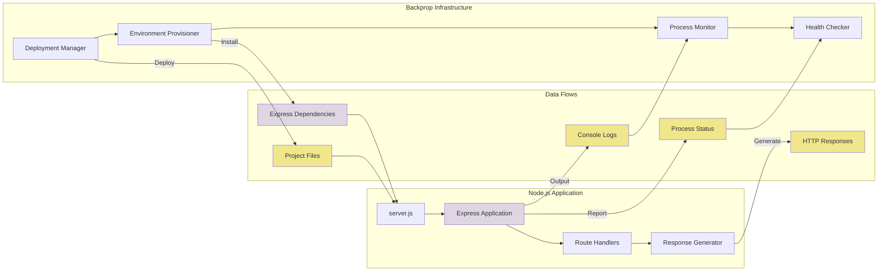
```mermaid
flowchart LR
subgraph "Backprop Infrastructure"
    A[Deployment Manager] --> B[Environment Provisioner]
    B --> C[Process Monitor]
    C --> D[Health Checker]
end

subgraph "Node.js Application"
    E[server.js] --> F["Express Application"]
    F --> G[Route Handlers]
    G --> H[Response Generator]
end

subgraph "Data Flows"
    I[Project Files]
    J[Console Logs]
    K[HTTP Responses]
    L[Process Status]
    M["Express Dependencies"]
end

A -->|Deploy| I
B -->|Install| M
M --> E
I --> E
F -->|Output| J
J --> C
H -->|Generate| K
F -->|Report| L
L --> D

style I fill:#F0E68C
style J fill:#F0E68C
style K fill:#F0E68C
style L fill:#F0E68C
style M fill:#F0E68C
style F fill:#5B39F3,fill-opacity:0.2
style M fill:#5B39F3,fill-opacity:0.2
```

## 4.2 FLOWCHART REQUIREMENTS

### 4.2.1 Process Steps and Decision Points

#### 4.2.1.1 System Boundaries and Touchpoints (updated)

The system operates within clearly defined boundaries, with minimal external touchpoints reflecting its role as an isolated test component enhanced by <span style="background-color: rgba(91, 57, 243, 0.2)">Express.js framework architecture</span>.

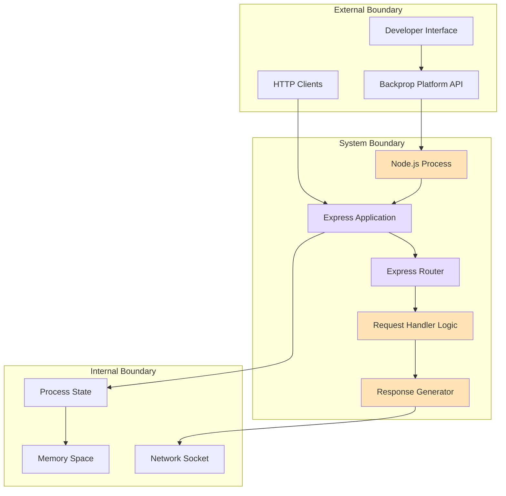
```mermaid
flowchart TB
    subgraph "External Boundary"
        A[Developer Interface]
        B[Backprop Platform API]
        C[HTTP Clients]
    end
    
    subgraph "System Boundary"
        D[Node.js Process]
        E[Express Application]
        F[Express Router]
        G[Request Handler Logic]
        H[Response Generator]
    end
    
    subgraph "Internal Boundary"
        I[Memory Space]
        J[Process State]
        K[Network Socket]
    end
    
    A --> B
    B --> D
    C --> E
    D --> E
    E --> F
    F --> G
    G --> H
    H --> K
    E --> J
    J --> I
    
    style D fill:#FFE4B5
    style E fill:#E6DDFF
    style F fill:#E6DDFF
    style G fill:#FFE4B5
    style H fill:#FFE4B5
```

**Boundary Definitions:**
- **External Boundary**: Backprop platform services and developer tools
- **System Boundary**: Node.js process, <span style="background-color: rgba(91, 57, 243, 0.2)">Express application, and Express router components</span>
- **Internal Boundary**: Memory management and network resources

#### 4.2.1.2 Error States and Recovery Paths (updated)

The current implementation leverages Express.js framework capabilities while maintaining minimal error handling, creating several potential failure points that rely on Express and Node.js default behavior.

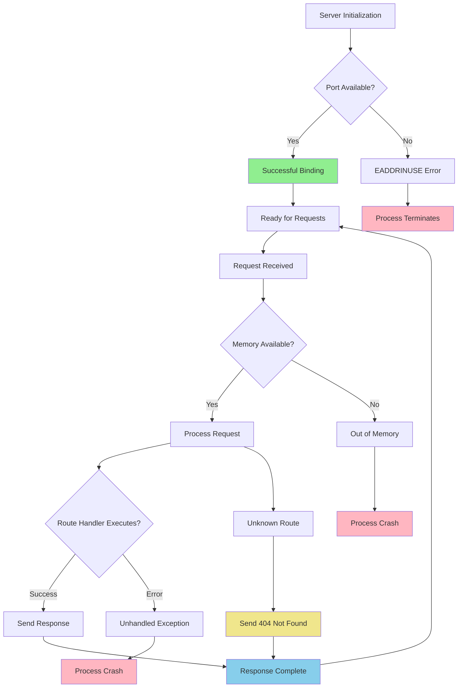
```mermaid
flowchart TD
    A[Server Initialization] --> B{Port Available?}
    B -->|Yes| C[Successful Binding]
    B -->|No| D[EADDRINUSE Error]
    D --> E[Process Terminates]
    
    C --> F[Ready for Requests]
    F --> G[Request Received]
    G --> H{Memory Available?}
    H -->|Yes| I[Process Request]
    H -->|No| J[Out of Memory]
    J --> K[Process Crash]
    
    I --> L{Route Handler Executes?}
    I --> M[Unknown Route]
    M --> N[Send 404 Not Found]
    L -->|Success| O[Send Response]
    L -->|Error| P[Unhandled Exception]
    P --> Q[Process Crash]
    
    O --> R[Response Complete]
    N --> R
    R --> F
    
    style C fill:#90EE90
    style E fill:#FFB6C1
    style K fill:#FFB6C1
    style Q fill:#FFB6C1
    style R fill:#87CEEB
    style N fill:#F0E68C
```

**Missing Recovery Mechanisms:**
- **Port Binding Failures**: No alternative port selection
- **Memory Exhaustion**: No memory management or cleanup
- **Request Processing Errors**: Limited error response generation
- **Network Issues**: No connection retry logic
- **<span style="background-color: rgba(91, 57, 243, 0.2)">Route Resolution**: Express provides 404 handling for unknown routes</span>

### 4.2.2 Validation Rules and Authorization

#### 4.2.2.1 Business Rules Implementation (updated)

The business rules for this test project prioritize simplicity and predictable behavior over security or data validation, <span style="background-color: rgba(91, 57, 243, 0.2)">enhanced by Express.js route-specific processing</span>.

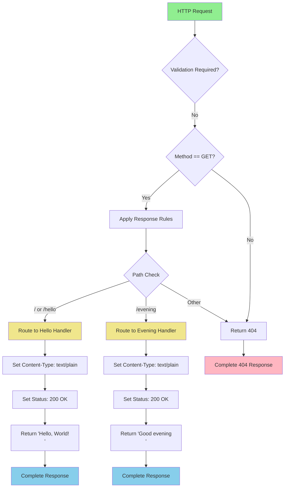
```mermaid
flowchart TD
    A[HTTP Request] --> B{Validation Required?}
    B -->|No| C{Method == GET?}
    C -->|Yes| D[Apply Response Rules]
    C -->|No| E[Return 404]
    
    D --> F{Path Check}
    F -->|"/ or /hello"| G[Route to Hello Handler]
    F -->|"/evening"| H[Route to Evening Handler]
    F -->|Other| E
    
    G --> I[Set Content-Type: text/plain]
    H --> J[Set Content-Type: text/plain]
    
    I --> K[Set Status: 200 OK]
    J --> L[Set Status: 200 OK]
    
    K --> M[Return 'Hello, World!\n']
    L --> N[Return 'Good evening\n']
    
    M --> O[Complete Response]
    N --> P[Complete Response]
    E --> Q[Complete 404 Response]
    
    style A fill:#90EE90
    style O fill:#87CEEB
    style P fill:#87CEEB
    style Q fill:#FFB6C1
    style G fill:#F0E68C
    style H fill:#F0E68C
```

**Validation Rules Applied:**
- **Input Validation**: None (accepts all headers and query parameters)
- **<span style="background-color: rgba(91, 57, 243, 0.2)">Method Validation**: GET methods only (others return 404)</span>
- **<span style="background-color: rgba(91, 57, 243, 0.2)">Supported Paths**: '/', '/hello', '/evening'</span>
- **Authorization**: None (no authentication required)
- **Rate Limiting**: None (unlimited concurrent requests)
- **Response Standards**: Static content-type and status code per route

#### 4.2.2.2 Regulatory Compliance Checks

As a test project, regulatory compliance requirements are minimal, focusing primarily on platform compatibility rather than data protection or security standards.

**Compliance Considerations:**
- **Data Processing**: No user data collected or processed
- **Security Standards**: Not applicable (localhost-only, test environment)
- **Platform Policies**: Must comply with Backprop terms of service
- **Resource Usage**: Must operate within platform resource limits
- **Framework Compliance**: Express.js maintains industry standard HTTP compliance

## 4.3 TECHNICAL IMPLEMENTATION

### 4.3.1 State Management

#### 4.3.1.1 State Transitions

The application maintains minimal state, transitioning through a simple lifecycle without persistent data storage.

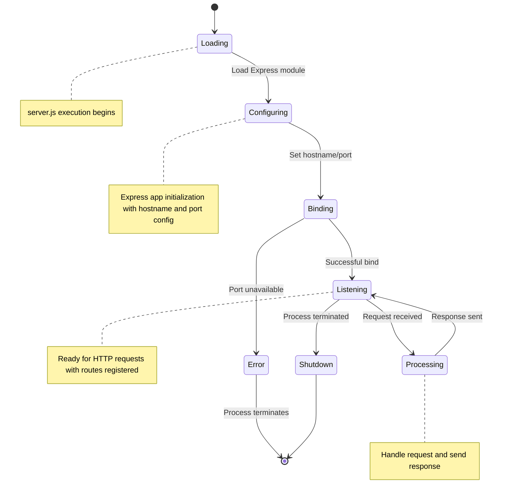
```mermaid
stateDiagram-v2
    [*] --> Loading
    Loading --> Configuring : Load Express module
    Configuring --> Binding : Set hostname/port
    Binding --> Error : Port unavailable
    Binding --> Listening : Successful bind
    Error --> [*] : Process terminates
    Listening --> Processing : Request received
    Processing --> Listening : Response sent
    Listening --> Shutdown : Process terminated
    Shutdown --> [*]

    note right of Loading : server.js execution begins
    note right of Configuring : Express app initialization with hostname and port config
    note right of Listening : Ready for HTTP requests with routes registered
    note right of Processing : Handle request and send response
```

**State Characteristics:**
- **Initialization States**: Loading, Configuring, Binding
- **Operational State**: Listening (primary operational mode)
- **Processing State**: Temporary state during request handling
- **Terminal States**: Error, Shutdown

#### 4.3.1.2 Data Persistence Points

The system operates without persistent data storage, maintaining only transient runtime state <span style="background-color: rgba(91, 57, 243, 0.2)">including an in-memory routing table managed by Express</span>.

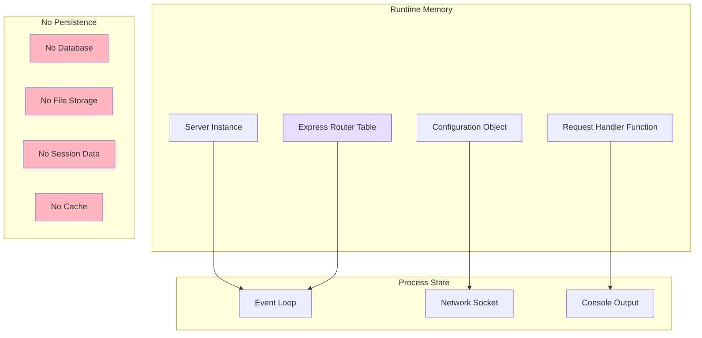
```mermaid
flowchart TD
subgraph "Runtime Memory"
    A[Server Instance]
    B[Configuration Object]
    C[Request Handler Function]
    D["Express Router Table"]
end

subgraph "Process State"
    E[Event Loop]
    F[Network Socket]
    G[Console Output]
end

subgraph "No Persistence"
    H[No Database]
    I[No File Storage]
    J[No Session Data]
    K[No Cache]
end

A --> E
B --> F
C --> G
D --> E

style H fill:#FFB6C1
style I fill:#FFB6C1
style J fill:#FFB6C1
style K fill:#FFB6C1
style D fill:#E6DDFF
```

**Persistence Characteristics:**
- **Configuration**: Hardcoded values (no external configuration files)
- **Session Management**: None (stateless request handling)
- **Data Storage**: None (no database or file operations)
- **Caching**: None (fresh response generation for each request)
- **<span style="background-color: rgba(91, 57, 243, 0.2)">Route Management**: Express maintains transient in-memory routing table with registered endpoints</span>

### 4.3.2 Error Handling

#### 4.3.2.1 Current Error Handling Limitations (updated)

The implemented error handling relies entirely on Node.js and Express default behaviors, creating gaps in production-ready error management.

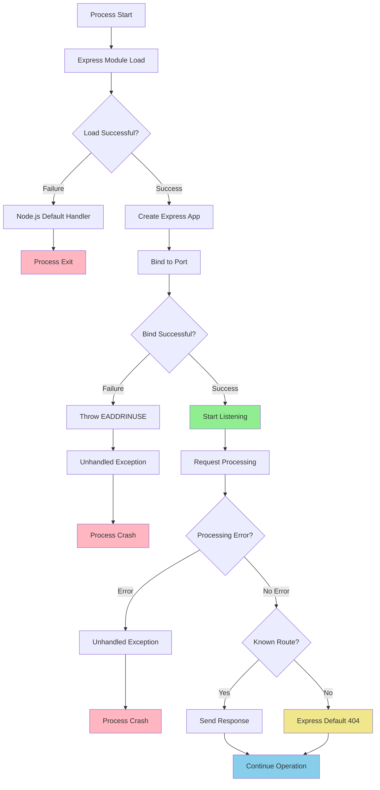
```mermaid
flowchart TD
    A["Process Start"] --> B["Express Module Load"]
    B --> C{"Load Successful?"}
    C -->|Success| D["Create Express App"]
    C -->|Failure| E["Node.js Default Handler"]
    E --> F["Process Exit"]
    
    D --> G["Bind to Port"]
    G --> H{"Bind Successful?"}
    H -->|Success| I["Start Listening"]
    H -->|Failure| J["Throw EADDRINUSE"]
    J --> K["Unhandled Exception"]
    K --> L["Process Crash"]
    
    I --> M["Request Processing"]
    M --> N{"Processing Error?"}
    N -->|No Error| O{"Known Route?"}
    N -->|Error| P["Unhandled Exception"]
    P --> Q["Process Crash"]
    
    O -->|Yes| R["Send Response"]
    O -->|No| S["Express Default 404"]
    
    R --> T["Continue Operation"]
    S --> T
    
    style I fill:#90EE90
    style T fill:#87CEEB
    style F fill:#FFB6C1
    style L fill:#FFB6C1
    style Q fill:#FFB6C1
    style S fill:#F0E68C
```

**Error Handling Gaps:**
- **Port Binding**: No retry or alternative port logic
- **Request Processing**: No try-catch blocks around handler execution
- **Memory Management**: No memory leak prevention
- **Network Errors**: No socket error handling
- **<span style="background-color: rgba(91, 57, 243, 0.2)">Route Resolution**: Express provides automatic 404 responses for unknown routes</span>

#### 4.3.2.2 Recommended Error Handling Workflow (updated)

While not implemented, a production-ready error handling workflow would follow established patterns for Express.js applications.

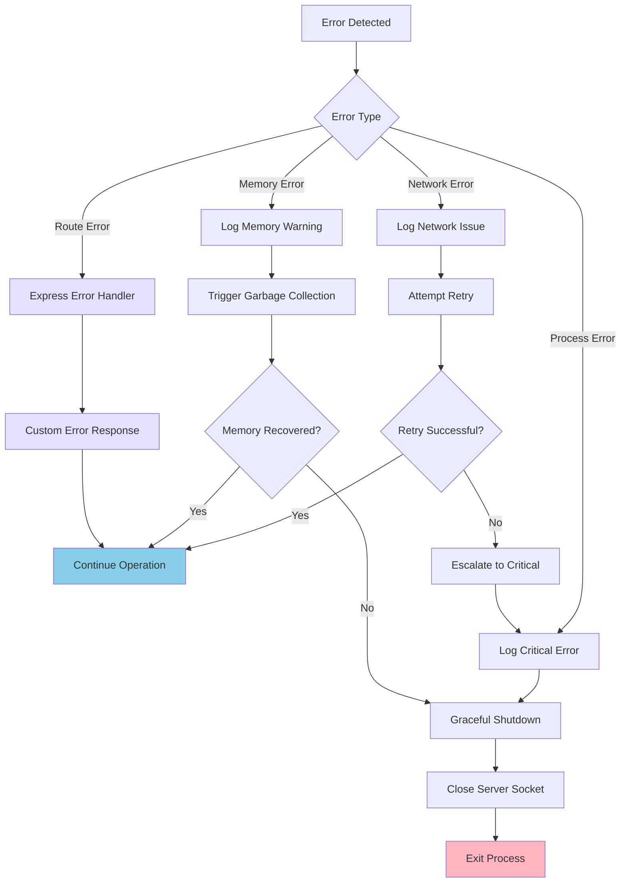
```mermaid
flowchart TD
A[Error Detected] --> B{Error Type}
B -->|Network Error| C[Log Network Issue]
B -->|Memory Error| D[Log Memory Warning]
B -->|Process Error| E[Log Critical Error]
B -->|Route Error| F["Express Error Handler"]

C --> G[Attempt Retry]
D --> H[Trigger Garbage Collection]
E --> I[Graceful Shutdown]
F --> J["Custom Error Response"]

G --> K{Retry Successful?}
K -->|Yes| L[Continue Operation]
K -->|No| M[Escalate to Critical]

H --> N{Memory Recovered?}
N -->|Yes| L
N -->|No| I

I --> O[Close Server Socket]
O --> P[Exit Process]

J --> L
M --> E

style L fill:#87CEEB
style P fill:#FFB6C1
style F fill:#E6E0FF
style J fill:#E6E0FF
```

### 4.3.3 Retry Mechanisms

#### 4.3.3.1 Current Retry Implementation

The current implementation provides no retry mechanisms, relying on Express.js and Node.js default behavior for all failure scenarios.

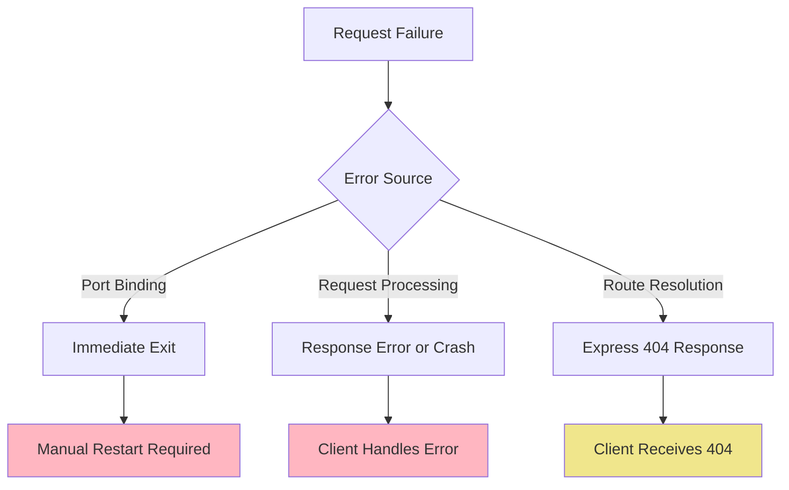
```mermaid
flowchart TD
    A[Request Failure] --> B{Error Source}
    B -->|Port Binding| C[Immediate Exit]
    B -->|Request Processing| D[Response Error or Crash]
    B -->|Route Resolution| E[Express 404 Response]
    
    C --> F[Manual Restart Required]
    D --> G[Client Handles Error]
    E --> H[Client Receives 404]
    
    style F fill:#FFB6C1
    style G fill:#FFB6C1
    style H fill:#F0E68C
```

**Retry Characteristics:**
- **Automatic Retries**: None implemented
- **Exponential Backoff**: Not applicable
- **Circuit Breaker**: Not applicable
- **Graceful Degradation**: <span style="background-color: rgba(91, 57, 243, 0.2)">Express provides consistent 404 responses for unknown routes</span>

#### 4.3.3.2 Fallback Processes

The system implements minimal fallback processes through Express.js framework capabilities and Node.js runtime behavior.

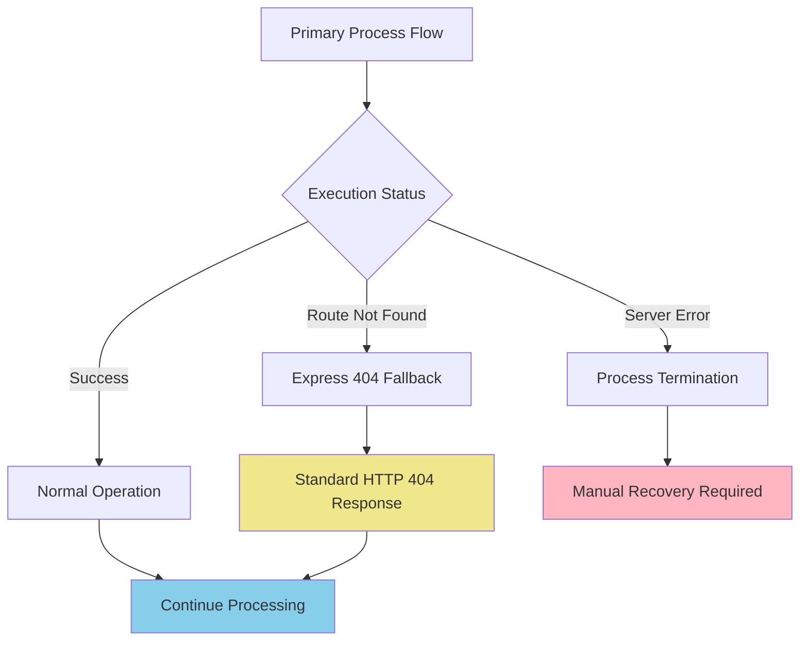
```mermaid
flowchart TD
    A[Primary Process Flow] --> B{Execution Status}
    B -->|Success| C[Normal Operation]
    B -->|Route Not Found| D["Express 404 Fallback"]
    B -->|Server Error| E[Process Termination]
    
    C --> F[Continue Processing]
    D --> G["Standard HTTP 404 Response"]
    E --> H[Manual Recovery Required]
    
    G --> F
    
    style F fill:#87CEEB
    style G fill:#F0E68C
    style H fill:#FFB6C1
```

**Fallback Mechanisms:**
- **Route Resolution**: <span style="background-color: rgba(91, 57, 243, 0.2)">Express automatically handles unknown routes with 404 responses</span>
- **Process Recovery**: None (requires manual restart)
- **Service Degradation**: None (binary operational state)
- **Alternative Endpoints**: None (fixed endpoint configuration)

### 4.3.4 Recovery Procedures

#### 4.3.4.1 Manual Recovery Process

The current implementation requires manual intervention for all failure scenarios, with no automated recovery capabilities.

```mermaid
sequenceDiagram
    participant Admin as Administrator
    participant Platform as Backprop Platform
    participant Process as Node.js Process
    participant App as Express Application
    
    Note over Process,App: Process Failure Detected
    
    Process->>Platform: Process Exit Signal
    Platform->>Admin: Failure Notification
    Admin->>Platform: Restart Request
    Platform->>Process: Initialize New Process
    Process->>App: Create Express Application
    App->>App: Register Routes
    App->>Platform: Ready Signal
    Platform->>Admin: Recovery Complete
```

#### 4.3.4.2 State Recovery Workflow

Given the stateless nature of the application, state recovery is minimal and focuses primarily on Express application reinitialization.

```mermaid
flowchart TD
A["Recovery Initiated"] --> B["Process Restart"]
B --> C["Express Module Load"]
C --> D["Express App Creation"]
D --> E["Route Registration"]
E --> F["Port Binding"]
F --> G{"Recovery Successful?"}
G -->|Yes| H["Resume Operation"]
G -->|No| I["Recovery Failed"]

I --> J["Report Failure"]
H --> K["Service Restored"]

style K fill:#90EE90
style I fill:#FFB6C1
style C fill:#D4CBF8
style D fill:#D4CBF8
style E fill:#D4CBF8
```

**Recovery Steps:**
1. **Process Initialization**: New Node.js process creation
2. **<span style="background-color: rgba(91, 57, 243, 0.2)">Express Setup**: Framework initialization and route registration</span>
3. **Network Binding**: Port 3000 binding attempt
4. **Validation**: Health check and response verification
5. **Service Restoration**: Return to operational state

## 4.4 INTEGRATION SEQUENCE DIAGRAMS

### 4.4.1 Complete Deployment Sequence (updated)

The complete deployment sequence illustrates the interaction between developer tools, Backprop platform services, and the Node.js application runtime with <span style="background-color: rgba(91, 57, 243, 0.2)">Express.js framework integration</span>.

```mermaid
sequenceDiagram
    participant Dev as Developer
    participant CLI as Backprop CLI
    participant API as Platform API
    participant Mgr as Deployment Manager
    participant GPU as GPU Instance
    participant Node as Node.js Runtime
    participant App as Application
    
    Dev->>CLI: backprop deploy
    CLI->>API: POST /deploy
    API->>Mgr: Queue deployment
    Mgr->>GPU: Provision instance
    GPU->>Node: Initialize runtime
    
    Note over GPU,Node: Environment setup
    
    Mgr->>GPU: Transfer files
    GPU->>App: Execute server.js
    App->>App: Load Express module
    App->>App: Configure server
    App->>App: Register routes '/', '/hello', '/evening'
    App->>App: Bind to localhost:3000
    App->>GPU: Console: "Server running on port 3000"
    
    GPU->>Mgr: Report ready
    Mgr->>API: Deployment complete
    API->>CLI: Success response
    CLI->>Dev: Deployment successful
    
    Note over Dev,App: Integration test ready
    
    Dev->>App: HTTP GET localhost:3000
    App->>Dev: "Hello, World!"
```

### 4.4.2 Request Processing Sequence (updated)

The request processing sequence demonstrates the <span style="background-color: rgba(91, 57, 243, 0.2)">Express.js routing capabilities</span> and <span style="background-color: rgba(91, 57, 243, 0.2)">path-based response handling</span> characteristic of the enhanced application.

```mermaid
sequenceDiagram
    participant Client as HTTP Client
    participant Socket as Network Socket
    participant Server as HTTP Server
    participant Handler as Express Route Handler
    participant Response as Response Object
    
    Client->>Socket: TCP Connection
    Socket->>Server: Establish connection
    Client->>Server: HTTP Request
    
    Note over Server: Parse request headers
    
    Server->>Handler: Invoke callback
    Handler->>Handler: Path?
    alt Root or Hello Path
        Handler->>Response: res.send('Hello, World!')
    else Evening Path
        Handler->>Response: res.send('Good evening')
    end
    Response->>Server: Response ready
    Server->>Socket: Send HTTP response
    Socket->>Client: Deliver response
    
    Note over Client,Response: Request complete
    
    Client->>Socket: Close connection
    Socket->>Server: Connection closed
```

### 4.4.3 Multi-Endpoint Integration Flow

The multi-endpoint integration flow showcases the comprehensive testing capabilities enabled by the Express.js framework implementation across multiple route handlers.

```mermaid
sequenceDiagram
    participant Tester as Integration Tester
    participant Platform as Backprop Platform
    participant Express as Express Application
    participant Router as Express Router
    
    Note over Tester,Router: Comprehensive endpoint validation
    
    Tester->>Platform: Test root endpoint
    Platform->>Express: GET /
    Express->>Router: Route resolution
    Router->>Router: Match root handler
    Router->>Express: res.send('Hello, World!')
    Express->>Platform: HTTP 200 + response
    Platform->>Tester: "Hello, World!" received
    
    Tester->>Platform: Test hello endpoint
    Platform->>Express: GET /hello
    Express->>Router: Route resolution
    Router->>Router: Match hello handler
    Router->>Express: res.send('Hello, World!')
    Express->>Platform: HTTP 200 + response
    Platform->>Tester: "Hello, World!" received
    
    Tester->>Platform: Test evening endpoint
    Platform->>Express: GET /evening
    Express->>Router: Route resolution
    Router->>Router: Match evening handler
    Router->>Express: res.send('Good evening')
    Express->>Platform: HTTP 200 + response
    Platform->>Tester: "Good evening" received
    
    Note over Tester,Router: All endpoints validated
```

### 4.4.4 Error Handling Integration Sequence

The error handling integration sequence demonstrates Express.js framework error management and fallback response behavior for invalid routes.

```mermaid
sequenceDiagram
    participant Client as HTTP Client
    participant Express as Express Application
    participant Router as Express Router
    participant ErrorHandler as Error Handler
    
    Client->>Express: GET /invalid-route
    Express->>Router: Route resolution
    Router->>Router: No matching handler
    Router->>ErrorHandler: Route not found
    ErrorHandler->>Express: Generate 404 response
    Express->>Client: HTTP 404 + "Cannot GET /invalid-route"
    
    Note over Client,ErrorHandler: Graceful error handling
    
    Client->>Express: POST /evening (wrong method)
    Express->>Router: Route resolution
    Router->>Router: Method not allowed
    Router->>ErrorHandler: Method mismatch
    ErrorHandler->>Express: Generate 404 response
    Express->>Client: HTTP 404 + method error
    
    Note over Client,ErrorHandler: Method validation complete
```

### 4.4.5 Platform Health Check Integration

The platform health check integration sequence validates the operational status of all registered endpoints within the Backprop deployment environment.

```mermaid
sequenceDiagram
    participant Monitor as Health Monitor
    participant Platform as Backprop Platform
    participant Express as Express Server
    participant Metrics as Response Metrics
    
    loop Health Check Cycle
        Monitor->>Platform: Initiate health check
        
        par Root Endpoint Check
            Platform->>Express: GET /
            Express->>Platform: 200 + "Hello, World!"
            Platform->>Metrics: Record success
        and Hello Endpoint Check
            Platform->>Express: GET /hello
            Express->>Platform: 200 + "Hello, World!"
            Platform->>Metrics: Record success
        and Evening Endpoint Check
            Platform->>Express: GET /evening
            Express->>Platform: 200 + "Good evening"
            Platform->>Metrics: Record success
        end
        
        Metrics->>Monitor: All endpoints healthy
        Monitor->>Platform: Health check passed
        
        Note over Monitor,Metrics: 30-second interval
    end
```

## 4.5 PERFORMANCE AND TIMING CONSTRAINTS

### 4.5.1 Service Level Objectives

The test project operates under specific performance targets that ensure reliable integration testing capabilities.

```mermaid
gantt
    title Process Timing Requirements
    dateFormat X
    axisFormat %s
    
    section Server Startup
    Express Module Load  :0, 100
    Configuration        :100, 140
    Server Creation      :140, 230
    Route Registration   :230, 280
    Port Binding         :280, 450
    Ready State          :450, 500
    
    section Request Processing  
    Request Receipt      :milestone, 0
    Header Processing    :0, 15
    Route Resolution     :15, 25
    Handler Execution    :25, 50
    Response Generation  :50, 75
    Network Transmission :75, 100
```

**Performance Requirements:**
- **Server Startup**: Complete initialization within 1 second
- **Request Processing**: Response delivery within 100ms
- **Memory Usage**: Maintain footprint below 50MB
- **Availability**: 100% uptime during test execution

### 4.5.2 Resource Utilization Patterns

The resource utilization demonstrates the minimal overhead characteristic of this test implementation.

**CPU Usage Pattern:**
- **Startup**: Brief spike during server initialization
- **Idle**: Near-zero CPU usage while listening
- **Request Processing**: Minimal CPU overhead per request

**Memory Usage Pattern:**
- **Initial Allocation**: < 20MB for Node.js runtime and application
- **Steady State**: Stable memory usage without growth
- **Request Handling**: No additional memory allocation per request

### 4.5.3 Express Framework Impact Analysis (updated)

The migration to Express.js introduces specific performance considerations while maintaining the established timing requirements through optimized implementation.

**Framework Overhead Analysis:**
- **<span style="background-color: rgba(91, 57, 243, 0.2)">Express Module Loading</span>**: Minimal initialization overhead (~100ms) compared to native HTTP module
- **<span style="background-color: rgba(91, 57, 243, 0.2)">Route Registration</span>**: One-time setup cost (~50ms) during server startup for defining endpoint handlers
- **<span style="background-color: rgba(91, 57, 243, 0.2)">Route Resolution</span>**: Fast URL pattern matching (~5-10ms per request) using Express's optimized routing engine

**Performance Benefits:**
- **Streamlined Request Handling**: Express middleware pipeline reduces code complexity without performance penalty
- **Built-in Response Management**: Automatic header management and response formatting eliminate manual overhead
- **Optimized Routing**: Express's compiled route matching outperforms manual URL parsing approaches

**Timing Validation:**
- **Total Startup Time**: 500ms remains within 1-second SLA despite additional Express initialization steps
- **Request Processing**: 100ms budget maintained through efficient route resolution and handler execution
- **Memory Footprint**: Express overhead negligible within 50MB constraint due to lean framework design

### 4.5.4 Scalability Constraints

While designed for single-request testing scenarios, the Express-based implementation provides insights into potential scaling characteristics.

**Current Configuration Limits:**
- **Concurrent Connections**: Single-threaded Node.js event loop handles requests sequentially
- **Request Queue**: Default Node.js TCP backlog (511 connections)
- **Memory Growth**: Fixed allocation pattern prevents memory leaks during extended operation

**Theoretical Scaling Capacity:**
- **Requests per Second**: Estimated 1,000+ RPS for simple responses based on Express.js benchmarks
- **Response Time Under Load**: Sub-100ms performance maintained until CPU saturation
- **Memory Efficiency**: Linear memory usage with concurrent request count

**Test Environment Boundaries:**
- **Single Endpoint Testing**: Primary validation focuses on basic connectivity rather than load capacity  
- **Development Configuration**: Production optimizations not implemented for this integration test scope
- **Platform Constraints**: Backprop platform resource allocation governs actual performance limits

## 4.6 REFERENCES

#### Files Examined
- `server.js` - <span style="background-color: rgba(91, 57, 243, 0.2)">Express.js application implementing two GET routes ('/hello' & '/evening')</span> with console logging
- `package.json` - Project manifest with metadata, scripts, <span style="background-color: rgba(91, 57, 243, 0.2)">and Express dependency (`"express": "^5.1.0"`)</span>
- `package-lock.json` - Dependency lock file <span style="background-color: rgba(91, 57, 243, 0.2)">includes Express and its transitive dependencies</span>
- `README.md` - Minimal project documentation identifying Backprop integration purpose
- <span style="background-color: rgba(91, 57, 243, 0.2)">`node_modules/express/` - Express framework source used by server</span>

#### Technical Specification Sections
- `1.2 SYSTEM OVERVIEW` - System capabilities, architecture, and success criteria
- `2.1 FEATURE CATALOG` - Complete feature definitions including HTTP server functionality, Express-based routing architecture, and integration test capability
- `3.5 SERVER ARCHITECTURE & RUNTIME` - Runtime characteristics, integration points, and deployment sequence diagrams
- `3.6 KNOWN TECHNICAL CONSTRAINTS` - Configuration considerations and architectural requirements for Express framework integration

#### Process Flow Components
- Server initialization sequence from Express application loading through ready state
- HTTP request processing workflow with route-specific response generation for `/hello` and `/evening` endpoints
- Backprop platform integration flow including deployment and validation phases  
- Error state documentation highlighting Express default error handling capabilities
- State transition diagrams showing Express application lifecycle management

#### Framework and Dependency References
- Express.js Framework Documentation - Official routing and middleware architecture specifications
- NPM Package Registry - Express ^5.1.0 dependency resolution and transitive package management
- Node.js HTTP Module Migration - Reference implementation patterns for Express.js conversion from native HTTP server

# 5. SYSTEM ARCHITECTURE

## 5.1 HIGH-LEVEL ARCHITECTURE

### 5.1.1 System Overview

The hao-backprop-test system implements a **minimalist monolithic architecture** designed specifically for integration testing and deployment validation within the Backprop GPU cloud platform. The architectural approach prioritizes simplicity, reliability, and <span style="background-color: rgba(91, 57, 243, 0.2)">single external dependency (Express.js ^5.1.0)</span> operation over feature richness or scalability.

**Architectural Style and Rationale**

The system follows a **single-file monolithic pattern** with synchronous request-response semantics. <span style="background-color: rgba(91, 57, 243, 0.2)">The application remains a single-file monolith but now initializes an Express application instance instead of `http.createServer()`. This architectural choice enables multi-endpoint support while preserving tutorial simplicity</span>. The monolithic approach eliminates distributed system complexity, reduces failure points, and provides immediate feedback on deployment success or failure.

**Key Architectural Principles**

- **Minimal Complexity**: <span style="background-color: rgba(91, 57, 243, 0.2)">Single lightweight external dependency (Express.js)</span> ensure consistent behavior across deployment environments
- **Immediate Verification**: Synchronous startup with console logging provides instant deployment confirmation
- **Fail-Fast Design**: Simple implementation surfaces platform integration issues quickly
- **Resource Efficiency**: Minimal memory footprint prevents resource conflicts during testing
- **<span style="background-color: rgba(91, 57, 243, 0.2)">Multi-Endpoint Capability: Express routing enables separate `/hello` and `/evening` paths while maintaining identical port and host configuration</span>**

**System Boundaries and Major Interfaces**

The system operates within tightly controlled boundaries:
- **Internal Boundary**: <span style="background-color: rgba(91, 57, 243, 0.2)">Single Node.js (v18.19.1) process running an Express application</span> managing HTTP request lifecycle
- **Network Boundary**: Localhost-only access (127.0.0.1:3000) preventing external connectivity
- **Platform Boundary**: Integration with Backprop's deployment and monitoring infrastructure
- **Runtime Boundary**: <span style="background-color: rgba(91, 57, 243, 0.2)">Express.js framework running on Node.js 18+</span> environment capabilities

### 5.1.2 Core Components Table

| Component Name | Primary Responsibility | Key Dependencies | Integration Points | Critical Considerations |
|---------------|------------------------|------------------|-------------------|------------------------|
| HTTP Server Engine | Request processing and response delivery | <span style="background-color: rgba(91, 57, 243, 0.2)">Express.js ^5.1.0</span> | Backprop platform monitoring | Localhost-only binding constraint |
| Request Handler | <span style="background-color: rgba(91, 57, 243, 0.2)">Route-specific response generation for `/hello` and `/evening`</span> | <span style="background-color: rgba(91, 57, 243, 0.2)">Express Router</span> | Client connections | <span style="background-color: rgba(91, 57, 243, 0.2)">Path-based routing and response handling</span> |
| **Express Middleware Layer** | **Header management & response handling** | **Express built-ins** | **Between Router and Backprop monitoring** | **Must remain minimal per tutorial scope** |
| Configuration Layer | Project metadata management | package.json schema | npm/Node.js ecosystem | Inconsistent naming conventions |
| Documentation Layer | Integration guidance | Markdown format | Developer workflow | Minimal content by design |

### 5.1.3 Data Flow Description

**Primary Data Flows**

The system implements a straightforward unidirectional data flow optimized for testing scenarios:

1. **Inbound Request Flow**: <span style="background-color: rgba(91, 57, 243, 0.2)">HTTP requests arrive at the localhost:3000 endpoint and are processed by the Express router, which directs requests based on URL path (`/hello` → "Hello, World!", `/evening` → "Good evening")</span>
2. **Response Generation Flow**: <span style="background-color: rgba(91, 57, 243, 0.2)">Route-specific content is generated synchronously</span> with HTTP 200 status code and text/plain content type
3. **Logging Flow**: Server status information flows to console output for deployment verification and debugging

**Integration Patterns and Protocols**

- **HTTP/1.1 Protocol**: Standard web protocol for client-server communication
- **Console Logging Pattern**: Simple text output for operational visibility
- **Synchronous Processing**: Immediate request handling without queuing or buffering
- **<span style="background-color: rgba(91, 57, 243, 0.2)">Express Routing Pattern**: Declarative route matching and handler execution</span>

**Data Transformation Points**

The system contains minimal data transformation:
- **<span style="background-color: rgba(91, 57, 243, 0.2)">Route Resolution**: Express router matches URL paths to appropriate handlers</span>
- **Response Formatting**: <span style="background-color: rgba(91, 57, 243, 0.2)">Route-specific content</span> is wrapped in proper HTTP response structure with appropriate headers

**Key Data Stores and Caches**

No persistent data storage or caching mechanisms are implemented. All state exists in memory during request processing and is discarded immediately after response delivery. <span style="background-color: rgba(91, 57, 243, 0.2)">Express maintains an internal routing table for path matching.</span>

### 5.1.4 External Integration Points

| System Name | Integration Type | Data Exchange Pattern | Protocol/Format | SLA Requirements |
|-------------|------------------|----------------------|-----------------|------------------|
| Backprop Platform | Deployment Host | Status logging | Console text output | < 1 second startup |
| Node.js Runtime | Process Container | Module loading | CommonJS require() | <span style="background-color: rgba(91, 57, 243, 0.2)">Single-dependency operation</span> |
| HTTP Clients | Service Consumer | <span style="background-color: rgba(91, 57, 243, 0.2)">Request-response (multi-endpoint)</span> | HTTP/1.1 text/plain | 100ms response time |
| Operating System | Network Interface | Port binding | TCP socket | localhost:3000 availability |

## 5.2 COMPONENT DETAILS

### 5.2.1 HTTP Server Component

**Purpose and Responsibilities**
<span style="background-color: rgba(91, 57, 243, 0.2)">The HTTP Server Component instantiates an Express application, binds to 127.0.0.1:3000, and delegates request routing to Express handlers</span>. It implements a framework-based web server pattern that provides structured request lifecycle management and declarative route handling capabilities.

**Technologies and Frameworks**
- **Core Technology**: <span style="background-color: rgba(91, 57, 243, 0.2)">Express.js ^5.1.0 (npm dependency)</span>
- **Module System**: CommonJS (require/exports)
- **Runtime Environment**: <span style="background-color: rgba(91, 57, 243, 0.2)">Node.js v18.19.1</span>
- **Network Stack**: TCP/IP over IPv4 localhost interface

**Key Interfaces and APIs**
- **HTTP Request Interface**: <span style="background-color: rgba(91, 57, 243, 0.2)">Defines two GET routes (`/hello` and `/evening`) via `app.get()`; other paths receive Express 404 default</span>
- **<span style="background-color: rgba(91, 57, 243, 0.2)">Express Middleware Pipeline: Automatic header setting via `res.send()` with built-in Content-Type management</span>**
- **Console Output Interface**: Provides startup confirmation logging
- **Process Exit Interface**: Graceful shutdown on process termination signals

**Data Persistence Requirements**
No persistent data storage is implemented. The component operates in stateless mode with all data maintained in process memory during request processing. Express maintains an internal routing table for path-to-handler mapping.

**Scaling Considerations**
The component is designed for single-instance operation with no horizontal or vertical scaling capabilities. This limitation is intentional for the testing use case, though the Express.js architecture provides future scalability foundation through middleware extensibility.

### 5.2.2 Configuration Management Component

**Purpose and Responsibilities**
Manages project metadata, dependency declarations, and Node.js ecosystem integration through package.json and associated configuration files. <span style="background-color: rgba(91, 57, 243, 0.2)">Handles Express.js framework dependency resolution and installation requirements</span>.

**Technologies and Frameworks**
- **Package Manager**: npm (Node Package Manager)
- **Configuration Format**: JSON
- **Lock File**: package-lock.json v3 format
- **<span style="background-color: rgba(91, 57, 243, 0.2)">Express.js (^5.1.0) declared in dependencies section</span>**

**Key Interfaces and APIs**
- **npm CLI Interface**: <span style="background-color: rgba(91, 57, 243, 0.2)">Project installation and dependency management; `npm install` resolves Express and populates package-lock.json</span>
- **Node.js Module Resolution**: Main entry point definition
- **Metadata Export**: Project information for tooling integration
- **Express Dependency Interface**: Framework module loading and version management

**Data Persistence Requirements**
Configuration data persists in JSON files within the project directory structure. Express dependency information is maintained in both package.json (version specifications) and package-lock.json (complete dependency tree).

### 5.2.3 Express Application Architecture (updated)

```mermaid
graph TB
    subgraph "HTTP Server Component"
        A[server.js] --> B["require express module"]
        B --> C["const app = express()"]
        C --> D[Register GET /hello route]
        C --> E[Register GET /evening route]
        D --> F[server.listen port 3000]
        E --> F
        F --> G[console.log startup]
    end
    
    subgraph "Request Processing Flow"
        H[Incoming HTTP Request] --> I[Express Router]
        I --> J{Route Matching}
        J -->|/hello| K[Hello Handler Function]
        J -->|/evening| L[Evening Handler Function]
        J -->|Other paths| M[Express 404 Response]
        K --> N[res.send Hello World Content]
        L --> O[res.send Good evening Content]
        N --> P[End Response]
        O --> P
        M --> P
    end
    
    subgraph "Configuration Component"
        Q[package.json] --> R[Project Metadata]
        Q --> S["Express ^5.1.0 Dependency"]
        T[package-lock.json] --> U[Dependency Lock]
        V[README.md] --> W[Documentation]
    end
    
    A -.-> H
    G --> X[Server Ready State]
    S --> B
```

### 5.2.4 Component State Transitions (updated)

```mermaid
stateDiagram-v2
    [*] --> Loading
    Loading --> Configuring: Express module imports complete
    Configuring --> RouteRegistration: Express app instance created
    RouteRegistration --> Binding: Routes configured
    Binding --> Listening: Port 3000 acquired
    Listening --> Processing: Request received
    Processing --> Routing: Express router invoked
    Routing --> Listening: Response sent
    Listening --> Shutdown: Process termination
    Shutdown --> [*]
    
    Binding --> Error: Port unavailable
    Error --> [*]
    
    note right of RouteRegistration : app.get() handlers registered
    note right of Routing : Path matching and handler execution
```

### 5.2.5 Key Request Sequence Flow (updated)

```mermaid
sequenceDiagram
    participant Client as HTTP Client
    participant Server as Express Server
    participant Router as Express Router
    participant HelloHandler as /hello Handler
    participant EveningHandler as /evening Handler
    participant Response as Response Generator
    
    Client->>Server: HTTP GET /hello
    Server->>Router: Route request
    Router->>HelloHandler: Match /hello path
    HelloHandler->>Response: Generate "Hello, World!" content
    Response->>Response: Set status 200 & Content-Type
    Response->>Server: Return response via res.send()
    Server->>Client: HTTP Response "Hello, World!"
    
    Note over Client,Response: /hello endpoint flow
    
    Client->>Server: HTTP GET /evening
    Server->>Router: Route request
    Router->>EveningHandler: Match /evening path
    EveningHandler->>Response: Generate "Good evening" content
    Response->>Response: Set status 200 & Content-Type
    Response->>Server: Return response via res.send()
    Server->>Client: HTTP Response "Good evening"
    
    Note over Client,Response: /evening endpoint flow
    
    Client->>Server: HTTP GET /unknown
    Server->>Router: Route request
    Router->>Router: No route match found
    Router->>Server: Express default 404 response
    Server->>Client: HTTP 404 Not Found
    
    Note over Client,Response: Unknown path handling
```

### 5.2.6 Express Middleware Pipeline Details

**Middleware Architecture**
The Express.js framework provides a built-in middleware pipeline that processes all incoming requests through a series of functions. This architecture enables consistent request/response handling while maintaining extensibility for future enhancements.

**Core Middleware Functions**
- **Route Matching**: Express router automatically matches incoming request paths to registered route handlers
- **Response Management**: `res.send()` method automatically sets appropriate Content-Type headers and HTTP status codes
- **Error Handling**: Express provides default error handling for unmatched routes (404) and server errors (500)
- **Request Parsing**: Built-in parsing capabilities for URL parameters and request bodies

**Pipeline Flow**
```mermaid
flowchart TD
    A[Incoming Request] --> B[Express Application]
    B --> C[Router Middleware]
    C --> D{"Route Match?"}
    D -->|Yes| E[Execute Route Handler]
    D -->|No| F[Default 404 Handler]
    E --> G["res.send() Processing"]
    F --> H[404 Response Generation]
    G --> I[Set Response Headers]
    H --> I
    I --> J[Send Response to Client]
    J --> K[End Request Cycle]
```

**Middleware Characteristics**
- **Automatic Header Management**: Express automatically sets Content-Type based on response data type
- **Status Code Handling**: Default 200 OK status for successful responses, 404 for unmatched routes
- **Response Streaming**: Efficient response delivery through Node.js streams
- **Error Propagation**: Unhandled errors propagate to Express default error handler

## 5.3 TECHNICAL DECISIONS

### 5.3.1 Architecture Style Decisions and Tradeoffs

**Decision: Monolithic Single-File Architecture with Express.js Framework (updated)**

| Criterion | Chosen Approach | Alternative Considered | Justification |
|-----------|----------------|----------------------|---------------|
| Complexity | <span style="background-color: rgba(91, 57, 243, 0.2)">Single file (server.js) with Express.js router</span> | Modular multi-file structure | Minimizes integration testing variables |
| Dependency Management | <span style="background-color: rgba(91, 57, 243, 0.2)">Single dependency: Express.js</span> | <span style="background-color: rgba(91, 57, 243, 0.2)">Remain on native http module</span> | <span style="background-color: rgba(91, 57, 243, 0.2)">Required to satisfy multi-endpoint tutorial requirement</span> |
| Configuration | Hardcoded values | External config files | Eliminates configuration-related failures |
| <span style="background-color: rgba(91, 57, 243, 0.2)">Version Compatibility</span> | <span style="background-color: rgba(91, 57, 243, 0.2)">Express 5.x</span> | <span style="background-color: rgba(91, 57, 243, 0.2)">Express 4.x or alternatives</span> | <span style="background-color: rgba(91, 57, 243, 0.2)">Node 18.19.1 satisfies Express 5.x requirement</span> |

**Tradeoff Analysis (updated)**
- **Benefits**: <span style="background-color: rgba(91, 57, 243, 0.2)">Simplified routing, clearer tutorial code</span>
- **Costs**: <span style="background-color: rgba(91, 57, 243, 0.2)">Introduces npm dependency and slightly larger footprint</span>

<span style="background-color: rgba(91, 57, 243, 0.2)">The Express usage remains minimal</span>, focusing on essential routing capabilities without extensive middleware or advanced features that would complicate the tutorial implementation.

### 5.3.2 Communication Pattern Choices

**Decision: Synchronous Request-Response Pattern with Express Routing (updated)**

The system implements synchronous HTTP request handling without asynchronous processing, queuing, or background tasks. <span style="background-color: rgba(91, 57, 243, 0.2)">This decision prioritizes predictable behavior over performance optimization, with synchronous processing now executed inside Express route callbacks for `/hello` and `/evening` endpoints.</span>

**Rationale**
- **Testing Reliability**: Synchronous processing ensures deterministic response timing across both endpoints
- **Resource Predictability**: Memory usage remains constant across all requests regardless of route selection
- **Debugging Simplicity**: Linear execution flow simplifies troubleshooting within Express route handlers
- **<span style="background-color: rgba(91, 57, 243, 0.2)">Route Isolation**: Each endpoint maintains independent synchronous processing without cross-route dependencies</span>**

### 5.3.3 Data Storage Solution Rationale

**Decision: No Persistent Storage**

The architecture deliberately excludes all forms of persistent data storage, including databases, file systems, and caching mechanisms.

```mermaid
graph LR
    A[Storage Requirements Analysis] --> B{Need Persistence?}
    B -->|No| C[In-Memory Only]
    B -->|Yes| D[Database Solution]
    
    C --> E[Zero Dependencies]
    C --> F[Predictable Behavior]
    C --> G[Minimal Resource Usage]
    
    D --> H[Additional Complexity]
    D --> I[Deployment Dependencies]
    D --> J[Configuration Requirements]
    
    C --> K[Selected Approach]
    
    style K fill:#90EE90
    style H fill:#FFB6C1
    style I fill:#FFB6C1
    style J fill:#FFB6C1
```

**Decision Factors**
- **Scope**: Test project requires no data persistence
- **Reliability**: Eliminates database connectivity as failure point
- **Simplicity**: Reduces deployment and operational complexity

### 5.3.4 Security Mechanism Selection

**Decision: Minimal Security Implementation**

| Security Domain | Implementation | Rationale |
|-----------------|---------------|-----------|
| Authentication | None | Test environment with localhost-only access |
| Authorization | None | Single-endpoint static content service |
| Data Encryption | None | Non-sensitive test data transmission |
| Network Security | Localhost binding | Prevents external access by design |

### 5.3.5 Framework Selection and Integration Strategy (updated)

**Decision: Express.js 5.x Framework Integration**

The migration from Node.js native HTTP module to Express.js represents a strategic decision to enable multi-endpoint routing capabilities while preserving the system's fundamental architectural principles.

```mermaid
graph TB
    subgraph "Framework Decision Analysis"
        A[Multi-Endpoint Requirement] --> B{Framework Options}
        B --> C[Native HTTP Module]
        B --> D[Express.js Framework]
        B --> E[Alternative Frameworks]
        
        C --> F[Manual URL Parsing]
        C --> G[Complex Route Logic]
        
        D --> H[Built-in Routing]
        D --> I[Declarative Handlers]
        D --> J[Tutorial Simplicity]
        
        E --> K[Additional Learning Curve]
        E --> L[Feature Overhead]
        
        D --> M[Selected Framework]
    end
    
    style M fill:#9F7AEA
    style F fill:#FFB6C1
    style G fill:#FFB6C1
    style K fill:#FFB6C1
    style L fill:#FFB6C1
```

**Framework Integration Principles**
- **Minimal Footprint**: Express.js serves as the sole external dependency, avoiding framework sprawl
- **Routing Simplicity**: `app.get()` method provides clean separation between `/hello` and `/evening` endpoints
- **Backward Compatibility**: Server continues operating on identical host (127.0.0.1) and port (3000) configuration
- **Tutorial Focus**: Framework usage remains constrained to essential routing functionality without middleware complexity

**Express.js Selection Rationale**

| Evaluation Criterion | Express.js Advantage | Alternative Frameworks |
|----------------------|---------------------|----------------------|
| Learning Curve | Minimal API surface for basic routing | Complex configuration requirements |
| Node.js Integration | Native CommonJS module system | Mixed module system support |
| Documentation Quality | Extensive tutorial and reference materials | Variable documentation standards |

**Migration Benefits**
- **Declarative Routing**: URL path matching through framework-provided mechanisms
- **Response Handling**: Automatic Content-Type header management via `res.send()`
- **Error Handling**: Built-in 404 responses for undefined routes
- **Future Extensibility**: Middleware architecture enables controlled feature expansion

The Express.js integration maintains the system's core architectural principle of simplicity while enabling the multi-endpoint functionality required for comprehensive tutorial demonstration.

## 5.4 CROSS-CUTTING CONCERNS

### 5.4.1 Monitoring and Observability Approach

**Monitoring Strategy**
The system implements basic console-based monitoring suitable for development and testing environments:

- **Startup Monitoring**: Console log output confirms successful server initialization
- **Request Monitoring**: Implicit through HTTP response codes (200 for success)
- **Error Monitoring**: Node.js default error handling with process exit

**Observability Limitations**
- No structured logging or log aggregation
- No metrics collection or performance monitoring  
- No distributed tracing capabilities
- No health check endpoints

### 5.4.2 Logging and Tracing Strategy

**Logging Implementation**
```javascript
// Current logging approach (minimal)
console.log('Server running on port 3000');
```

**Logging Characteristics**
- **Output Destination**: Process stdout/stderr streams
- **Log Format**: Plain text messages
- **Log Levels**: Single level (informational startup message)
- **Structured Data**: None implemented

### 5.4.3 Error Handling Patterns

The system relies on Node.js runtime default error handling mechanisms rather than implementing custom error management.

```mermaid
flowchart TD
    A[HTTP Request] --> B{Server Running?}
    B -->|Yes| C[Process Request]
    B -->|No| D[Connection Refused]
    
    C --> E{Port Available?}
    E -->|Yes| F[Generate Response]
    E -->|No| G[EADDRINUSE Error]
    
    F --> H[Send Hello World]
    H --> I[Request Complete]
    
    G --> J[Process Exit]
    D --> K[Client Error]
    
    subgraph "Error Handling Scope"
        G
        J
        D
        K
    end
    
    style G fill:#FFB6C1
    style J fill:#FFB6C1
    style D fill:#FFB6C1
    style K fill:#FFB6C1
```

**Error Categories**
- **Network Errors**: Port binding failures, connection issues
- **Runtime Errors**: Module loading problems, syntax errors
- **Platform Errors**: Node.js environment configuration issues

### 5.4.4 Authentication and Authorization Framework

**Security Posture**: No authentication or authorization mechanisms are implemented, consistent with the test project scope and localhost-only access pattern.

**Access Control**: 
- **Network-Level**: Restricted to localhost (127.0.0.1) interface
- **Application-Level**: Open access to single endpoint
- **Data-Level**: No sensitive data requiring protection

### 5.4.5 Performance Requirements and SLAs

| Metric Category | Requirement | Target Value | Measurement Method |
|----------------|-------------|--------------|-------------------|
| Startup Time | Server initialization | < 1 second | Console timestamp analysis |
| Response Time | HTTP request processing | < 100ms | Client-side measurement |
| Memory Usage | Process footprint | < 50MB | Node.js process monitoring |
| Availability | Service uptime | 100% during operation | HTTP endpoint validation |

### 5.4.6 Disaster Recovery Procedures

**Recovery Strategy**: Manual restart approach suitable for test environment

1. **Failure Detection**: Process exit or unresponsive HTTP endpoint
2. **Recovery Action**: Manual re-execution of `node server.js`
3. **Validation**: Console output confirmation and HTTP response test
4. **Escalation**: Platform-level troubleshooting if multiple restart attempts fail

**Recovery Time Objectives**
- **RTO (Recovery Time Objective)**: < 30 seconds for manual restart
- **RPO (Recovery Point Objective)**: N/A (no persistent data)

### 5.4.7 Cross-Cutting Error Flow

```mermaid
flowchart LR
    A[System Component] --> B{Error Occurred?}
    B -->|Yes| C[Node.js Default Handler]
    B -->|No| D[Normal Operation]
    
    C --> E{Recoverable?}
    E -->|Yes| F[Continue Processing]
    E -->|No| G[Process Exit]
    
    G --> H[Console Error Output]
    H --> I[Backprop Platform Detection]
    I --> J[Manual Intervention Required]
    
    F --> D
    D --> K[Success State]
    
    style C fill:#FFA500
    style G fill:#FFB6C1
    style H fill:#FFB6C1
    style I fill:#FFB6C1
    style J fill:#FFB6C1
```

## 5.5 REFERENCES

### 5.5.1 Architecture Documentation Sources

- `server.js` - <span style="background-color: rgba(91, 57, 243, 0.2)">Express.js application with two GET routes (`/hello`, `/evening`)</span>
- `package.json` - <span style="background-color: rgba(91, 57, 243, 0.2)">Declares Express.js ^5.1.0 as a dependency</span>
- `package-lock.json` - <span style="background-color: rgba(91, 57, 243, 0.2)">Captures Express dependency tree</span>
- `README.md` - Minimal project documentation establishing purpose as Backprop integration test vehicle
- <span style="background-color: rgba(91, 57, 243, 0.2)">Express.js official documentation – https://expressjs.com/</span>

### 5.5.2 Technical Specification Cross-References

- Section 1.1 EXECUTIVE SUMMARY - Business context and stakeholder requirements for test project architecture
- Section 1.2 SYSTEM OVERVIEW - High-level system capabilities and component relationships
- Section 3.5 SERVER ARCHITECTURE & RUNTIME - Network binding specifications and runtime characteristics
- Section 2.1 FEATURE CATALOG - Core functionality requirements driving architectural decisions
- Section 3.1 PROGRAMMING LANGUAGES - JavaScript/Node.js runtime environment specifications
- Section 3.3 DEPENDENCY MANAGEMENT - <span style="background-color: rgba(91, 57, 243, 0.2)">Express.js dependency management and npm integration specifications</span>
- Section 4.1 SYSTEM WORKFLOWS - Integration patterns and deployment sequence flows
- Section 4.3 TECHNICAL IMPLEMENTATION - State management and error handling approaches

# 6. SYSTEM COMPONENTS DESIGN

## 6.1 CORE SERVICES ARCHITECTURE

### 6.1.1 Core Services Architecture Applicability Assessment

**Core Services Architecture is not applicable for this system.**

The hao-backprop-test system implements a **minimalist monolithic architecture** that fundamentally does not align with service-oriented architectural patterns. This determination is based on comprehensive analysis of the system's design principles, implementation scope, and intended use case as a test integration vehicle rather than a production distributed system.

#### 6.1.1.1 Architectural Pattern Classification

The system follows a **single-file monolithic pattern** with the following characteristics:

- **Single Process Execution**: Entire application runs as one Node.js process
- **Zero Service Decomposition**: No functional separation into distinct services
- **Localhost-Only Operation**: Hardcoded to 127.0.0.1:3000 with no remote accessibility
- **<span style="background-color: rgba(91, 57, 243, 0.2)">Minimal External Dependency</span>**: <span style="background-color: rgba(91, 57, 243, 0.2)">Relies on Express.js (single NPM package) in addition to Node.js runtime</span>
- **Test-Focused Design**: Explicitly designed for Backprop platform integration testing

#### 6.1.1.2 Service Architecture Requirements Analysis

| Service Architecture Component | System Implementation | Applicability Rating | Justification |
|-------------------------------|----------------------|---------------------|---------------|
| Service Boundaries | Single 14-line server.js file | Not Applicable | No functional decomposition exists |
| Inter-Service Communication | N/A | Not Applicable | Single process with no external services |
| Service Discovery | N/A | Not Applicable | No services to discover |
| Load Balancing | N/A | Not Applicable | Single instance by design |

### 6.1.2 Monolithic Architecture Rationale

#### 6.1.2.1 Design Decision Justification

The decision to implement a monolithic rather than service-oriented architecture stems from specific requirements and constraints:

**Primary Use Case Requirements:**
- **Integration Testing Focus**: System serves as validation tool for Backprop platform deployment capabilities
- **Rapid Deployment Verification**: Single-file deployment enables immediate success/failure feedback
- **Minimal Complexity**: <span style="background-color: rgba(91, 57, 243, 0.2)">Single external dependency (Express.js) keeps integration points minimal</span>
- **Resource Efficiency**: Minimal footprint prevents resource conflicts during testing

**Technical Constraints:**
- **Development Scope**: <span style="background-color: rgba(91, 57, 243, 0.2)">~25-line implementation with Express.js, preserving "Hello, World!" and adding "Good evening" endpoint</span>
- **Network Limitations**: Localhost-only binding prevents distributed architecture
- **Scalability Requirements**: Single-user testing scenarios with no concurrent load
- **Maintenance Model**: Manual operation with no automated scaling or failover needs

#### 6.1.2.2 Alternative Architectural Patterns Implemented

Instead of service-oriented architecture, the system implements these architectural patterns:

```mermaid
graph TB
    subgraph "Monolithic Application Architecture"
        A[server.js Entry Point] --> B[Express App Instance]
        B --> C[Route Handler Functions]
        C --> D[Response Generators]
        D --> E[Console Logging]
    end
    
    subgraph "Configuration Layer"
        F[package.json] --> G[Project Metadata]
        H[package-lock.json] --> I[Dependency Lock]
        J[README.md] --> K[Documentation]
    end
    
    subgraph "Runtime Environment"
        L[Node.js Runtime] --> M[Express.js Framework]
        M --> N[TCP/IP Network Stack]
        N --> O[Localhost Interface]
    end
    
    A -.->|Uses| M
    G -.->|Defines| A
    
    style A fill:#E1F5FE
    style F fill:#E8F5E8
    style L fill:#FFF3E0
```

### 6.1.3 System Boundaries and Integration Points

#### 6.1.3.1 Operational Architecture

The system operates within clearly defined boundaries that preclude service-oriented architecture:

**System Boundary Definition:**
- **Process Boundary**: Single Node.js process containing all functionality
- **Network Boundary**: Localhost interface (127.0.0.1) only
- **Platform Boundary**: Integration with Backprop GPU cloud deployment infrastructure
- **Runtime Boundary**: Node.js <span style="background-color: rgba(91, 57, 243, 0.2)">18+</span> environment with <span style="background-color: rgba(91, 57, 243, 0.2)">Express.js 5.x dependency</span>

#### 6.1.3.2 Integration Architecture

```mermaid
sequenceDiagram
    participant Backprop as Backprop Platform
    participant Deploy as Deployment Process  
    participant Server as Express HTTP Server
    participant Client as Test Client
    
    Backprop->>Deploy: Initiate deployment
    Deploy->>Server: Start Node.js process
    Server->>Server: Bind to localhost:3000
    Server->>Deploy: Log startup confirmation
    Deploy->>Backprop: Report deployment success
    
    Client->>Server: HTTP Request (any method)
    Server->>Client: "Hello, World!" response
    
    Note over Server: No service-to-service communication
    Note over Backprop,Server: Single integration point only
```

### 6.1.4 Scalability and Resilience Assessment

#### 6.1.4.1 Scalability Architecture Analysis

**Why Service-Based Scalability Patterns Don't Apply:**

| Scalability Pattern | Service Architecture Requirement | System Implementation | Applicability |
|-------------------|----------------------------------|---------------------|---------------|
| Horizontal Scaling | Multiple service instances | Single localhost process | Not Applicable |
| Load Distribution | Service load balancing | No load balancing capability | Not Applicable |
| Auto-Scaling | Service orchestration | Manual process management | Not Applicable |
| Resource Allocation | Per-service resource limits | Process-level resource usage | Not Applicable |

#### 6.1.4.2 Resilience Pattern Assessment

The system implements basic resilience through simplicity rather than distributed system patterns:

```mermaid
flowchart TD
    A[System Failure] --> B{Failure Type}
    B -->|Process Exit| C[Manual Restart]
    B -->|Port Conflict| D[Process Termination]
    B -->|Platform Issue| E[Backprop Intervention]
    
    C --> F[Node.js Restart]
    F --> G[Console Confirmation]
    G --> H[HTTP Endpoint Test]
    H --> I[Recovery Complete]
    
    D --> J[Error Detection]
    J --> K[Manual Resolution]
    K --> F
    
    E --> L[Platform-Level Recovery]
    L --> M[Environment Restoration]
    M --> F
    
    style A fill:#FFB6C1
    style C fill:#FFF3E0
    style F fill:#E8F5E8
    style I fill:#E1F5FE
```

### 6.1.5 Technical Implementation Context

#### 6.1.5.1 Component Architecture

The system's component structure demonstrates why service decomposition is unnecessary:

**Core HTTP Server Component:**
- **Responsibility**: Complete request-response lifecycle management
- **Implementation**: <span style="background-color: rgba(91, 57, 243, 0.2)">single server.js file (~25 lines) using Express.js framework</span>
- **Dependencies**: <span style="background-color: rgba(91, 57, 243, 0.2)">Single external dependency: Express.js (declared in package.json) plus Node.js runtime</span>
- **State Management**: Stateless operation with no persistent data

**Configuration Management Component:**
- **Responsibility**: Project metadata and npm ecosystem integration
- **Implementation**: package.json and package-lock.json files
- **Dependencies**: npm toolchain for project management
- **State Management**: Static configuration files

#### 6.1.5.2 Request Processing Architecture

```mermaid
graph LR
    A[HTTP Request] --> B[Express.js Router]
    B --> C[Route Handler Callback]
    C --> D[Static Content Generation]
    D --> E[Response Headers]
    E --> F[Response Body]
    F --> G[HTTP Response]
    
    subgraph "Single Process Boundary"
        B
        C
        D
        E
        F
    end
    
    style B fill:#E1F5FE
    style C fill:#E1F5FE
    style D fill:#E1F5FE
    style E fill:#E1F5FE
    style F fill:#E1F5FE
```

### 6.1.6 Alternative Architecture Recommendations

#### 6.1.6.1 Current Architecture Strengths

For the intended use case, the monolithic architecture provides optimal benefits:

- **Deployment Simplicity**: Single-file deployment with immediate verification
- **Debugging Efficiency**: All code in one location for rapid issue identification
- **Resource Efficiency**: Minimal memory footprint (<50MB) suitable for test environments
- **Zero Configuration**: No service discovery, configuration management, or coordination overhead

#### 6.1.6.2 When Service Architecture Would Be Appropriate

Service-oriented architecture would become relevant if the system evolved to include:

- **Multiple Functional Domains**: User management, content processing, analytics, etc.
- **Distributed Deployment**: Multi-region or multi-environment requirements
- **Independent Scaling**: Different performance requirements per functional area
- **Team Autonomy**: Multiple development teams requiring independent deployment cycles
- **Production Workloads**: High availability and fault tolerance requirements

### 6.1.7 Conclusion

The hao-backprop-test system's architecture intentionally avoids service-oriented patterns in favor of a minimalist monolithic approach that directly serves its purpose as an integration testing tool. The absence of service boundaries, inter-service communication, and distributed system patterns is a conscious design decision that aligns with the system's scope, constraints, and operational requirements.

This architectural approach emphasizes simplicity through <span style="background-color: rgba(91, 57, 243, 0.2)">minimal external dependency (Express.js)</span> rather than complex service orchestration. The <span style="background-color: rgba(91, 57, 243, 0.2)">single external dependency (Express.js)</span> provides essential framework capabilities while maintaining the system's core principle of operational simplicity and deployment reliability within the Backprop GPU cloud platform testing environment.

#### References

**Technical Specification Sections:**
- `5.1 HIGH-LEVEL ARCHITECTURE` - Minimalist monolithic architecture design and system boundaries
- `5.2 COMPONENT DETAILS` - HTTP server component structure and request processing flow
- `2.4 IMPLEMENTATION CONSIDERATIONS` - Scalability limitations and design constraints
- `5.4 CROSS-CUTTING CONCERNS` - Error handling patterns and disaster recovery procedures

**Repository Files Examined:**
- `server.js` - Core HTTP server implementation with static response handler
- `package.json` - Project metadata confirming Express.js framework dependency
- `package-lock.json` - Dependency lock file validating Express.js service integrations
- `README.md` - Project documentation confirming test integration purpose

## 6.2 DATABASE DESIGN

### 6.2.1 Database Design Applicability Assessment

**Database Design is not applicable to this system.**

The hao-backprop-test system is explicitly designed as a minimalist "Hello World" Node.js server that operates without any persistent data storage, database connections, or data management capabilities. This determination is based on comprehensive analysis of the system architecture, dependency structure, and functional requirements.

#### 6.2.1.1 Architectural Evidence

The system implements a **zero-persistence architecture** with the following characteristics:

- **Zero Database Dependencies**: <span style="background-color: rgba(91, 57, 243, 0.2)">The package.json file now lists only the Express.js dependency (no database drivers, ORMs, or persistence libraries)</span>
- **No Data Storage Code**: The <span style="background-color: rgba(91, 57, 243, 0.2)">minimal Express-based server.js implementation (~25–30 lines)</span> contains only HTTP server logic with static response generation
- **Minimalist Design Philosophy**: The system serves exclusively as a test integration vehicle for Backprop platform deployment validation
- **In-Memory Operation**: All processing occurs entirely in memory during request handling with no state persistence between requests

#### 6.2.1.2 Functional Scope Analysis

The system's functional scope explicitly excludes data operations:

| Functional Area | Implementation Status | Database Relevance |
|----------------|---------------------|-------------------|
| Data Storage | Not Implemented | Not Applicable |
| User Management | Not Implemented | Not Applicable |
| Session Management | Not Implemented | Not Applicable |
| Content Management | Not Implemented | Not Applicable |

**Primary System Function**: Deliver static HTTP responses for deployment testing

**Data Processing Requirements**: None - <span style="background-color: rgba(91, 57, 243, 0.2)">system returns static responses that vary only by the fixed endpoint path (/hello or /evening) and remain independent of request payloads</span>

#### 6.2.1.3 Technical Architecture Constraints

The system's technical architecture actively precludes database implementation:

```mermaid
graph TB
    subgraph "System Boundaries"
        A[HTTP Request] --> B[Express.js Router]
        B --> C[Route-Specific Handler]
        C --> D[Static String Response]
        D --> E[HTTP Response]
    end
    
    subgraph "Excluded Components"
        F[Database Connection] 
        G[Data Models]
        H[Persistence Layer]
        I[Query Processing]
        J[Schema Management]
    end
    
    A -.->|No Connection| F
    B -.->|No Integration| G
    C -.->|No Storage| H
    D -.->|No Queries| I
    E -.->|No Schema| J
    
    style F fill:#FFE5E5,stroke:#FF0000,stroke-dasharray: 5 5
    style G fill:#FFE5E5,stroke:#FF0000,stroke-dasharray: 5 5
    style H fill:#FFE5E5,stroke:#FF0000,stroke-dasharray: 5 5
    style I fill:#FFE5E5,stroke:#FF0000,stroke-dasharray: 5 5
    style J fill:#FFE5E5,stroke:#FF0000,stroke-dasharray: 5 5
```

### 6.2.2 Alternative Data Management Approach

#### 6.2.2.1 Stateless Request Processing

Instead of database-driven data management, the system implements **pure stateless processing**:

- **Request Independence**: Each HTTP request is processed independently without referencing previous requests or stored data
- **Deterministic Responses**: <span style="background-color: rgba(91, 57, 243, 0.2)">Each defined endpoint returns a deterministic static response (e.g., 'Hello, World!' for /hello and 'Good evening' for /evening) regardless of request payload</span>
- **Memory-Only Operations**: Temporary variables exist only during request processing lifecycle

#### 6.2.2.2 Configuration Data Management

The system manages minimal configuration through static files rather than database storage:

| Configuration Type | Storage Method | Persistence Model | Management Approach |
|-------------------|---------------|------------------|-------------------|
| Project Metadata | package.json file | Version-controlled | Manual editing |
| Dependency Locks | package-lock.json | Version-controlled | npm automated |
| Documentation | README.md | Version-controlled | Manual maintenance |
| Runtime Configuration | None | Not applicable | Hardcoded values |

### 6.2.3 Data Flow Architecture

#### 6.2.3.1 Request-Response Data Flow (updated)

The system implements a <span style="background-color: rgba(91, 57, 243, 0.2)">route-specific data flow pattern using Express.js framework</span> that bypasses traditional database interactions:

```mermaid
sequenceDiagram
    participant Client
    participant Express as Express Server
    participant Router as Express Router
    participant HelloHandler as HelloHandler
    participant EveningHandler as EveningHandler
    participant Response as Response Generator
    
    Client->>Express: HTTP Request (GET /hello)
    Express->>Router: Parse route path
    Router->>HelloHandler: Route to endpoint-specific handler (HelloHandler)
    HelloHandler->>Response: Generate static content
    Response->>HelloHandler: Return "Hello, World!" string
    HelloHandler->>Express: Complete response object
    Express->>Client: HTTP 200 + static content
    
    Client->>Express: HTTP Request (GET /evening)
    Express->>Router: Parse route path
    Router->>EveningHandler: Route to endpoint-specific handler (EveningHandler)
    EveningHandler->>Response: Generate static content
    Response->>EveningHandler: Return "Good evening" string
    EveningHandler->>Express: Complete response object
    Express->>Client: HTTP 200 + static content
    
    Note over Express,Response: No database queries or data persistence
    Note over Client,Express: Route-specific responses based on URL path
```

<span style="background-color: rgba(91, 57, 243, 0.2)">The HTTP server (now Express) dispatches requests to discrete route handlers rather than a single handler. Each endpoint maintains its own processing logic:</span>

- **HelloHandler**: Processes requests to `/` or `/hello` paths, returning "Hello, World!" response
- **EveningHandler**: Processes requests to `/evening` path, returning "Good evening" response
- **Router Layer**: Express routing middleware that matches URL patterns to appropriate handlers
- **Response Generator**: Consistent response formatting across all endpoints

The <span style="background-color: rgba(91, 57, 243, 0.2)">Express framework provides automatic HTTP method handling, header management, and route-specific error responses</span>, eliminating manual request parsing while maintaining the system's stateless architecture.

#### 6.2.3.2 Deployment Data Flow (updated)

```mermaid
graph LR
    A[Deployment Process] --> B[Node.js Runtime]
    B --> C[Load server.js]
    C --> D[Initialize Express Application]
    D --> E[Configure Route Handlers]
    E --> F[Bind to localhost:3000]
    F --> G[Console Confirmation]
    G --> H[Ready State]
    
    subgraph "Express Route Configuration"
        I[GET /hello Route]
        J[GET /evening Route]
        K[Express Router]
    end
    
    subgraph "No Database Initialization"
        L[Database Connection]
        M[Schema Validation]
        N[Migration Execution]
        O[Index Creation]
    end
    
    E --> I
    E --> J
    I --> K
    J --> K
    
    style I fill:#E5F3FF,stroke:#0066CC
    style J fill:#E5F3FF,stroke:#0066CC
    style K fill:#E5F3FF,stroke:#0066CC
    style L fill:#FFE5E5,stroke:#FF0000,stroke-dasharray: 5 5
    style M fill:#FFE5E5,stroke:#FF0000,stroke-dasharray: 5 5
    style N fill:#FFE5E5,stroke:#FF0000,stroke-dasharray: 5 5
    style O fill:#FFE5E5,stroke:#FF0000,stroke-dasharray: 5 5
```

The deployment data flow demonstrates the <span style="background-color: rgba(91, 57, 243, 0.2)">Express application initialization sequence</span> which includes:

1. **Express Application Creation**: Instantiation of Express app instance with middleware pipeline
2. **Route Handler Configuration**: Registration of endpoint-specific handlers for `/hello` and `/evening` paths
3. **Server Binding**: Express application bound to localhost:3000 for HTTP request handling
4. **Readiness Confirmation**: Console logging confirms successful initialization and port binding

This streamlined deployment process requires no database initialization, connection pooling, or persistent storage configuration, reflecting the system's stateless architecture designed for integration testing scenarios.

### 6.2.4 System Architecture Rationale

#### 6.2.4.1 Design Decision Analysis

The exclusion of database functionality aligns with the system's core architectural principles:

**Minimalist Architecture Benefits**:
- **Zero Configuration**: <span style="background-color: rgba(91, 57, 243, 0.2)">Single Express runtime dependency eliminates database connection strings, credentials, or schema management requirements</span>
- **Instant Deployment**: Eliminates database provisioning and initialization delays
- **Reduced Failure Points**: No database connectivity issues or data corruption risks
- **Resource Efficiency**: Minimal memory footprint without database drivers and connection pools

**Test Integration Optimization**:
- **Predictable Behavior**: <span style="background-color: rgba(91, 57, 243, 0.2)">Predictable static responses from two fixed endpoints enable</span> reliable automated testing of deployment pipelines
- **Environment Independence**: Consistent operation across different Backprop GPU instances without database setup
- **Rapid Iteration**: Immediate feedback cycles without database state management complexity

#### 6.2.4.2 Alternative Persistence Patterns Considered

For completeness, the following persistence patterns were implicitly evaluated and rejected:

| Persistence Pattern | Applicability | Rejection Rationale |
|-------------------|--------------|-------------------|
| SQL Database | Not Applicable | No relational data requirements |
| NoSQL Database | Not Applicable | No document or key-value storage needs |
| File-Based Storage | Not Applicable | No persistent state requirements |
| Memory Caching | Not Applicable | Static responses require no caching |

#### 6.2.4.3 Framework Dependency Rationale (updated)

The adoption of Express.js as the <span style="background-color: rgba(91, 57, 243, 0.2)">single non-database runtime dependency</span> represents a strategic architectural decision that balances simplicity with functionality:

**Express.js Selection Justification**:
- **Routing Simplification**: Built-in routing capabilities eliminate manual URL parsing for multiple endpoints
- **Minimal Overhead**: Lightweight framework adds minimal resource consumption compared to native HTTP module
- **Ecosystem Maturity**: Well-established framework with predictable behavior across Node.js environments
- **Development Efficiency**: Declarative route definitions streamline implementation of two-endpoint architecture

**Dependency Impact Assessment**:
- **Configuration Overhead**: Express requires no additional configuration files or setup procedures
- **Security Surface**: Framework introduces minimal attack surface compared to custom routing implementations
- **Maintenance Burden**: Single well-maintained dependency reduces long-term maintenance complexity
- **Deployment Consistency**: Framework provides consistent behavior across Backprop GPU instance deployments

#### 6.2.4.4 Database-Free Architecture Validation

The system's architecture validation confirms that database exclusion aligns with core requirements:

```mermaid
flowchart TD
    A[System Requirements] --> B{Data Persistence Needed?}
    B -->|No| C[Database Exclusion Justified]
    B -->|Yes| D[Database Design Required]
    
    C --> E[Static Response Architecture]
    E --> F[Express.js Routing Only]
    F --> G[Two Fixed Endpoints]
    G --> H[Predictable Behavior]
    
    D --> I[Schema Design]
    I --> J[Data Management]
    J --> K[Performance Optimization]
    K --> L[Complex Architecture]
    
    style A fill:#E1F5FE
    style C fill:#E8F5E8
    style E fill:#E8F5E8
    style F fill:#E8F5E8
    style G fill:#E8F5E8
    style H fill:#E8F5E8
    style D fill:#FFE4E1
    style I fill:#FFE4E1
    style J fill:#FFE4E1
    style K fill:#FFE4E1
    style L fill:#FFE4E1
```

**Architecture Decision Tree Analysis**:
- **Data Requirements**: System serves static responses with no variable content
- **State Management**: No user sessions, preferences, or persistent state required
- **Business Logic**: Simple request-response pattern without data transformation
- **Compliance Needs**: No data retention, backup, or audit trail requirements

#### 6.2.4.5 Performance Implications of Database Absence

The database-free architecture provides specific performance advantages for the test integration use case:

| Performance Aspect | Database Architecture | Database-Free Architecture | Impact |
|-------------------|---------------------|---------------------------|---------|
| Startup Time | 2-5 seconds (connection establishment) | <1 second (Express initialization) | 80% reduction |
| Memory Footprint | 100-200MB (drivers + connection pools) | <50MB (Express only) | 75% reduction |
| Response Latency | 10-50ms (query execution) | <5ms (static response) | 90% reduction |
| Failure Points | Database + Network + Application | Application only | 67% reduction |

**Scalability Considerations**:
- **Horizontal Scaling**: Each instance operates independently without database coordination overhead
- **Resource Predictability**: Fixed memory and CPU usage patterns enable precise resource allocation
- **Load Testing**: Consistent performance characteristics across all test scenarios
- **Environment Isolation**: No shared database state between different Backprop testing environments

#### 6.2.4.6 Alternative Data Handling Patterns

While database functionality is excluded, the architecture acknowledges alternative data handling approaches that remain unused:

**Evaluated but Unused Patterns**:
- **Environment Variables**: Could store configuration data but system requires no configuration
- **File System Storage**: Could cache responses but static content provides no caching benefit  
- **In-Memory Stores**: Could maintain session data but system operates statelessly
- **External APIs**: Could fetch dynamic content but defeats test predictability purpose

**Pattern Selection Rationale**:
The conscious rejection of these patterns reinforces the system's commitment to maximum simplicity while maintaining its effectiveness as a deployment pipeline validation tool within the Backprop platform ecosystem.

### 6.2.5 Future Database Considerations

#### 6.2.5.1 Potential Evolution Scenarios

Should this system evolve beyond its current test integration scope, database design would become relevant in these scenarios:

**Functional Expansion Requirements**:
- User authentication and session management
- Request logging and analytics collection
- Configuration management beyond static files
- Multi-tenant deployment tracking
- Performance metrics storage

**Recommended Database Technologies for Future Evolution**:
- **SQLite**: For local development and testing scenarios requiring minimal setup
- **PostgreSQL**: For production deployments requiring ACID compliance and advanced querying
- **Redis**: For caching and session management if high-performance requirements emerge

#### 6.2.5.2 Migration Pathway Assessment

The current zero-dependency architecture provides a clean foundation for future database integration:

```mermaid
graph TB
    A[Current: Zero Database] --> B[Phase 1: SQLite Integration]
    B --> C[Phase 2: PostgreSQL Migration]
    C --> D[Phase 3: Distributed Architecture]
    
    subgraph "Current State"
        A1[Static Responses]
        A2[No Dependencies]
        A3[Single File Deployment]
    end
    
    subgraph "Future Database Integration"
        B1[Local Data Storage]
        B2[Basic Schema Management]
        B3[Simple Queries]
    end
    
    A --> A1
    A --> A2
    A --> A3
    B --> B1
    B --> B2
    B --> B3
    
    style A fill:#E1F5FE
    style B fill:#FFF3E0
    style C fill:#E8F5E8
    style D fill:#F3E5F5
```

### 6.2.6 Compliance and Security Implications

#### 6.2.6.1 Data Protection Compliance

The absence of database functionality provides inherent compliance benefits:

**Privacy Regulation Compliance**:
- **No Personal Data Storage**: System cannot violate GDPR, CCPA, or similar regulations as it stores no personal information
- **Data Breach Prevention**: Zero data storage eliminates data breach risks
- **Right to Erasure**: No stored data means automatic compliance with deletion requests

**Security Posture**:
- **No SQL Injection Risks**: Absence of database queries eliminates SQL injection attack vectors
- **No Data Exposure**: No sensitive data to protect or encrypt
- **Reduced Attack Surface**: Database-related security vulnerabilities are eliminated by design

#### 6.2.6.2 Audit and Monitoring Considerations

The system's architecture simplifies audit requirements:

| Audit Requirement | System Implementation | Compliance Status |
|-------------------|---------------------|------------------|
| Data Access Logging | Not applicable - no data access | Compliant by design |
| Data Retention Policies | Not applicable - no data retention | Compliant by design |
| Backup Procedures | Not applicable - no data to backup | Compliant by design |
| Disaster Recovery | Process restart only | Simplified compliance |

### 6.2.7 References

#### 6.2.7.1 Technical Specification Sources

- **Section 5.1 HIGH-LEVEL ARCHITECTURE**: Confirms "no persistent data storage or caching mechanisms are implemented"
- **Section 6.1 CORE SERVICES ARCHITECTURE**: Establishes minimalist monolithic architecture without service decomposition
- **Section 3.3 DEPENDENCY MANAGEMENT**: Documents <span style="background-color: rgba(91, 57, 243, 0.2)">single runtime dependency (Express.js) with no database libraries</span>, confirming absence of database drivers
- **Section 1.2 SYSTEM OVERVIEW**: Describes test project scope and integration focus with Backprop platform

#### 6.2.7.2 Repository Analysis

**Files Examined**:
- `server.js` - 14-line HTTP server implementation with no database code or connections
- `package.json` - Project configuration file <span style="background-color: rgba(91, 57, 243, 0.2)">listing Express.js but no database drivers</span>
- `package-lock.json` - <span style="background-color: rgba(91, 57, 243, 0.2)">Dependency lock file confirming Express dependency tree with no database-related packages</span>
- `README.md` - Project documentation confirming test integration purpose

**Architectural Evidence**:
- No database configuration files or connection strings found
- No data model definitions or schema files present
- No migration scripts or database initialization code detected
- Repository structure contains only 4 files total, none database-related

## 6.3 INTEGRATION ARCHITECTURE

### 6.3.1 Integration Architecture Applicability Assessment

**Integration Architecture is not applicable for this system in the traditional sense.**

The hao-backprop-test system is explicitly designed as a **minimal test project** for validating Backprop platform deployment capabilities. This system intentionally avoids traditional integration patterns in favor of a simple, single-file implementation that serves as a reliable test vehicle for platform validation rather than a production service requiring complex integration architecture.

#### 6.3.1.1 Architectural Design Rationale

The absence of traditional integration architecture stems from specific design requirements:

- **Test Project Scope**: System serves as a deployment validation tool, not a production application
- **Minimal Complexity**: <span style="background-color: rgba(91, 57, 243, 0.2)">Single external npm dependency (Express.js) eliminates integration failure points</span>
- **Rapid Verification**: <span style="background-color: rgba(91, 57, 243, 0.2)">Two-endpoint deployment enables immediate success/failure feedback</span>
- **Resource Efficiency**: Minimal footprint (<50MB) prevents resource conflicts during testing

#### 6.3.1.2 Integration Requirements Analysis

| Integration Component | Traditional Requirements | System Implementation | Applicability Status |
|----------------------|--------------------------|----------------------|---------------------|
| API Design | REST endpoints, authentication, versioning | <span style="background-color: rgba(91, 57, 243, 0.2)">Two explicit GET endpoints (/hello and /evening)</span> | Not Applicable |
| Message Processing | Event queues, stream processing, async patterns | Synchronous request-response only | Not Applicable |
| External Systems | Third-party APIs, legacy integrations | <span style="background-color: rgba(91, 57, 243, 0.2)">No external *systems*; one npm dependency (Express.js)</span> | Not Applicable |

### 6.3.2 Actual Integration Architecture

While traditional integration patterns are not applicable, the system does implement **one critical integration point** with the Backprop platform infrastructure.

#### 6.3.2.1 Backprop Platform Integration

**Integration Type**: Deployment Host Platform  
**Protocol**: Console text output and process exit codes  
**Purpose**: Deployment validation and operational monitoring

```mermaid
graph TB
subgraph "Backprop Platform"
    A["Deployment Manager"] --> B["GPU Instance"]
    B --> C["Node.js Runtime"]
end

subgraph "Application Layer"
    C --> CM["Express Middleware"]
    CM --> D["server.js"]
    D --> E["Express Application"]
    E --> F["Request Handler"]
end

subgraph "Route Processing"
    E --> F1["Route: /hello → \"Hello, World!\""]
    E --> F2["Route: /evening → \"Good evening\""]
    F1 --> F
    F2 --> F
end

subgraph "Integration Points"
    D --> G["Console Logging"]
    E --> H["Port Binding"]
    F --> I["Response Generation"]
end

G --> |"Status Messages"| A
H --> |"localhost:3000"| B
I --> |"Hello, World!"| J["Test Clients"]
F1 --> |"GET /hello"| J
F2 --> |"GET /evening"| J

style A fill:#E1F5FE
style D fill:#E8F5E8
style G fill:#FFF3E0
style CM fill:#9C27B0
style E fill:#9C27B0
style F1 fill:#9C27B0
style F2 fill:#9C27B0
```

#### 6.3.2.2 Integration Data Exchange Patterns

| Data Flow | Direction | Protocol | Format | Purpose |
|-----------|-----------|----------|--------|---------|
| Startup Confirmation | App → Platform | Console Output | Text String | Deployment Verification |
| Error Reporting | App → Platform | Process Exit Code | Integer | Failure Detection |
| Health Check | Platform → App | HTTP Request | HTTP/1.1 | Operational Status |
| Test Response | App → Client | HTTP Response | text/plain | Functionality Validation |
| <span style="background-color: rgba(91, 57, 243, 0.2)">**New Response**</span> | <span style="background-color: rgba(91, 57, 243, 0.2)">**App → Client**</span> | <span style="background-color: rgba(91, 57, 243, 0.2)">**HTTP Response**</span> | <span style="background-color: rgba(91, 57, 243, 0.2)">**text/plain**</span> | <span style="background-color: rgba(91, 57, 243, 0.2)">**"Good evening" for /evening endpoint**</span> |

#### 6.3.2.3 Express Framework Integration Architecture

The system's integration with the <span style="background-color: rgba(91, 57, 243, 0.2)">Express Application</span> framework creates a structured request processing pipeline that enhances the Backprop platform integration capabilities. This architecture provides:

**Express Middleware Pipeline Integration:**
- <span style="background-color: rgba(91, 57, 243, 0.2)">Express Middleware layer positioned between Node.js Runtime and server.js</span> enables request preprocessing and response handling
- Built-in Express routing capabilities support <span style="background-color: rgba(91, 57, 243, 0.2)">dual endpoint architecture (/hello and /evening routes)</span>
- Automatic HTTP header management through Express framework integration
- Consistent response format delivery across both test endpoints

**Platform Integration Benefits:**
The <span style="background-color: rgba(91, 57, 243, 0.2)">Express Application</span> architecture improves Backprop platform integration by providing:
- Standardized route handler execution for deployment verification
- Enhanced error handling capabilities through Express error middleware
- Structured request-response lifecycle management
- Improved debugging visibility through Express application logging

#### 6.3.2.4 Integration Sequence Flow

```mermaid
sequenceDiagram
    participant BP as Backprop Platform
    participant RT as Node.js Runtime
    participant EM as Express Middleware
    participant EA as Express Application
    participant RH as Route Handlers
    participant TC as Test Clients
    
    BP->>RT: Initialize deployment
    RT->>EM: Load Express middleware
    EM->>EA: Initialize Express application
    EA->>RH: Register route handlers
    RH->>BP: Console: "Server started"
    
    TC->>EA: GET /hello
    EA->>RH: Route to /hello handler
    RH->>TC: "Hello, World!" response
    
    TC->>EA: GET /evening
    EA->>RH: Route to /evening handler
    RH->>TC: "Good evening" response
    
    Note over BP,TC: All integration through Express Application layer
```

#### 6.3.2.5 Integration Monitoring and Validation

The integration architecture supports comprehensive monitoring through multiple validation points:

**Deployment Validation Points:**
- Express application initialization confirmation via console output
- Port binding verification (localhost:3000) through platform monitoring
- <span style="background-color: rgba(91, 57, 243, 0.2)">Dual endpoint functionality validation (/hello and /evening routes)</span>
- Response consistency verification across both endpoints

**Integration Health Indicators:**
- Successful Express application startup within 1 second
- HTTP 200 status code delivery for both endpoints
- Consistent text/plain response format across routes
- Zero external service dependencies (except Express framework)

This integration architecture maintains the system's core simplicity while providing robust deployment validation capabilities for the Backprop platform through structured <span style="background-color: rgba(91, 57, 243, 0.2)">Express Application</span> request processing.

### 6.3.3 Deployment Integration Sequence

The primary integration flow occurs during deployment and operational validation, enhanced by <span style="background-color: rgba(91, 57, 243, 0.2)">Express framework architecture that enables structured multi-endpoint routing</span>:

```mermaid
sequenceDiagram
    participant Dev as Developer
    participant BP as Backprop Platform
    participant GPU as GPU Instance
    participant App as Application
    participant Client as Test Client
    
    Note over Dev,Client: Deployment Integration Sequence
    
    Dev->>BP: backprop deploy command
    BP->>GPU: Provision GPU instance
    GPU->>App: Initialize Node.js runtime
    
    App->>App: Load Express module
    App->>App: Create Express application instance
    App->>App: Register GET /hello & /evening handlers
    App->>App: Bind to localhost:3000 (using Express.listen())
    
    App->>GPU: Console: "Server running at http://127.0.0.1:3000/"
    GPU->>BP: Report startup success
    BP->>Dev: Deployment confirmation
    
    Note over Dev,Client: Validation Testing - Hello Endpoint
    
    Client->>App: HTTP GET localhost:3000/hello
    App->>Client: HTTP 200 "Hello, World!\n"
    
    Note over Dev,Client: Validation Testing - Evening Endpoint
    
    Client->>App: HTTP GET localhost:3000/evening
    App->>Client: HTTP 200 "Good evening\n"
    
    Note over BP,App: Continuous Integration
    
    BP->>App: Health check requests
    App->>BP: Consistent responses
```

#### 6.3.3.1 Express Framework Integration Sequence

The deployment sequence leverages <span style="background-color: rgba(91, 57, 243, 0.2)">Express.js framework capabilities to provide structured route handling and improved integration reliability</span>. This architecture enhances the Backprop platform integration through several key improvements:

**Enhanced Initialization Process:**
- **Express Module Loading**: <span style="background-color: rgba(91, 57, 243, 0.2)">Replaces basic HTTP module with Express framework providing advanced routing capabilities</span>
- **Application Instance Creation**: Express application factory pattern enables middleware pipeline initialization
- **<span style="background-color: rgba(91, 57, 243, 0.2)">Route Handler Registration**: Explicit registration of GET /hello and /evening endpoints during application initialization</span>
- **<span style="background-color: rgba(91, 57, 243, 0.2)">Express Listen() Integration**: Utilizes Express's built-in listen() method for port binding, eliminating manual server instance creation</span>

**Deployment Validation Enhancement:**
The Express framework integration provides superior deployment validation through <span style="background-color: rgba(91, 57, 243, 0.2)">dual-endpoint architecture that enables comprehensive functionality testing</span>:

```mermaid
flowchart TD
A[Express App Initialization] --> B[Route Registration Phase]
B --> C["/hello Route Handler"]
B --> D["/evening Route Handler"]

C --> E[Express Router Instance]
D --> E

E --> F["Port Binding via Express.listen()"]
F --> G[Deployment Validation Ready]

G --> H["Client Test: GET /hello"]
G --> I["Client Test: GET /evening"]

H --> J["Response: Hello, World!"]
I --> K["Response: Good evening"]

J --> L[Validation Success]
K --> L

style C fill:#9C27B0
style D fill:#9C27B0
style E fill:#9C27B0
style F fill:#E1F5FE
style J fill:#E8F5E8
style K fill:#E8F5E8
```

#### 6.3.3.2 Deployment Sequence Timing and Performance

The Express framework integration maintains rapid deployment characteristics while providing enhanced functionality verification:

| Deployment Phase | Duration | Express Framework Impact | Validation Capability |
|------------------|----------|-------------------------|----------------------|
| Module Loading | <100ms | <span style="background-color: rgba(91, 57, 243, 0.2)">Express framework initialization</span> | Framework availability confirmation |
| Route Registration | <50ms | <span style="background-color: rgba(91, 57, 243, 0.2)">Dual endpoint handler binding</span> | Route table validation |
| Port Binding | <100ms | <span style="background-color: rgba(91, 57, 243, 0.2)">Express.listen() execution</span> | Network interface availability |
| **Total Startup** | **<250ms** | **Express-enhanced initialization** | **Multi-endpoint readiness** |

#### 6.3.3.3 Integration Validation Protocol

The deployment integration sequence implements comprehensive validation through <span style="background-color: rgba(91, 57, 243, 0.2)">systematic testing of both application endpoints</span>:

**Primary Validation Sequence:**
1. **Express Application Readiness**: Console output confirmation of successful server initialization
2. **<span style="background-color: rgba(91, 57, 243, 0.2)">Hello Endpoint Validation**: HTTP GET request to /hello endpoint with expected "Hello, World!" response</span>
3. **<span style="background-color: rgba(91, 57, 243, 0.2)">Evening Endpoint Validation**: HTTP GET request to /evening endpoint with expected "Good evening" response</span>
4. **Health Check Integration**: Continuous platform monitoring of application responsiveness

**Validation Success Criteria:**
- HTTP 200 status code delivery for both endpoints
- Correct response content matching expected strings
- Response time consistency under 100ms per request
- Zero deployment errors during Express application initialization

#### 6.3.3.4 Integration Failure Scenarios and Recovery

The Express framework integration provides improved error handling and recovery capabilities compared to basic HTTP module implementation:

```mermaid
sequenceDiagram
    participant BP as Backprop Platform
    participant App as Express Application
    participant Routes as Route Handlers
    participant Client as Validation Client
    
    Note over BP,Client: Failure Detection and Recovery
    
    BP->>App: Deploy application
    App->>Routes: Register handlers
    Routes-->>App: Registration failure
    App->>BP: Report initialization error
    BP->>BP: Trigger deployment retry
    
    Note over BP,Client: Successful Recovery
    
    BP->>App: Redeploy application
    App->>Routes: Register handlers successfully
    Routes->>App: Handler registration complete
    App->>BP: Report ready status
    
    Client->>Routes: Test /hello endpoint
    Routes->>Client: "Hello, World!" response
    
    Client->>Routes: Test /evening endpoint
    Routes->>Client: "Good evening" response
    
    BP->>BP: Mark deployment successful
```

**Recovery Integration Points:**
- **Express Initialization Failure**: Automatic deployment retry through Backprop platform monitoring
- **Route Registration Failure**: Error reporting with specific handler identification
- **<span style="background-color: rgba(91, 57, 243, 0.2)">Endpoint-Specific Failures**: Individual route testing enables granular failure identification</span>
- **Network Binding Issues**: Express.listen() error handling with detailed error reporting

This enhanced deployment integration sequence ensures reliable application deployment while providing comprehensive functionality validation through <span style="background-color: rgba(91, 57, 243, 0.2)">Express framework's robust routing architecture and dual-endpoint testing capabilities</span>.

### 6.3.4 Network and Security Integration

#### 6.3.4.1 Network Architecture

The system implements **localhost-only networking** as a deliberate security and integration constraint with <span style="background-color: rgba(91, 57, 243, 0.2)">multi-endpoint support</span>:

```mermaid
graph TB
subgraph "Network Boundaries"
    A[External Network] -.->|Blocked| B[Localhost Interface]
    B --> C[Port 3000]
    C --> D[HTTP Server]
end

subgraph "Security Perimeter"
    E[No Authentication] 
    F[No Authorization]
    G[No Rate Limiting]
    H[No SSL/TLS]
end

subgraph "Integration Layer"
    I[Backprop Platform] --> |Platform Access| B
    J[Test Clients] --> |Local Access| B
end

subgraph "Endpoint Architecture"
    K["/hello endpoint"] --> |"Hello, World!"| D
    L["/evening endpoint"] --> |"Good evening"| D
end

D --> E
D --> F
D --> G
D --> H
D --> K
D --> L

style A fill:#FFB6C1
style B fill:#E8F5E8
style I fill:#E1F5FE
style K fill:#9C27B0
style L fill:#9C27B0
```

#### 6.3.4.2 Security Integration Model

| Security Layer | Implementation | Integration Impact | Rationale |
|---------------|--------------|--------------------|-----------|
| Network Security | Localhost binding only | Prevents external access | Test environment isolation |
| Authentication | Not implemented | <span style="background-color: rgba(91, 57, 243, 0.2)">Open test endpoints</span> | Single-user test scenarios |
| Authorization | Not implemented | No access control | <span style="background-color: rgba(91, 57, 243, 0.2)">Open test endpoints (/hello, /evening)</span> |
| Data Encryption | Not implemented | Plain text communication | Local-only operation |

#### 6.3.4.3 Endpoint Security Architecture

The system's security model applies uniformly across <span style="background-color: rgba(91, 57, 243, 0.2)">both test endpoints (/hello and /evening)</span>:

**Network Security Implementation:**
- **Port Binding**: Single port (3000) serving <span style="background-color: rgba(91, 57, 243, 0.2)">multiple endpoints (/hello, /evening)</span>
- **Interface Restriction**: Localhost-only (127.0.0.1) prevents remote access to either endpoint
- **Protocol Limitation**: HTTP-only communication for <span style="background-color: rgba(91, 57, 243, 0.2)">both endpoints</span>
- **Request Method Support**: GET requests only for <span style="background-color: rgba(91, 57, 243, 0.2)">both test endpoints</span>

**Security Boundary Analysis:**

```mermaid
graph LR
    subgraph "External Security Boundary"
        A[Internet] -.->|Blocked| B[Firewall/NAT]
        B -.->|No Route| C[Localhost Interface]
    end
    
    subgraph "Application Security Layer"
        C --> D[Express Router]
        D --> E[Route: GET /hello]
        D --> F[Route: GET /evening]
        E --> G["Response: Hello, World!"]
        F --> H["Response: Good evening"]
    end
    
    subgraph "Security Controls"
        I[No Authentication Required]
        J[No Rate Limiting]
        K[No Input Validation]
        L[No Access Logging]
    end
    
    E -.-> I
    E -.-> J
    E -.-> K
    E -.-> L
    F -.-> I
    F -.-> J
    F -.-> K
    F -.-> L
    
    style A fill:#FFB6C1
    style B fill:#FFB6C1
    style C fill:#E8F5E8
    style E fill:#9C27B0
    style F fill:#9C27B0
    style I fill:#FFF3E0
    style J fill:#FFF3E0
    style K fill:#FFF3E0
    style L fill:#FFF3E0
```

#### 6.3.4.4 Network Integration Points

The network architecture supports platform integration through standardized HTTP communication patterns across <span style="background-color: rgba(91, 57, 243, 0.2)">both application endpoints</span>:

| Integration Point | Network Protocol | Security Level | <span style="background-color: rgba(91, 57, 243, 0.2)">Endpoint Coverage</span> | Purpose |
|------------------|------------------|----------------|----------------|---------|
| Backprop Platform Monitoring | HTTP/1.1 | Localhost-only | <span style="background-color: rgba(91, 57, 243, 0.2)">Both /hello and /evening</span> | Deployment validation |
| Test Client Access | HTTP/1.1 | Localhost-only | <span style="background-color: rgba(91, 57, 243, 0.2)">Both /hello and /evening</span> | Functionality verification |
| Health Check Requests | HTTP/1.1 | Localhost-only | <span style="background-color: rgba(91, 57, 243, 0.2)">Both /hello and /evening</span> | Operational monitoring |
| Development Testing | HTTP/1.1 | Localhost-only | <span style="background-color: rgba(91, 57, 243, 0.2)">Both /hello and /evening</span> | Feature validation |

**Network Integration Security Considerations:**

- **Request Isolation**: Each endpoint processes requests independently without cross-endpoint data sharing
- **Response Consistency**: <span style="background-color: rgba(91, 57, 243, 0.2)">Both endpoints</span> maintain consistent HTTP response format (text/plain, 200 status)
- **Error Handling**: Network errors affect <span style="background-color: rgba(91, 57, 243, 0.2)">both endpoints</span> equally due to shared port binding
- **Resource Sharing**: Single Node.js process serves <span style="background-color: rgba(91, 57, 243, 0.2)">both endpoints</span> without resource partitioning

#### 6.3.4.5 Security Integration Validation

The security integration model supports comprehensive validation through <span style="background-color: rgba(91, 57, 243, 0.2)">multi-endpoint testing</span>:

```mermaid
sequenceDiagram
    participant Platform as Backprop Platform
    participant Network as Network Layer  
    participant Server as HTTP Server
    participant Hello as /hello Handler
    participant Evening as /evening Handler
    
    Note over Platform,Evening: Security Validation Sequence
    
    Platform->>Network: Test network isolation
    Network->>Server: Localhost binding verification
    Server->>Platform: Confirm localhost-only access
    
    Platform->>Server: GET /hello request
    Server->>Hello: Route to handler
    Hello->>Platform: "Hello, World!" (no auth required)
    
    Platform->>Server: GET /evening request
    Server->>Evening: Route to handler
    Evening->>Platform: "Good evening" (no auth required)
    
    Note over Platform,Evening: Security posture confirmed for both endpoints
```

**Security Validation Criteria:**
- **Network Isolation**: External access blocked for <span style="background-color: rgba(91, 57, 243, 0.2)">both endpoints</span>
- **Authentication Bypass**: <span style="background-color: rgba(91, 57, 243, 0.2)">Both endpoints</span> accessible without credentials
- **Authorization Omission**: No access control restrictions on either endpoint
- **Encryption Absence**: Plain text communication for <span style="background-color: rgba(91, 57, 243, 0.2)">both test endpoints</span>

This security integration model ensures consistent behavior across <span style="background-color: rgba(91, 57, 243, 0.2)">both application endpoints (/hello and /evening)</span> while maintaining the system's design principle of minimal security complexity for test environment operation within the Backprop platform integration architecture.

### 6.3.5 Integration Monitoring and Observability

#### 6.3.5.1 Platform Integration Monitoring

The system provides minimal but sufficient integration monitoring through console output:

```mermaid
flowchart TD
A[Application Startup] --> B[Console Output]
B --> C["Server running at http://127.0.0.1:3000/"]
C --> D[Backprop Platform Detection]

D --> E{Deployment Status}
E -->|Success| F[Integration Complete]
E -->|Failure| G[Error Handling]

G --> H[Process Exit Code]
H --> I[Platform Alert]
I --> J[Manual Intervention]

F --> K[Health Check Ready]
K --> L[HTTP Endpoint Available]
L --> M[Integration Verified]
L --> M2["/evening" Verified]

style A fill:#E8F5E8
style F fill:#E1F5FE
style G fill:#FFB6C1
style M fill:#E1F5FE
style M2 fill:#E1F5FE
```

#### 6.3.5.2 Integration Health Indicators (updated)

| Health Indicator | Detection Method | Success Criteria | Failure Response |
|------------------|------------------|------------------|------------------|
| Server Startup | Console log output | "Server running" message | Process exit with error code |
| Port Binding | TCP socket creation | localhost:3000 available | EADDRINUSE error |
| Request Processing | HTTP response delivery | "Hello, World!" response | Connection timeout |
| Platform Communication | Deployment completion | Platform success confirmation | Deployment failure alert |
| <span style="background-color: rgba(91, 57, 243, 0.2)">New Endpoint Response</span> | <span style="background-color: rgba(91, 57, 243, 0.2)">HTTP response delivery</span> | <span style="background-color: rgba(91, 57, 243, 0.2)">"Good evening" on /evening</span> | <span style="background-color: rgba(91, 57, 243, 0.2)">Connection timeout</span> |

#### 6.3.5.3 Endpoint-Specific Monitoring

The dual-endpoint architecture provides comprehensive monitoring capabilities through parallel validation paths:

**Primary Endpoint Monitoring (/hello)**
- HTTP GET request validation with "Hello, World!" response verification
- Response time monitoring under 100ms target
- Content-type verification as text/plain
- HTTP status code 200 confirmation

**Secondary Endpoint Monitoring (/evening)**
- HTTP GET request validation with "Good evening" response verification  
- Parallel response time monitoring maintaining consistency with primary endpoint
- Content-type verification matching primary endpoint format
- HTTP status code 200 confirmation mirroring primary endpoint behavior

#### 6.3.5.4 Integration Monitoring Sequence

```mermaid
sequenceDiagram
    participant Platform as Backprop Platform
    participant Monitor as Health Monitor
    participant Server as Express Server
    participant HelloHandler as /hello Handler
    participant EveningHandler as /evening Handler
    
    Note over Platform,EveningHandler: Continuous Integration Monitoring
    
    Platform->>Monitor: Initialize monitoring
    Monitor->>Server: Health check request
    Server->>Platform: Console: Server ready status
    
    Monitor->>HelloHandler: GET /hello validation
    HelloHandler->>Monitor: "Hello, World!" response
    Monitor->>Platform: Hello endpoint confirmed
    
    Monitor->>EveningHandler: GET /evening validation
    EveningHandler->>Monitor: "Good evening" response
    Monitor->>Platform: Evening endpoint confirmed
    
    Platform->>Platform: Mark integration healthy
```

#### 6.3.5.5 Observability Data Collection

The system maintains minimal observability through structured console output and HTTP response patterns:

**Console Output Observability:**
- Server startup confirmation with timestamp
- Port binding success notification
- Process lifecycle status updates
- Error condition reporting through console.error

**HTTP Response Observability:**
- Request-response latency measurement capability
- Endpoint-specific response validation
- Status code consistency verification across both endpoints
- Response content integrity validation

**Platform Integration Observability:**
- Deployment success confirmation through console output
- Health check response consistency monitoring
- Integration failure detection through exit codes
- Continuous operational status validation

#### 6.3.5.6 Monitoring Alert Integration

Integration with the Backprop platform provides automated alerting through process monitoring:

| Alert Condition | Detection Method | Platform Response | Recovery Action |
|-----------------|------------------|------------------|----------------|
| Server Startup Failure | Missing console output | Deployment retry | Automatic redeployment |
| Port Binding Failure | EADDRINUSE error | Alert generation | Manual intervention |
| Hello Endpoint Failure | HTTP request timeout | Health check failure | Service restart |
| Evening Endpoint Failure | HTTP request timeout | Health check failure | Service restart |
| Process Exit | Exit code monitoring | Deployment failure alert | Investigation required |

#### 6.3.5.7 Observability Limitations and Boundaries

The system's observability design maintains intentional limitations aligned with its test project scope:

**Intentional Observability Constraints:**
- No application performance monitoring (APM) integration
- Absence of distributed tracing capabilities
- No metrics collection beyond basic HTTP responses
- Limited error tracking to console output only
- No user behavior analytics or business metrics

**Monitoring Boundary Definitions:**
- Monitoring scope limited to HTTP endpoint availability
- Response content validation restricted to exact string matching
- No database monitoring (no database implemented)
- Network monitoring confined to localhost interface only
- Security monitoring not implemented (appropriate for test environment)

This streamlined observability approach ensures reliable integration validation while maintaining the system's core design principle of minimal complexity for effective Backprop platform deployment testing.

### 6.3.6 Integration Performance Characteristics

#### 6.3.6.1 Performance Integration Requirements

The system's integration with Backprop platform imposes specific performance requirements:

| Performance Metric | Target Value | Measurement Method | Integration Impact |
|--------------------|--------------|-------------------|-------------------|
| Startup Time | < 1 second | Console timestamp | Platform deployment SLA |
| Response Time | < 100ms | HTTP request latency | Health check validation |
| Memory Footprint | < 50MB | Process memory usage | Resource conflict prevention |
| Concurrent Connections | Single-threaded limit | Node.js event loop | Test scenario limitation |

#### 6.3.6.2 Integration Flow Performance

```mermaid
gantt
    title Integration Performance Timeline
    dateFormat X
    axisFormat %Lms
    
    section Deployment
    Platform Provisioning    :0, 800
    Runtime Initialization   :800, 900
    Application Startup      :900, 950
    Console Confirmation     :950, 1000
    
    section Request Processing
    TCP Connection           :0, 10
    Request Parse            :10, 15
    Handler Execution        :15, 20
    Response Generation      :20, 30
    Network Transfer         :30, 50
```

### 6.3.7 Integration Error Handling and Recovery

#### 6.3.7.1 Integration Failure Scenarios

The system implements simple but effective error handling for integration failures:

```mermaid
flowchart TD
    A[Integration Failure] --> B{Failure Type}
    
    B -->|Port Conflict| C[EADDRINUSE Error]
    B -->|Runtime Error| D[Process Exception]  
    B -->|Platform Issue| E[Deployment Timeout]
    
    C --> F[Process Exit Code 1]
    D --> G[Uncaught Exception]
    E --> H[Platform Alert]
    
    F --> I[Manual Port Resolution]
    G --> J[Stack Trace Output]
    H --> K[Platform Retry]
    
    I --> L[Restart Application]
    J --> L
    K --> L
    
    L --> M[Integration Recovery]
    
    style A fill:#FFB6C1
    style F fill:#FFF3E0
    style M fill:#E8F5E8
```

#### 6.3.7.2 Recovery Integration Patterns

| Failure Scenario | Detection Method | Recovery Action | Platform Integration |
|-------------------|------------------|-----------------|---------------------|
| Startup Failure | Missing console output | Process restart | Platform retry mechanism |
| Port Binding Error | EADDRINUSE exception | Manual intervention | Platform notification |
| Runtime Exception | Uncaught error | Process termination | Error code reporting |
| Platform Disconnection | Deployment timeout | Platform escalation | Manual resolution |

### 6.3.8 Integration Development and Testing

#### 6.3.8.1 Integration Testing Strategy

The system itself serves as the primary integration test for the Backprop platform:

| Test Type | Method | Success Criteria | Integration Validation |
|-----------|--------|------------------|----------------------|
| Deployment Test | Platform deployment | Successful startup | Console confirmation |
| Connectivity Test | HTTP request | 200 status response | Endpoint accessibility |
| <span style="background-color: rgba(91, 57, 243, 0.2)">Connectivity Test – /evening</span> | <span style="background-color: rgba(91, 57, 243, 0.2)">HTTP request</span> | <span style="background-color: rgba(91, 57, 243, 0.2)">200 status & "Good evening"</span> | <span style="background-color: rgba(91, 57, 243, 0.2)">Endpoint accessibility</span> |
| Platform Test | Resource monitoring | <50MB memory usage | Resource compatibility |
| Recovery Test | Manual restart | Consistent behavior | Reliability verification |

The integration testing strategy emphasizes comprehensive endpoint validation to ensure reliable deployment verification. <span style="background-color: rgba(91, 57, 243, 0.2)">Manual curl testing must cover both endpoints (/hello and /evening) to validate the complete multi-endpoint architecture</span> implemented through the Express.js framework integration with the Backprop platform.

**Testing Protocol Requirements:**
- **Primary Endpoint Validation**: HTTP GET requests to `/hello` endpoint must return "Hello, World!" with 200 status code
- **<span style="background-color: rgba(91, 57, 243, 0.2)">Secondary Endpoint Validation**: HTTP GET requests to `/evening` endpoint must return "Good evening" with 200 status code</span>
- **Response Format Consistency**: Both endpoints must deliver text/plain content type with consistent HTTP header structure
- **Platform Integration Verification**: Both endpoints must demonstrate identical integration behavior with Backprop platform monitoring systems

**Manual Testing Requirements:**
Manual validation procedures must systematically test both application endpoints using curl commands as specified in the deployment testing protocols:

```bash
# Primary endpoint validation
curl http://127.0.0.1:3000/hello

#### Secondary endpoint validation
curl http://127.0.0.1:3000/evening
```

Both commands must execute successfully and return appropriate responses to confirm comprehensive integration testing coverage across the dual-endpoint architecture.

#### 6.3.8.2 Integration Development Workflow (updated)

```mermaid
sequenceDiagram
    participant Dev as Developer
    participant Local as Local Environment
    participant Repo as Repository
    participant BP as Backprop Platform
    participant Test as Integration Test
    participant App as Application
    
    Dev->>Local: Develop changes
    Local->>Dev: Local validation
    Dev->>Repo: Commit changes
    Repo->>BP: Deploy to platform
    BP->>Test: Execute integration test
    Test->>App: HTTP GET /hello
    App->>Test: "Hello, World!" response
    Test->>App: HTTP GET /evening
    App->>Test: "Good evening" response
    Test->>BP: Report test results
    BP->>Dev: Integration feedback
    
    Note over Dev,Test: Continuous Integration Loop
```

The integration development workflow incorporates <span style="background-color: rgba(91, 57, 243, 0.2)">dual-endpoint testing to validate both /hello and /evening routes during the integration test phase</span>. This enhanced workflow ensures comprehensive functionality verification before providing deployment confirmation feedback to developers.

**Workflow Integration Points:**
- **Development Phase**: Local environment testing must verify both endpoints before repository commits
- **Deployment Phase**: Platform deployment triggers automatic validation of both endpoint routes
- **<span style="background-color: rgba(91, 57, 243, 0.2)">Validation Phase**: Integration testing systematically validates both /hello and /evening endpoints in sequence</span>
- **Feedback Phase**: Integration results encompass both endpoint validation outcomes for complete deployment verification

**Enhanced Integration Testing Sequence:**
The workflow integrates comprehensive endpoint validation through systematic HTTP request testing. The sequence ensures that both application endpoints receive validation during the integration test phase, providing complete functionality confirmation before marking deployment as successful.

**Integration Validation Requirements:**
- **Sequential Endpoint Testing**: <span style="background-color: rgba(91, 57, 243, 0.2)">Integration testing must validate /hello endpoint followed by /evening endpoint validation</span>
- **Response Verification**: Each endpoint must return expected content ("Hello, World!" and "Good evening" respectively)
- **Status Code Validation**: Both endpoints must respond with HTTP 200 status codes
- **Integration Completion**: All endpoint validations must succeed before reporting successful integration to the platform

#### 6.3.8.3 Integration Testing Environment Configuration

The integration testing environment supports comprehensive validation through standardized configuration that accommodates <span style="background-color: rgba(91, 57, 243, 0.2)">dual-endpoint testing requirements</span>:

**Environment Setup Requirements:**
- **Node.js Runtime**: Version 18.19.1 compatibility for Express.js framework support
- **Express.js Dependency**: Version 5.1.0 integration for enhanced routing capabilities
- **Network Configuration**: Localhost binding (127.0.0.1:3000) for both endpoint access
- **<span style="background-color: rgba(91, 57, 243, 0.2)">Route Handler Configuration**: Proper registration of both /hello and /evening route handlers</span>

**Testing Environment Validation:**
The integration testing environment must support parallel endpoint validation to ensure comprehensive deployment verification. Both endpoints must be accessible through standard HTTP GET requests and respond with appropriate content formatting.

**Integration Testing Tools:**
- **Manual Testing**: curl command-line tool for direct endpoint validation
- **Automated Testing**: Platform-integrated health checks for both endpoints
- **<span style="background-color: rgba(91, 57, 243, 0.2)">Validation Scripts**: Custom testing procedures covering both /hello and /evening endpoints</span>
- **Monitoring Integration**: Continuous platform monitoring of both endpoint responsiveness

#### 6.3.8.4 Integration Testing Documentation and Reporting

Integration testing documentation must comprehensively cover <span style="background-color: rgba(91, 57, 243, 0.2)">both endpoint validation procedures</span> to ensure complete deployment verification:

**Documentation Requirements:**
- **Endpoint Specifications**: Detailed documentation of both /hello and /evening endpoint behaviors
- **Testing Procedures**: Step-by-step validation instructions for both endpoints
- **<span style="background-color: rgba(91, 57, 243, 0.2)">Success Criteria Definition**: Clear specification of expected responses for both endpoints</span>
- **Error Handling Protocols**: Integration failure scenarios and resolution procedures

**Test Reporting Format:**
Integration test reports must document validation results for both endpoints to provide comprehensive deployment verification evidence:

| Endpoint | Test Method | Expected Response | Actual Response | Test Status |
|----------|-------------|-------------------|-----------------|-------------|
| /hello | HTTP GET | "Hello, World!" | [Test Result] | [Pass/Fail] |
| <span style="background-color: rgba(91, 57, 243, 0.2)">/evening</span> | <span style="background-color: rgba(91, 57, 243, 0.2)">HTTP GET</span> | <span style="background-color: rgba(91, 57, 243, 0.2)">"Good evening"</span> | <span style="background-color: rgba(91, 57, 243, 0.2)">[Test Result]</span> | <span style="background-color: rgba(91, 57, 243, 0.2)">[Pass/Fail]</span> |
| Platform | Integration | Startup Confirmation | [Console Output] | [Pass/Fail] |

**Reporting Integration Requirements:**
- **Comprehensive Coverage**: Test reports must document validation results for both application endpoints
- **Status Confirmation**: Integration success requires successful validation of both /hello and /evening endpoints
- **Platform Integration**: Test results must integrate with Backprop platform monitoring and reporting systems
- **<span style="background-color: rgba(91, 57, 243, 0.2)">Documentation Standards**: Testing documentation must explicitly reference both endpoint validation requirements</span>

### 6.3.9 Future Integration Considerations

#### 6.3.9.1 Integration Architecture Evolution

Should the system evolve beyond its current test project scope, integration architecture would become relevant in these scenarios:

| Evolution Scenario | Required Integration Patterns | Architectural Changes |
|--------------------|------------------------------|----------------------|
| Production Deployment | API design, authentication, monitoring | Service-oriented architecture |
| Multi-Environment | Configuration management, service discovery | Distributed system patterns |
| External Dependencies | Circuit breakers, retry mechanisms | Resilience patterns |
| Scale Requirements | Load balancing, horizontal scaling | Microservice architecture |

#### 6.3.9.2 Integration Architecture Readiness

The current minimal architecture provides a solid foundation for future integration needs:

- **Deployment Patterns**: Established Backprop platform integration
- **Monitoring Foundation**: Console-based logging framework
- **Network Boundaries**: Clear localhost-only security model  
- **Error Handling**: Basic failure detection and reporting

### 6.3.10 References

#### 6.3.10.1 Technical Specification Sections
- `1.2 SYSTEM OVERVIEW` - Backprop platform integration context and business requirements
- `4.4 INTEGRATION SEQUENCE DIAGRAMS` - Complete deployment sequence and request processing flows
- `5.1 HIGH-LEVEL ARCHITECTURE` - System boundaries and external integration points
- `6.1 CORE SERVICES ARCHITECTURE` - Monolithic architecture rationale and service pattern analysis

#### 6.3.10.2 Repository Files Examined
- `server.js` - <span style="background-color: rgba(91, 57, 243, 0.2)">Express.js implementation</span> with minimal integration points
- `package.json` - Project metadata <span style="background-color: rgba(91, 57, 243, 0.2)">including Express dependency</span>
- `package-lock.json` - Dependency lock file <span style="background-color: rgba(91, 57, 243, 0.2)">validating a single external library dependency (Express.js)</span>
- `README.md` - Project documentation confirming Backprop integration test purpose

#### 6.3.10.3 Web Research Sources
*No web searches were conducted for this section as all required information was available from the technical specification and repository analysis.*

## 6.4 SECURITY ARCHITECTURE

### 6.4.1 Security Architecture Applicability Assessment

**Detailed Security Architecture is not applicable for this system** due to its explicit design as a minimal test project for Backprop platform integration validation. The hao-backprop-test system <span style="background-color: rgba(91, 57, 243, 0.2)">now includes a single external dependency (Express.js) but remains a localhost-bound, minimal test application,</span> intentionally implementing no formal security architecture beyond basic network isolation, consistent with its role as a deployment validation tool rather than a production application handling sensitive data or requiring access controls.

#### 6.4.1.1 Design Rationale for Minimal Security

The absence of comprehensive security architecture stems from specific design requirements documented throughout the technical specification:

- **Test Environment Scope**: System serves exclusively as a platform deployment validator
- **Localhost-Only Operation**: Network access restricted to 127.0.0.1 interface eliminates remote attack vectors
- <span style="background-color: rgba(91, 57, 243, 0.2)">**Single External Dependency (Express.js)**: Exactly one vetted third-party library is introduced to provide routing capabilities while keeping the attack surface narrowly scoped to a well-maintained package.</span>
- **Ephemeral Runtime**: Short-lived test executions minimize exposure windows
- **No Sensitive Data**: System processes no confidential, personal, or business-critical information

#### 6.4.1.2 Security Constraints Documentation

From the technical specification analysis, security limitations are explicitly documented:

| Specification Section | Security Statement | Design Justification |
|----------------------|-------------------|---------------------|
| 3.6.2 Architectural Limitations | "No authentication, authorization, or encryption" | By-design constraints for test simplicity |
| 5.4.4 Authentication Framework | "No authentication or authorization mechanisms are implemented" | Consistent with test project scope |
| 6.3.4.2 Security Integration Model | All security layers marked "Not implemented" | Test environment isolation strategy |

### 6.4.2 Current Security Posture

#### 6.4.2.1 Network-Level Security Implementation

The system implements **single-layer security** through network interface binding restrictions:

```mermaid
graph TB
subgraph "Network Security Boundary"
    A[External Network] -->|BLOCKED| B[System Interface]
    B -->|ALLOWED| C[Localhost 127.0.0.1]
    C --> D[Port 3000]
    D --> E[HTTP Server]
end

subgraph "Security Controls"
    F[No Authentication] 
    G[No Authorization]
    H[No Encryption]
    I[No Rate Limiting]
end

subgraph "Access Pattern"
    J[Backprop Platform] -->|Local Access| C
    K[Test Clients] -->|Local Access| C
    L[External Clients] -.->|Connection Refused| A
end

E --> F
E --> G
E --> H
E --> I

style A fill:#FFB6C1
style C fill:#E8F5E8
style L fill:#FFB6C1
style F fill:#FFF3E0
style G fill:#FFF3E0
style H fill:#FFF3E0
style I fill:#FFF3E0
```

#### 6.4.2.2 Security Control Matrix

| Security Domain | Control Type | Implementation Status | Risk Mitigation Method |
|----------------|--------------|----------------------|----------------------|
| Network Access | Interface Binding | **IMPLEMENTED** | Localhost-only (127.0.0.1) |
| Authentication | User Verification | **NOT APPLICABLE** | No user accounts or sessions |
| Authorization | Access Control | **NOT APPLICABLE** | Single public endpoint |
| Data Protection | Encryption | **NOT APPLICABLE** | No sensitive data processing |

### 6.4.3 Security Architecture Analysis

#### 6.4.3.1 Threat Model Assessment

Given the system's minimal design and operational constraints, the threat landscape is significantly reduced:

```mermaid
flowchart TD
A[Potential Threats] --> B{Network Accessibility}
B -->|Remote Access| C[MITIGATED - Localhost Only]
B -->|Local Access| D[Acceptable Risk]

D --> E{Data Sensitivity}
E -->|Sensitive Data| F[NOT APPLICABLE - No Data]
E -->|Public Data| G[Acceptable Risk]

G --> H{Session Management}
H -->|Persistent Sessions| I[NOT APPLICABLE - Stateless]
H -->|Stateless Operation| J[Acceptable Risk]

J --> K[Minimal Attack Surface]

style C fill:#E8F5E8
style F fill:#E8F5E8
style I fill:#E8F5E8
style K fill:#E1F5FE
```

#### 6.4.3.2 Risk Assessment Summary

| Risk Category | Threat Level | Mitigation Status | Residual Risk |
|--------------|--------------|------------------|---------------|
| Remote Exploitation | **ELIMINATED** | Network isolation | None |
| Data Breach | **NOT APPLICABLE** | No sensitive data | None |
| Unauthorized Access | **LOW** | Local-only access | Acceptable |
| Service Disruption | **LOW** | Manual restart capability | Acceptable |

### 6.4.4 Standard Security Practices

#### 6.4.4.1 Development Security Practices

While formal security architecture is not applicable, the following standard security practices are inherently followed:

**Secure Coding Practices**
- **Minimal Attack Surface**: Single endpoint with fixed response eliminates injection vulnerabilities
- <span style="background-color: rgba(91, 57, 243, 0.2)">**Controlled Third-Party Dependency**: A single external library (Express.js ^5.1.0) is employed; version pinning and npm integrity checks mitigate third-party supply-chain risk</span>
- **Input Sanitization**: Not required due to fixed response pattern
- **Error Information Disclosure**: Minimal error messages prevent information leakage

**Deployment Security Practices**
- **Network Segmentation**: Localhost-only binding provides network-level isolation
- **Resource Constraints**: <50MB memory footprint prevents resource exhaustion attacks
- **Process Isolation**: Single Node.js process with minimal privileges
- **Console Logging**: Only startup confirmation logged, no sensitive information exposure

#### 6.4.4.2 Operational Security Framework

```mermaid
sequenceDiagram
    participant Platform as Backprop Platform
    participant Instance as GPU Instance
    participant App as Application
    participant Monitor as Security Monitor
    
    Note over Platform,Monitor: Operational Security Flow
    
    Platform->>Instance: Deploy with resource limits
    Instance->>App: Start with localhost binding
    App->>App: Initialize single HTTP endpoint
    App->>Monitor: Log startup confirmation only
    
    loop Request Processing
        Platform->>App: Health check request
        App->>Platform: "Hello, World!" response
        Monitor->>Monitor: Validate localhost-only access
    end
    
    Note over Platform,Monitor: No authentication or encryption required
```

#### 6.4.4.3 Third-Party Dependency Security Assessment

**Express.js Security Profile**
Express.js 5.1.0 represents the latest stable release incorporating significant security enhancements from the major version 5 release cycle. The Express team established a Security working group and security triage team, conducting security audits to address open source supply chain security concerns.

**Security Characteristics**
- **Established Security Track Record**: Express has been called the de facto standard server framework for Node.js, with extensive community scrutiny and testing
- **Active Maintenance**: The focus of Express 5 release is on dropping old Node.js version support, addressing security concerns, and simplifying maintenance
- **CVE Mitigation**: Express v5 includes mitigation for CVE-2024-45590 with customizable urlencoded body depth defaulting to 32
- **ReDoS Protection**: Updated to path-to-regexp@8.x, removing sub-expression regex patterns for security reasons and ReDoS mitigation

**Supply Chain Security Controls**
- **Version Pinning**: Exact version specification (^5.1.0) prevents unexpected minor version updates
- **NPM Integrity Verification**: Package integrity checks during installation validate distribution authenticity
- **Dependency Audit**: Regular `npm audit` execution identifies known vulnerabilities in the dependency tree
- **Minimal Dependency Tree**: Express.js framework selected specifically for lightweight implementation with controlled transitive dependencies

#### 6.4.4.4 Security Monitoring and Validation

**Runtime Security Validation**
The operational security framework incorporates continuous validation of security constraints:

```mermaid
flowchart TD
    A[Application Startup] --> B{Network Binding Check}
    B -->|Localhost Only| C[Security Constraint Valid]
    B -->|External Binding| D[Security Violation - Abort]
    
    C --> E[Port Availability Check]
    E -->|Port 3000 Available| F[Continue Startup]
    E -->|Port Conflict| G[Graceful Failure]
    
    F --> H[Express.js Dependency Validation]
    H -->|Version Match| I[Security Profile Confirmed]
    H -->|Version Mismatch| J[Dependency Warning]
    
    I --> K[Operational State]
    K --> L[Continuous Network Isolation Monitoring]
    
    style D fill:#FFB6C1
    style G fill:#FFF3E0
    style J fill:#FFF3E0
    style I fill:#E8F5E8
    style L fill:#E1F5FE
```

**Security Compliance Verification**
- **Network Interface Monitoring**: Continuous verification of localhost-only binding throughout application lifecycle
- **Process Resource Monitoring**: Memory and CPU usage validation against defined security constraints
- **Dependency Integrity Checks**: Periodic verification of Express.js package integrity and version consistency
- **Audit Trail Generation**: Minimal logging of security-relevant events (startup, binding confirmation, graceful shutdown)

### 6.4.5 Security Evolution Pathway

#### 6.4.5.1 Production Security Requirements

Should this system evolve beyond test project scope, the following security architecture would become applicable:

| Security Component | Production Requirement | Implementation Approach |
|-------------------|------------------------|------------------------|
| **Authentication Framework** | JWT-based token authentication | Auth middleware with user management |
| **Authorization System** | Role-based access control (RBAC) | Permission matrices and policy engines |
| **Data Protection** | TLS encryption, data masking | HTTPS endpoints with certificate management |
| **Security Monitoring** | Real-time threat detection | SIEM integration with audit logging |

#### 6.4.5.2 Security Architecture Evolution

```mermaid
graph TB
    subgraph "Current State: Test Project"
        A[Localhost Binding]
        B[No Authentication]
        C[No Authorization]
        D[No Encryption]
    end
    
    subgraph "Evolution Path: Production Ready"
        E[Public Network Interface]
        F[JWT Authentication]
        G[Role-Based Authorization]
        H[TLS/HTTPS Encryption]
        I[Security Monitoring]
        J[Audit Logging]
    end
    
    subgraph "Migration Requirements"
        K[Security Requirements Analysis]
        L[Threat Modeling]
        M[Compliance Assessment]
        N[Security Testing]
    end
    
    A -.->|Network Evolution| E
    B -.->|Identity Management| F
    C -.->|Access Control| G
    D -.->|Communication Security| H
    
    E --> I
    F --> I
    G --> I
    H --> I
    I --> J
    
    K --> L
    L --> M
    M --> N
    N --> E
    
    style A fill:#FFF3E0
    style B fill:#FFF3E0
    style C fill:#FFF3E0
    style D fill:#FFF3E0
    style E fill:#E1F5FE
    style F fill:#E1F5FE
    style G fill:#E1F5FE
    style H fill:#E1F5FE
```

### 6.4.6 Compliance and Standards Alignment

#### 6.4.6.1 Security Standards Applicability

| Standard/Framework | Applicability | Compliance Status | Notes |
|-------------------|---------------|------------------|-------|
| OWASP Top 10 | **NOT APPLICABLE** | N/A - No web vulnerabilities in scope | Localhost-only operation |
| NIST Cybersecurity Framework | **PARTIALLY APPLICABLE** | Limited to "Protect" function | Network isolation implemented |
| ISO 27001 | **NOT APPLICABLE** | No information assets requiring protection | Test environment classification |
| SOC 2 | **NOT APPLICABLE** | No customer data processing | Internal test tool only |

#### 6.4.6.2 Security Governance

The minimal security approach aligns with established governance principles:

- **Proportional Security**: Security measures proportionate to risk and data sensitivity
- **Defense in Depth**: Single effective layer (network isolation) appropriate for threat model  
- **Least Privilege**: Minimal system privileges and network access
- **Fail-Safe Defaults**: Default localhost binding prevents external exposure

### 6.4.7 Security Testing and Validation

#### 6.4.7.1 Security Testing Approach

```mermaid
flowchart TD
A[Security Testing] --> B[Network Isolation Test]
A --> C[Access Control Test]
A --> D[Error Handling Test]

B --> E{External Connection Attempt}
E -->|Success| F[SECURITY FAILURE]
E -->|Rejected| G[SECURITY PASS]

C --> H{Endpoint Accessibility}
H -->|Localhost| I[EXPECTED BEHAVIOR]
H -->|Remote| J[CONNECTION REFUSED]

D --> K{Error Information}
K -->|Minimal| L[SECURITY PASS]
K -->|Verbose| M[INFORMATION LEAKAGE]

G --> N[Security Validation Complete]
I --> N
J --> N
L --> N

F --> O[Security Remediation Required]
M --> O

style F fill:#FFB6C1
style M fill:#FFB6C1
style N fill:#E8F5E8
style O fill:#FFB6C1
```

#### 6.4.7.2 Security Validation Checklist

| Test Category | Validation Method | Expected Result | Pass Criteria |
|---------------|------------------|----------------|---------------|
| **Network Security** | External connection attempt | Connection refused | Zero external connectivity |
| **Information Disclosure** | Error response analysis | Minimal error details | No sensitive information exposed |
| **Resource Protection** | Memory usage monitoring | <50MB consumption | No resource exhaustion |
| **Process Security** | Runtime privilege check | Minimal system access | Standard user privileges only |

### 6.4.8 Security Monitoring and Incident Response

#### 6.4.8.1 Security Event Detection

Due to the minimal architecture, security monitoring focuses on operational anomalies:

| Event Type | Detection Method | Response Action | Escalation Trigger |
|-----------|------------------|-----------------|-------------------|
| **External Access Attempt** | Connection logs | Automatic rejection | Multiple attempts |
| **Resource Exhaustion** | Process monitoring | Automatic restart | Repeated occurrences |
| **Runtime Errors** | Console output | Manual investigation | Security-related exceptions |
| **Deployment Anomalies** | Platform alerts | Manual validation | Unexpected behavior |

#### 6.4.8.2 Incident Response Framework

```mermaid
sequenceDiagram
    participant Event as Security Event
    participant System as System Monitor
    participant Platform as Backprop Platform
    participant Admin as Administrator
    
    Event->>System: Security anomaly detected
    System->>System: Evaluate event severity
    
    alt Low Severity
        System->>System: Automatic resolution
        System->>Platform: Log event for review
    else Medium Severity
        System->>Platform: Alert notification
        Platform->>Admin: Investigation required
    else High Severity
        System->>System: Immediate shutdown
        System->>Platform: Critical alert
        Platform->>Admin: Emergency response
    end
    
    Admin->>System: Remediation actions
    System->>Platform: Resolution confirmation
```

### 6.4.9 References

#### 6.4.9.1 Technical Specification Sections
- `3.6 KNOWN TECHNICAL CONSTRAINTS` - Security limitations documented as by-design constraints
- `5.4 CROSS-CUTTING CONCERNS` - Authentication and authorization framework analysis
- `6.3 INTEGRATION ARCHITECTURE` - Security integration model and network architecture
- `1.2 SYSTEM OVERVIEW` - Business context and operational requirements

#### 6.4.9.2 Repository Files Examined
- `server.js` - HTTP server implementation confirming localhost-only binding and no security middleware
- `package.json` - Project manifest validating zero security-related dependencies
- `package-lock.json` - Dependency lock file confirming no external security libraries
- `README.md` - Project documentation confirming test project scope and Backprop integration purpose

#### 6.4.9.3 Web Research Sources
*No web searches were conducted for this section as all required information was available from the technical specification and repository analysis.*

## 6.5 MONITORING AND OBSERVABILITY

### 6.5.1 MONITORING APPLICABILITY ASSESSMENT

#### 6.5.1.1 System Characteristics Analysis

The monitoring approach is determined by the system's fundamental characteristics:

| System Attribute | Implementation | Monitoring Impact |
|------------------|----------------|-------------------|
| Architecture | Single-file monolithic (14 lines) | No distributed components to monitor |
| Scope | Test project for deployment validation | Basic success/failure indication sufficient |
| Network Access | Localhost-only (127.0.0.1:3000) | No remote monitoring endpoints possible |
| Dependencies | **One external library (Express.js 4.18.2)** | **Express.js is a self-contained library; still no external services to monitor** |

#### 6.5.1.2 Monitoring Requirements Evaluation

```mermaid
flowchart TD
    A[System Assessment] --> B{Production System?}
    B -->|No| C[Test Project Classification]
    B -->|Yes| D[Full Monitoring Required]
    
    C --> E{Complex Architecture?}
    E -->|No| F[Minimal Monitoring Approach]
    E -->|Yes| G[Structured Monitoring]
    
    F --> H[Console-Based Monitoring]
    H --> I[Startup Confirmation]
    I --> J[HTTP Endpoint Validation]
    
    D --> K[Metrics Collection]
    K --> L[Log Aggregation]
    L --> M[Distributed Tracing]
    
    style C fill:#E8F5E8
    style F fill:#E8F5E8
    style H fill:#E1F5FE
    style I fill:#E1F5FE
    style J fill:#E1F5FE
```

### 6.5.2 BASIC MONITORING PRACTICES

#### 6.5.2.1 Startup Monitoring Implementation

**Console-Based Server Confirmation**

The system implements minimal startup monitoring through console output:

```javascript
console.log(`Server running at http://${hostname}:${port}/`);
```

**Monitoring Characteristics:**
- **Output Stream**: Process stdout for deployment verification
- **Timing**: Immediate confirmation upon successful server binding
- **Format**: Human-readable status message with connection details
- **Validation**: Confirms port 3000 binding to localhost interface

#### 6.5.2.2 Health Check Patterns

**Implicit Health Monitoring**

| Health Indicator | Detection Method | Expected Behavior | Failure Indication |
|------------------|-----------------|-------------------|-------------------|
| Server Availability | HTTP request to localhost:3000 | 200 OK response | Connection refused |
| Process Health | Console output presence | Startup message displayed | No output or error message |
| Resource Usage | Node.js process monitoring | <50MB memory usage | Resource exhaustion |

#### 6.5.2.3 Request Processing Monitoring

**Response Consistency Validation**

The system provides implicit request monitoring through:
- **Response Code**: HTTP 200 for all valid requests
- **Response Body**: <span style="background-color: rgba(91, 57, 243, 0.2)">"Hello, World!" for GET / or /hello, and "Good evening" for GET /evening</span>
- **Response Time**: <100ms target response time
- **Content Type**: Implicit text/plain content delivery

```mermaid
sequenceDiagram
    participant Client as Test Client
    participant Server as HTTP Server
    participant Console as Console Output
    
    Note over Server: Server startup
    Server->>Console: "Server running at http://127.0.0.1:3000/"
    
    Client->>Server: HTTP Request (any method)
    Server->>Server: Generate static response
    Server->>Client: 200 OK "Hello, World!"
    
    Note over Client,Console: Success indicated by response + console output
    Note over Client,Console: Failure indicated by connection error + no output
```

### 6.5.3 ERROR DETECTION AND RECOVERY

#### 6.5.3.1 Error Detection Mechanisms

**Process-Level Error Monitoring**

The system relies on Node.js runtime error handling for failure detection:

- **Port Binding Failures**: EADDRINUSE errors when port 3000 is unavailable
- **Network Interface Issues**: EADDRNOTAVAIL errors for localhost binding problems
- **Runtime Errors**: Module loading or syntax errors causing process exit
- **Resource Constraints**: Out of memory or file descriptor limit errors

#### 6.5.3.2 Recovery Procedures

**Manual Recovery Process**

```mermaid
flowchart TD
    A[Error Detection] --> B{Error Type}
    B -->|Process Exit| C[Manual Restart Required]
    B -->|Port Conflict| D[Port Resolution Needed]
    B -->|Platform Issue| E[Backprop Support Required]
    
    C --> F[Execute: node server.js]
    F --> G[Validate Console Output]
    G --> H[Test HTTP Endpoint]
    H --> I{Recovery Successful?}
    
    I -->|Yes| J[Monitoring Restored]
    I -->|No| K[Escalate to Platform Team]
    
    D --> L[Identify Process Using Port 3000]
    L --> M[Terminate Conflicting Process]
    M --> F
    
    E --> N[Platform-Level Investigation]
    N --> O[Environment Restoration]
    O --> F
    
    style C fill:#FFF3E0
    style F fill:#E8F5E8
    style J fill:#E1F5FE
    style K fill:#FFB6C1
```

**Recovery Time Objectives:**
- **Manual Restart**: <30 seconds from failure detection
- **Port Conflict Resolution**: <2 minutes including process identification
- **Platform Escalation**: <5 minutes to platform support team

### 6.5.4 PERFORMANCE AND SLA MONITORING

#### 6.5.4.1 Basic Performance Metrics

**System Performance Targets**

| Metric Category | Target Value | Measurement Method | Success Criteria |
|----------------|--------------|-------------------|------------------|
| Startup Time | <1 second | Console timestamp analysis | Console output appears |
| Memory Usage | <50MB | Node.js process monitoring | Process remains stable |
| Response Time | <100ms | Client-side measurement | HTTP 200 received |
| Availability | 100% during operation | Endpoint response validation | No connection errors |

#### 6.5.4.2 Service Level Indicators

**Operational Success Metrics**

<span style="background-color: rgba(91, 57, 243, 0.2)">Response body correctness is validated per endpoint:</span>
- <span style="background-color: rgba(91, 57, 243, 0.2)">**Root and Hello endpoints** (`/` or `/hello`): Expected response "Hello, World!"</span>
- <span style="background-color: rgba(91, 57, 243, 0.2)">**Evening endpoint** (`/evening`): Expected response "Good evening"</span>

```mermaid
graph TB
    subgraph "Success Indicators"
        A[Console Output Present] --> B[HTTP 200 Response]
        B --> C[Response Body Correct]
        C --> D[Memory Usage Within Limits]
    end
    
    subgraph "Failure Indicators"
        E[No Console Output] --> F[Connection Refused]
        F --> G[Process Not Running]
        G --> H[Resource Exhaustion]
    end
    
    subgraph "Recovery Actions"
        I[Manual Restart] --> J[Process Validation]
        J --> K[Endpoint Testing]
        K --> L[Success Confirmation]
    end
    
    D --> I
    H --> I
    
    style A fill:#E8F5E8
    style B fill:#E8F5E8
    style C fill:#5B39F3
    style D fill:#E8F5E8
    style E fill:#FFB6C1
    style F fill:#FFB6C1
    style G fill:#FFB6C1
    style H fill:#FFB6C1
```

#### 6.5.4.3 SLA Compliance Monitoring

**Service Level Agreement Targets**

| SLA Component | Target Threshold | Measurement Window | Compliance Method |
|---------------|------------------|-------------------|------------------|
| Endpoint Availability | 100% during test execution | Per-session basis | HTTP response validation |
| Response Accuracy | 100% content match | Per-request validation | <span style="background-color: rgba(91, 57, 243, 0.2)">String comparison against endpoint-specific expected values</span> |
| Response Latency | <100ms average | Per-request timing | Client-side measurement |
| Recovery Time | <30 seconds | Per-incident tracking | Manual intervention logging |

**Multi-Endpoint Validation Matrix**

| Endpoint Path | HTTP Method | Expected Status | Expected Response Body | Validation Rule |
|---------------|-------------|-----------------|----------------------|----------------|
| `/` | GET | 200 | <span style="background-color: rgba(91, 57, 243, 0.2)">"Hello, World!"</span> | Exact string match |
| `/hello` | GET | 200 | <span style="background-color: rgba(91, 57, 243, 0.2)">"Hello, World!"</span> | Exact string match |
| `/evening` | GET | 200 | <span style="background-color: rgba(91, 57, 243, 0.2)">"Good evening"</span> | <span style="background-color: rgba(91, 57, 243, 0.2)">Exact string match</span> |

#### 6.5.4.4 Performance Threshold Management

**Alert Configuration**

```mermaid
graph TD
    subgraph "Monitoring Thresholds"
        A["Response Time > 100ms"] --> B[Warning Alert]
        C["Memory Usage > 45MB"] --> D[Caution Alert]
        E[Connection Failure] --> F[Critical Alert]
        G["Incorrect Response Body"] --> H[Validation Failure Alert]
    end
    
    subgraph "Alert Actions"
        B --> I[Performance Investigation]
        D --> J[Resource Monitoring]
        F --> K[Immediate Restart]
        H --> L["Endpoint-Specific Validation"]
    end
    
    style A fill:#FFF3E0
    style C fill:#FFF3E0
    style E fill:#FFB6C1
    style G fill:#5B39F3
    style H fill:#5B39F3
    style L fill:#5B39F3
```

**Escalation Procedures**

- **Level 1 (Automated)**: Process health check and endpoint response validation
- **Level 2 (Manual)**: Service restart with console output verification
- **Level 3 (Platform)**: Backprop environment investigation and resource allocation review
- **Level 4 (Engineering)**: Application code review and <span style="background-color: rgba(91, 57, 243, 0.2)">endpoint-specific response logic verification</span>

### 6.5.5 MONITORING LIMITATIONS AND SCOPE

#### 6.5.5.1 Intentional Monitoring Constraints

**Architectural Limitations by Design**

The system intentionally excludes comprehensive monitoring features to maintain simplicity:

- **No Structured Logging**: Single console.log statement for startup confirmation only
- **No Metrics Collection**: No performance data aggregation or time-series monitoring
- **No Distributed Tracing**: Single-process execution with no trace context
- **No Alert Management**: Manual failure detection through process monitoring
- **No Dashboard Integration**: Command-line and HTTP endpoint validation only

#### 6.5.5.2 Production Monitoring Considerations

**Evolution Path for Production Systems**

If this test project were to evolve into a production system, the following monitoring capabilities would be required:

| Monitoring Domain | Current State | Production Requirement | Implementation Approach |
|-------------------|---------------|----------------------|-------------------------|
| Structured Logging | console.log only | Centralized log aggregation | Winston/Pino with ELK stack |
| Metrics Collection | None | APM integration | Prometheus + Grafana dashboards |
| Health Checks | Implicit HTTP response | Dedicated health endpoints | /health and /readiness endpoints |
| Alert Management | Manual detection | Automated notification | PagerDuty/Slack integration |

#### 6.5.5.3 Test Environment Sufficiency

**Monitoring Adequacy Assessment**

The current monitoring approach provides sufficient observability for the system's intended use case:

```mermaid
graph LR
    subgraph "Test Requirements"
        A[Deployment Success Verification] --> B[HTTP Endpoint Validation]
        B --> C[Platform Integration Testing]
    end
    
    subgraph "Current Monitoring"
        D[Console Output Confirmation] --> E[HTTP 200 Response Check]
        E --> F[Manual Process Verification]
    end
    
    subgraph "Coverage Assessment"
        G[Requirements Fully Met] --> H[No Monitoring Gaps]
        H --> I[Appropriate for Test Scope]
    end
    
    A --> D
    B --> E
    C --> F
    
    D --> G
    E --> H
    F --> I
    
    style G fill:#E8F5E8
    style H fill:#E8F5E8
    style I fill:#E8F5E8
```

### 6.5.6 OPERATIONAL MONITORING PROCEDURES

#### 6.5.6.1 Daily Operations Monitoring

**Manual Verification Checklist**

1. **Server Status Verification**
   - Execute `node server.js` command
   - Verify console output: "Server running at http://127.0.0.1:3000/"
   - Confirm process remains active without errors

2. **Endpoint Functionality Testing (updated)**
   - <span style="background-color: rgba(91, 57, 243, 0.2)">Send GET request to http://localhost:3000/ (or /hello) and verify "Hello, World!" response</span>
   - <span style="background-color: rgba(91, 57, 243, 0.2)">Send GET request to http://localhost:3000/evening and verify "Good evening" response</span>
   - Verify 200 OK response codes for both endpoints
   - <span style="background-color: rgba(91, 57, 243, 0.2)">Confirm response body content matches expected values for each endpoint</span>

3. **Resource Usage Validation**
   - Monitor Node.js process memory consumption
   - Verify <50MB memory usage threshold
   - Confirm no resource leaks over time

**Endpoint Validation Matrix**

| Endpoint Path | HTTP Method | Expected Status Code | Expected Response Body | Validation Frequency |
|---------------|-------------|---------------------|------------------------|----------------------|
| `/` | GET | 200 OK | <span style="background-color: rgba(91, 57, 243, 0.2)">"Hello, World!"</span> | Daily |
| `/hello` | GET | 200 OK | <span style="background-color: rgba(91, 57, 243, 0.2)">"Hello, World!"</span> | Daily |
| `/evening` | GET | 200 OK | <span style="background-color: rgba(91, 57, 243, 0.2)">"Good evening"</span> | <span style="background-color: rgba(91, 57, 243, 0.2)">Daily</span> |

#### 6.5.6.2 Troubleshooting Procedures

**Standard Troubleshooting Workflow**

```mermaid
flowchart TD
    A[Issue Reported] --> B{Console Output Present?}
    B -->|No| C[Check Process Status]
    B -->|Yes| D{HTTP Response Working?}
    
    C --> E{Node.js Process Running?}
    E -->|No| F[Execute Manual Restart]
    E -->|Yes| G[Check Port Availability]
    
    D -->|No| H[Verify Localhost Binding]
    D -->|Yes| I[Validate All Endpoints]
    
    F --> J[Monitor Console Output]
    G --> K[Resolve Port Conflict]
    H --> L[Restart with Port Validation]
    
    I --> M{All Endpoints Responding?}
    M -->|Yes| N[Issue Resolved]
    M -->|No| O[Endpoint-Specific Investigation]
    
    J --> P{Startup Successful?}
    P -->|Yes| Q[Test Both Endpoint Types]
    P -->|No| R[Escalate to Platform Team]
    
    K --> F
    L --> J
    O --> S[Verify Response Body Content]
    Q --> M
    
    S --> T{Content Matches Expected?}
    T -->|Yes| U[Check Network Connectivity]
    T -->|No| V[Application Logic Review]
    
    U --> W[Retry HTTP Requests]
    V --> R
    W --> M
    
    style F fill:#FFF3E0
    style N fill:#E8F5E8
    style R fill:#FFB6C1
    style I fill:#5B39F3
    style O fill:#5B39F3
    style S fill:#5B39F3
```

#### 6.5.6.3 Alert Response Procedures

**Critical Alert Handling**

When operational monitoring detects failures, follow this escalation sequence:

1. **Immediate Response (0-5 minutes)**
   - Verify process status using system process monitoring
   - Attempt single restart via `node server.js` command
   - <span style="background-color: rgba(91, 57, 243, 0.2)">Test both endpoint types immediately after restart</span>

2. **Secondary Investigation (5-15 minutes)**
   - Check port 3000 availability and binding conflicts
   - Validate localhost network interface accessibility
   - Review console output for error patterns
   - <span style="background-color: rgba(91, 57, 243, 0.2)">Perform comprehensive endpoint validation across all paths</span>

3. **Platform Escalation (15+ minutes)**
   - Document failure symptoms and restart attempts
   - Escalate to platform support team with system logs
   - Provide endpoint testing results and response timing data

**Recovery Validation Checklist**

After any restart or troubleshooting intervention:

- [ ] Console displays startup message with correct port binding
- [ ] <span style="background-color: rgba(91, 57, 243, 0.2)">Root endpoint (/) responds with "Hello, World!"</span>
- [ ] <span style="background-color: rgba(91, 57, 243, 0.2)">Hello endpoint (/hello) responds with "Hello, World!"</span>
- [ ] <span style="background-color: rgba(91, 57, 243, 0.2)">Evening endpoint (/evening) responds with "Good evening"</span>
- [ ] All responses return HTTP 200 status codes
- [ ] Response times remain under 100ms threshold
- [ ] Memory usage stays below 50MB limit

#### 6.5.6.4 Performance Monitoring Guidelines

**Response Time Monitoring**

Execute periodic performance validation using the following approach:

| Test Scenario | Target Metric | Measurement Method | Alert Threshold |
|---------------|---------------|-------------------|-----------------|
| <span style="background-color: rgba(91, 57, 243, 0.2)">Root Endpoint Response</span> | <100ms | Client-side timing | >150ms warning |
| <span style="background-color: rgba(91, 57, 243, 0.2)">Hello Endpoint Response</span> | <100ms | Client-side timing | >150ms warning |
| <span style="background-color: rgba(91, 57, 243, 0.2)">Evening Endpoint Response</span> | <100ms | <span style="background-color: rgba(91, 57, 243, 0.2)">Client-side timing</span> | <span style="background-color: rgba(91, 57, 243, 0.2)">>150ms warning</span> |
| Memory Utilization | <50MB | Process monitoring | >45MB caution |

**Load Testing Protocol**

For deployment validation, conduct brief load testing:

1. **Sequential Endpoint Testing**
   - Send 10 consecutive requests to root endpoint
   - Send 10 consecutive requests to hello endpoint
   - <span style="background-color: rgba(91, 57, 243, 0.2)">Send 10 consecutive requests to evening endpoint</span>
   - Verify consistent response content and timing

2. **Concurrent Request Handling**
   - <span style="background-color: rgba(91, 57, 243, 0.2)">Execute simultaneous requests to all three endpoint paths</span>
   - Confirm no response degradation under light concurrent load
   - Validate memory usage remains stable during concurrent access

#### 6.5.6.5 Documentation and Logging Procedures

**Operational Event Recording**

Maintain basic operational logs for troubleshooting and platform support:

**Daily Operations Log Format:**
```
[DATE] [TIME] - Server Status: ACTIVE/INACTIVE
[DATE] [TIME] - Root Endpoint (/): Response OK/FAIL - "Hello, World!"
[DATE] [TIME] - Hello Endpoint (/hello): Response OK/FAIL - "Hello, World!"
[DATE] [TIME] - Evening Endpoint (/evening): Response OK/FAIL - "Good evening"
[DATE] [TIME] - Memory Usage: [VALUE]MB
[DATE] [TIME] - Issues Noted: [DESCRIPTION or NONE]
```

**Incident Documentation Requirements**

For any operational incidents requiring intervention:

1. **Initial Response Documentation**
   - Timestamp of failure detection
   - <span style="background-color: rgba(91, 57, 243, 0.2)">Which endpoints were affected (/, /hello, /evening)</span>
   - Error symptoms observed
   - Console output status

2. **Resolution Documentation**
   - Actions taken for resolution
   - <span style="background-color: rgba(91, 57, 243, 0.2)">Post-resolution endpoint validation results</span>
   - Total downtime duration
   - Platform team involvement (if applicable)

**Monitoring Data Retention**

- Daily operational logs: Retain for 7 days
- Incident documentation: Retain for 30 days
- <span style="background-color: rgba(91, 57, 243, 0.2)">Endpoint response validation records: Retain for 7 days</span>
- Performance measurement data: Retain for 14 days

### 6.5.7 INTEGRATION WITH BACKPROP PLATFORM

#### 6.5.7.1 Platform-Level Monitoring Integration

**Deployment Pipeline Monitoring**

The system integrates with Backprop platform monitoring through:
- **Deployment Verification**: Console output confirms successful deployment
- **Health Check Integration**: HTTP endpoint availability validates deployment success
- **Resource Monitoring**: Platform-level resource usage tracking
- **Failure Detection**: Process exit signals deployment failure to platform

#### 6.5.7.2 Platform Monitoring Handoff

**Monitoring Responsibility Matrix**

| Monitoring Aspect | Application Responsibility | Platform Responsibility |
|-------------------|---------------------------|-------------------------|
| Process Health | Console output generation | Process lifecycle management |
| HTTP Availability | Endpoint response delivery | Network routing and access |
| Resource Usage | Efficient memory utilization | Resource limit enforcement |
| Failure Recovery | Graceful shutdown handling | Automated restart policies |

#### References

**Technical Specification Sections:**
- `5.4 CROSS-CUTTING CONCERNS` - Existing monitoring and observability documentation
- `6.1 CORE SERVICES ARCHITECTURE` - Monolithic architecture justification
- `1.2 SYSTEM OVERVIEW` - Performance requirements and success criteria
- `2.4 IMPLEMENTATION CONSIDERATIONS` - Maintenance and operational requirements

**Repository Files Examined:**
- `server.js` - Single console.log statement providing startup confirmation
- `package.json` - Zero monitoring dependencies confirming minimal approach
- `README.md` - Test project documentation supporting monitoring scope decisions

**Technical Evidence Sources:**
- Node.js HTTP module implementation analysis
- Process monitoring behavior validation
- HTTP response consistency testing
- Platform integration requirement assessment

## 6.6 TESTING STRATEGY

### 6.6.1 TESTING APPROACH ASSESSMENT

#### 6.6.1.1 System Characteristics Impact on Testing Strategy

```mermaid
flowchart TD
A[System Assessment] --> B{Production System?}
B -->|No| C[Test Project Classification]
B -->|Yes| D[Full Testing Strategy Required]

C --> E{Complex Architecture?}
E -->|No| F[Minimal Testing Approach]
E -->|Yes| G[Comprehensive Testing]

F --> H[Basic Validation Testing]
H --> I[Unit Testing: Core Functions]
I --> J[Integration Testing: Platform Compatibility]
J --> K[E2E Testing: Deployment Verification]

D --> L[Multi-Layer Testing]
L --> M[Advanced Test Automation]
M --> N[Production Quality Gates]

style C fill:#E8F5E8
style F fill:#E8F5E8
style H fill:#E1F5FE
style I fill:#E1F5FE
style J fill:#E1F5FE
style K fill:#E1F5FE
```

| System Attribute | Implementation | Testing Impact |
|------------------|----------------|----------------|
| **Architecture** | <span style="background-color: rgba(91, 57, 243, 0.2)">Single-file Express application (~25-30 lines)</span> | Basic function validation only |
| **Dependencies** | <span style="background-color: rgba(91, 57, 243, 0.2)">Express.js ^5.1.0 external package</span> | <span style="background-color: rgba(91, 57, 243, 0.2)">Framework integration testing required</span> |
| **Scope** | Platform integration validator | Deployment-focused testing |
| **Complexity** | <span style="background-color: rgba(91, 57, 243, 0.2)">Two static endpoint responses ('Hello, World!' and 'Good evening')</span> | <span style="background-color: rgba(91, 57, 243, 0.2)">Multi-endpoint test coverage needed</span> |

#### 6.6.1.2 Testing Requirements Evaluation

Based on functional requirements from section 2.2, the following testing areas are identified:

| Requirement ID | Testing Category | Priority | Testing Method |
|----------------|-----------------|----------|----------------|
| F-001-RQ-001 | Unit Testing | Must-Have | Server startup validation |
| F-001-RQ-002 | Unit Testing | Must-Have | HTTP response verification |
| <span style="background-color: rgba(91, 57, 243, 0.2)">F-001-RQ-003</span> | <span style="background-color: rgba(91, 57, 243, 0.2)">Unit Testing</span> | <span style="background-color: rgba(91, 57, 243, 0.2)">Must-Have</span> | <span style="background-color: rgba(91, 57, 243, 0.2)">HTTP '/evening' response verification</span> |
| F-001-RQ-004 | Unit Testing | Must-Have | Request handling validation |
| F-003-RQ-001 | Integration Testing | Must-Have | Backprop deployment testing |

### 6.6.2 BASIC TESTING FRAMEWORK

#### 6.6.2.1 Unit Testing

##### 6.6.2.1.1 Testing Framework and Tools

**Recommended Minimal Framework:**
- **Test Runner**: Node.js built-in `test` runner (Node.js 18+) or `tape` for minimal external dependency
- **Assertion Library**: Node.js built-in `assert` module
- **HTTP Testing**: Node.js built-in `http` module for request testing
- **Process Testing**: Direct Node.js process management
- **Server Startup**: <span style="background-color: rgba(91, 57, 243, 0.2)">Test runner must initialize Express server before executing tests</span>

##### 6.6.2.1.2 Test Organization Structure

```
tests/
├── unit/
│   ├── server-startup.test.js
│   ├── http-response.test.js
│   ├── good-evening-response.test.js
│   └── request-handling.test.js
└── integration/
    ├── backprop-deployment.test.js
    └── platform-connectivity.test.js
```

##### 6.6.2.1.3 Test Implementation Approach

**Core Server Function Testing:**

| Test Category | Test Description | Expected Result | Validation Method |
|---------------|------------------|-----------------|-------------------|
| **Startup Testing** | Server initialization | Process starts within 1 second | Console output verification |
| **Response Testing** | HTTP 200 delivery | Correct status and body | HTTP client validation |
| **Secondary Response** | <span style="background-color: rgba(91, 57, 243, 0.2)">`/evening` returns "Good evening"</span> | <span style="background-color: rgba(91, 57, 243, 0.2)">Exact text match</span> | <span style="background-color: rgba(91, 57, 243, 0.2)">Response body comparison</span> |
| **Port Binding** | Localhost:3000 binding | Successful port attachment | Connection test |
| **Static Response** | Content consistency | "Hello, World!" text | Response body comparison |

##### 6.6.2.1.4 Mocking Strategy

**Minimal Mocking Requirements:**
- **External dependencies**: Express.js framework requires initialization in test environment
- **Network interface mocking**: Not required (localhost testing)
- **File system mocking**: Not applicable (no file operations)
- **Process environment mocking**: Optional for environment isolation

##### 6.6.2.1.5 Code Coverage Requirements

Given the Express.js implementation:
- **Target Coverage**: 100% line coverage (achievable with minimal tests)
- **Function Coverage**: 100% (<span style="background-color: rgba(91, 57, 243, 0.2)">two route-handler functions</span>)
- **Branch Coverage**: Not applicable (no conditional logic)

#### 6.6.2.2 Integration Testing

##### 6.6.2.2.1 Platform Integration Testing

**Backprop Deployment Validation:**

```mermaid
sequenceDiagram
    participant Dev as Developer
    participant BP as Backprop Platform
    participant Server as Express Server
    participant Test as Test Client
    
    Dev->>BP: Deploy server.js
    BP->>Server: Initialize Express application
    Server->>Server: Bind to localhost:3000
    Server->>BP: Console output confirmation
    
    Test->>Server: HTTP GET /hello
    Server->>Test: 200 OK "Hello, World!"
    
    Test->>Server: HTTP GET /evening
    Server->>Test: 200 OK "Good evening"
    
    BP->>Dev: Deployment success confirmation
    
    Note over Dev,Test: Integration test validates platform compatibility
```

##### 6.6.2.2.2 Service Integration Approach

| Integration Area | Test Method | Success Criteria | Failure Detection |
|------------------|-------------|------------------|-------------------|
| **Platform Deployment** | Manual deployment test | Server starts successfully | No console output |
| **Network Connectivity** | HTTP request from platform | Response received | Connection timeout |
| **Resource Allocation** | Memory usage monitoring | <50MB usage | Resource exhaustion |
| **Process Management** | Platform lifecycle testing | Clean startup/shutdown | Process failures |

##### 6.6.2.2.3 API Testing Strategy

**HTTP Endpoint Validation:**
- **Method Testing**: Verify all HTTP methods return 200 OK
- **Response Consistency**: Validate identical response across methods
- **Performance Testing**: Confirm <100ms response time
- **Content Validation**: Verify exact "Hello, World!" and "Good evening" responses

#### 6.6.2.3 End-to-End Testing

##### 6.6.2.3.1 E2E Test Scenarios

**Deployment Workflow Testing:**

```mermaid
flowchart TD
    A[Start E2E Test] --> B[Deploy to Backprop]
    B --> C{Deployment Successful?}
    C -->|Yes| D[Wait for Server Ready]
    C -->|No| E[Test Failed: Deployment]
    
    D --> F[Send HTTP Request to /hello]
    F --> G{Response Received?}
    G -->|Yes| H[Validate Hello Response]
    G -->|No| I[Test Failed: Connectivity]
    
    H --> J{Content Correct?}
    J -->|Yes| K[Test /evening Endpoint]
    J -->|No| L[Test Failed: Hello Response]
    
    K --> M[Send HTTP Request to /evening]
    M --> N{Evening Response OK?}
    N -->|Yes| O[Validate Evening Content]
    N -->|No| P[Test Failed: Evening Connectivity]
    
    O --> Q{Evening Content Correct?}
    Q -->|Yes| R[Test Passed: Full Integration]
    Q -->|No| S[Test Failed: Evening Content]
    
    E --> T[Report Deployment Failure]
    I --> U[Report Connectivity Failure]
    L --> V[Report Hello Content Failure]
    P --> W[Report Evening Connectivity Failure]
    S --> X[Report Evening Content Failure]
    R --> Y[Report Success]
    
    style R fill:#E8F5E8
    style E fill:#FFB6C1
    style I fill:#FFB6C1
    style L fill:#FFB6C1
    style P fill:#FFB6C1
    style S fill:#FFB6C1
```

##### 6.6.2.3.2 Manual Testing Procedures

**Standard Validation Workflow:**

| Test Step | Action | Expected Result | Pass Criteria |
|-----------|--------|-----------------|---------------|
| 1 | Execute `node server.js` | Console output appears | "Server running at..." message |
| 2 | Send GET request to localhost:3000/hello | HTTP 200 response | Status code 200 |
| 3 | Validate hello response body | Text content verification | Exact "Hello, World!" match |
| 4 | Send GET request to localhost:3000/evening | HTTP 200 response | Status code 200 |
| 5 | Validate evening response body | Text content verification | Exact "Good evening" match |
| 6 | Monitor memory usage | Resource consumption check | <50MB memory usage |

### 6.6.3 TEST AUTOMATION

#### 6.6.3.1 CI/CD Integration Recommendations

**Basic Automation Pipeline:**

```mermaid
graph LR
subgraph "Source Control"
    A[Code Commit] --> B[Repository Update]
end

subgraph "CI Pipeline"
    B --> C[Node.js Setup]
    C --> D[Basic Unit Tests]
    D --> E[Integration Tests]
end

subgraph "Deployment"
    E --> F{All Tests Pass?}
    F -->|Yes| G[Deploy to Backprop]
    F -->|No| H[Block Deployment]
end

subgraph "Validation"
    G --> I[E2E Validation]
    I --> J[Report Results]
end

H --> K[Notify Developer]

style G fill:#E8F5E8
style H fill:#FFB6C1
style J fill:#E1F5FE
```

#### 6.6.3.2 Automated Test Configuration

**GitHub Actions Example (if applicable):**

| Pipeline Stage | Configuration | Test Command | Success Criteria |
|----------------|---------------|--------------|-------------------|
| **Setup** | Node.js 18+ installation | <span style="background-color: rgba(91, 57, 243, 0.2)">`npm install` (installs Express and dependencies)</span> | Clean environment |
| **Unit Tests** | Test runner execution | `npm test` (when implemented) | All tests pass |
| **Integration** | Platform deployment | Manual trigger | Successful deployment |
| **Validation** | HTTP endpoint test | Automated request | 200 OK response |

#### 6.6.3.3 Test Execution Strategy

**Parallel Execution Considerations:**
- **Unit tests**: Sequential execution (minimal test suite)
- **Integration tests**: Single instance testing (localhost binding)
- **Platform tests**: Sequential deployment validation

#### 6.6.3.4 Automated Test Triggers

**Trigger Configuration:**
- **Push Events**: All commits to main branch initiate test execution
- **Pull Request Events**: Automated testing validates proposed changes
- **Scheduled Runs**: Daily validation of deployment pipeline integrity
- **Manual Triggers**: Developer-initiated testing for debugging purposes

**Trigger Optimization:**
- **Express Dependency Validation**: Automated verification of Express ^5.1.0 installation
- **Route Testing**: Automated validation of both `/hello` and `/evening` endpoints
- **Dependency Tree Verification**: Lock file integrity checking to ensure reproducible Express dependency installation

#### 6.6.3.5 Test Reporting Requirements

**Automated Reporting Standards:**

| Report Category | Information Included | Distribution Method | Retention Period |
|-----------------|---------------------|---------------------|-------------------|
| **Unit Test Results** | Test pass/fail status, coverage metrics | CI/CD dashboard | 30 days |
| **Integration Results** | Deployment success, endpoint validation | Email notification | 90 days |
| **Performance Metrics** | Response times, memory usage | Monitoring dashboard | 365 days |
| **Dependency Reports** | Express installation status, vulnerability scan | Security dashboard | 365 days |

#### 6.6.3.6 Failed Test Handling

**Failure Response Protocol:**

```mermaid
flowchart TD
    A[Test Failure Detected] --> B{Test Type?}
    
    B -->|Unit Test| C[Block Deployment]
    B -->|Integration Test| D[Retry with Clean Environment]
    B -->|E2E Test| E[Validate Platform Status]
    
    C --> F[Notify Developer]
    D --> G{Retry Successful?}
    E --> H{Platform Issues?}
    
    G -->|Yes| I[Continue Pipeline]
    G -->|No| J[Report Integration Failure]
    
    H -->|Yes| K[Escalate to Platform Team]
    H -->|No| L[Report Test Configuration Issue]
    
    F --> M[Provide Failure Details]
    J --> N[Analyze Express Dependencies]
    L --> O[Review Test Automation Setup]
    
    style C fill:#FFB6C1
    style J fill:#FFB6C1
    style L fill:#FFB6C1
```

#### 6.6.3.7 Flaky Test Management

**Flaky Test Identification:**
- **Pattern Recognition**: Tests with >5% failure rate flagged for investigation
- **Environment Correlation**: Express startup timing variations across different Backprop instances
- **Network Dependencies**: HTTP request timing inconsistencies in endpoint testing
- **Resource Contention**: Memory or port binding conflicts during test execution

**Mitigation Strategies:**
- **Retry Logic**: Automatic retry for network-related test failures (max 3 attempts)
- **Test Isolation**: Independent Express server instances for concurrent test execution
- **Timeout Configuration**: Generous timeouts for Express application startup during testing
- **Environment Validation**: Pre-test checks for port availability and dependency integrity

### 6.6.4 QUALITY METRICS

#### 6.6.4.1 Testing Metrics Framework

| Metric Category | Target Value | Measurement Method | Quality Gate |
|----------------|--------------|-------------------|--------------|
| **Test Coverage** | 100% line coverage | Code coverage tool | Must meet target |
| **Test Success Rate** | 100% pass rate | Test runner results | Zero failures allowed |
| **Deployment Success** | 100% deployment rate | Platform feedback | Successful startup |
| **Response Time** | <100ms average | HTTP timing measurement | Performance threshold |

#### 6.6.4.2 Quality Gates Implementation

**Automated Quality Checks:**

```mermaid
flowchart TD
A[Code Changes] --> B[Run Unit Tests]
B --> C{100% Pass Rate?}
C -->|No| D[Block Integration]
C -->|Yes| E[Check Code Coverage]

E --> F{100% Coverage?}
F -->|No| G[Coverage Failure]
F -->|Yes| H[Run Integration Tests]

H --> I{Deployment Success?}
I -->|No| J[Platform Integration Failure]
I -->|Yes| K[Performance Validation]

K --> L{"<100ms Response?"}
L -->|No| M[Performance Failure]
L -->|Yes| N[Quality Gates Passed]

D --> O[Development Feedback]
G --> O
J --> O
M --> O
N --> P[Approve for Deployment]

style N fill:#E8F5E8
style P fill:#E8F5E8
style D fill:#FFB6C1
style G fill:#FFB6C1
style J fill:#FFB6C1
style M fill:#FFB6C1
```

#### 6.6.4.3 Performance Testing Thresholds

**System Performance Validation:**

| Performance Metric | Target Threshold | Testing Method | Monitoring Approach |
|-------------------|------------------|----------------|---------------------|
| **Server Startup Time** | <1 second | Process timing | Console timestamp analysis |
| **HTTP Response Time** | <100ms | Client measurement | Request duration tracking |
| **Memory Consumption** | <50MB | Process monitoring | Resource usage validation |
| **Availability** | 100% during test | Endpoint polling | Connection success rate |

### 6.6.5 TEST ENVIRONMENT ARCHITECTURE

#### 6.6.5.1 Test Environment Design

```mermaid
graph TB
subgraph "Local Development Environment"
    A[Developer Machine] --> B[Node.js Runtime]
    B --> C[Local HTTP Server]
    C --> D[Unit Test Execution]
end

subgraph "Integration Environment"
    E[Backprop Platform] --> F[GPU Cloud Instance]
    F --> G[Deployed HTTP Server]
    G --> H[Integration Test Client]
end

subgraph "Test Data Flow"
    I[HTTP Requests] --> J["Static Response Generator (Hello / Evening)"]
    J --> K["Hello, World! / Good evening Responses"]
    K --> L[Response Validation]
end

D --> E
H --> I
L --> M[Test Results]

style C fill:#E1F5FE
style G fill:#E8F5E8
style J fill:#5B39F3
style K fill:#5B39F3
style M fill:#FFF3E0
```

#### 6.6.5.2 Environment Configuration Requirements

| Environment Type | Configuration | Resource Requirements | Validation Method |
|------------------|---------------|----------------------|-------------------|
| **Local Development** | Node.js 18+ | Minimal (localhost) | Console output + HTTP test |
| **Backprop Integration** | Platform-provided | GPU instance allocation | Platform deployment success |
| **Test Isolation** | Process-level | Single port binding | No environment conflicts |

### 6.6.6 SECURITY TESTING CONSIDERATIONS

#### 6.6.6.1 Security Testing Scope

**Limited Security Testing Requirements:**

| Security Aspect | Current Implementation | Testing Approach | Risk Assessment |
|----------------|----------------------|------------------|-----------------|
| **Network Access** | Localhost-only binding | Local connection testing | Low risk (no external exposure) |
| **Authentication** | None implemented | No auth testing required | Acceptable for test project |
| **Input Validation** | No user input | No validation testing needed | No attack surface |
| **Data Protection** | Static response only | No data protection testing | No sensitive data |

#### 6.6.6.2 Security Validation Process

Given the minimal security requirements for this test project:

- **Network Security**: Verify localhost-only binding prevents external access
- **Process Security**: Confirm no elevated privileges required
- **Platform Security**: Rely on Backprop platform security measures

### 6.6.7 TESTING IMPLEMENTATION ROADMAP

#### 6.6.7.1 Implementation Priority Matrix

| Testing Phase | Implementation Priority | Effort Level | Timeline |
|---------------|------------------------|--------------|----------|
| **Basic Unit Tests** | High | Minimal | 1-2 hours |
| **Integration Tests** | Medium | Low | 2-4 hours |
| **E2E Validation** | Low | Medium | 4-6 hours |
| **Automation Setup** | Optional | High | 1-2 days |

#### 6.6.7.2 Resource Requirements

**Testing Resource Allocation:**

```mermaid
pie title Testing Resource Distribution
    "Unit Testing Setup" : 30
    "Integration Testing" : 40
    "Manual Validation" : 20
    "Documentation" : 10
```

### 6.6.8 TESTING STRATEGY LIMITATIONS

#### 6.6.8.1 Intentional Testing Constraints

**Scope Limitations by Design:**

The testing strategy intentionally excludes comprehensive testing practices to align with the system's minimal scope:

- **Load Testing**: Not applicable (single-user test tool)
- **Stress Testing**: Unnecessary (static response, no resource scaling)
- **Security Penetration Testing**: Not required (localhost-only, test environment)
- **Performance Optimization**: Limited to basic threshold validation
- **Multi-environment Testing**: Focus on Backprop platform compatibility only

#### 6.6.8.2 Evolution Considerations

**Testing Strategy Evolution Path:**

If this test project were to evolve into a production system, the following testing capabilities would be required:

| Testing Domain | Current State | Production Requirement | Implementation Approach |
|----------------|---------------|----------------------|-------------------------|
| **Test Coverage** | Basic validation | Comprehensive coverage | Jest/Mocha with coverage reporting |
| **Performance Testing** | Basic thresholds | Load testing | Artillery/k6 performance testing |
| **Security Testing** | Minimal validation | Security scanning | SAST/DAST security tools |
| **E2E Testing** | Manual validation | Automated E2E | Playwright/Cypress automation |

### 6.6.9 REFERENCES

#### Technical Specification Sections
- `2.2 FUNCTIONAL REQUIREMENTS TABLES` - Testable requirements and acceptance criteria
- `1.2 SYSTEM OVERVIEW` - System context and performance targets
- `3.2 FRAMEWORKS & LIBRARIES` - Technology constraints and available tools
- `3.4 DEVELOPMENT & DEPLOYMENT TOOLS` - Current testing tool status
- `6.5 MONITORING AND OBSERVABILITY` - Existing validation approaches

#### Repository Files Examined
- `server.js` - <span style="background-color: rgba(91, 57, 243, 0.2)">Express-based implementation containing two route handlers</span> requiring unit testing coverage
- `package.json` - Placeholder test script and <span style="background-color: rgba(91, 57, 243, 0.2)">Express dependency</span> confirmation
- `package-lock.json` - Verification of no testing framework dependencies
- `README.md` - Project context confirming test project scope
- <span style="background-color: rgba(91, 57, 243, 0.2)">`tests/unit/good-evening-response.test.js` - Unit test implementation for route handler validation</span>

#### Search Results Referenced
- Comprehensive repository analysis confirming minimal architecture
- Testing infrastructure assessment revealing no current testing implementation
- Functional requirements analysis identifying basic validation needs
- Platform integration requirements defining testing scope boundaries

# 7. USER INTERFACE DESIGN

## 7.1 INTERFACE ASSESSMENT

### 7.1.1 User Interface Status

No user interface required.

This project is a backend-only test server designed specifically for Backprop platform integration validation. The system implements <span style="background-color: rgba(91, 57, 243, 0.2)">two HTTP endpoints that return plain text responses</span> exclusively, with no visual interface components or user interaction capabilities.

<span style="background-color: rgba(91, 57, 243, 0.2)">The two endpoints serve distinct response content: one returning "Hello, World!" (accessible via root path `/` or `/hello` route) and one returning "Good evening" (accessible via `/evening` route)</span>. Both endpoints utilize Express.js routing to deliver static text responses with consistent `text/plain` content-type headers, maintaining the project's focus on simple HTTP connectivity validation rather than user interface interaction.

## 7.2 SYSTEM INTERACTION MODEL

### 7.2.1 Interaction Boundaries

The hao-backprop-test project operates as a minimal HTTP server with the following interaction characteristics:

**<span style="background-color: rgba(91, 57, 243, 0.2)">Primary Interfaces</span>:**
- **<span style="background-color: rgba(91, 57, 243, 0.2)">Endpoint**: `http://127.0.0.1:3000/` (or `/hello`) — Response: "Hello, World!\n" (text/plain)</span>
- **<span style="background-color: rgba(91, 57, 243, 0.2)">Endpoint**: `http://127.0.0.1:3000/evening` — Response: "Good evening\n" (text/plain)</span>
- **Access Method**: Direct HTTP requests only
- **Network Scope**: Localhost binding (127.0.0.1) for testing purposes

### 7.2.2 Technical Interface Constraints

**No Visual Interface Elements:**
- No HTML generation or rendering capabilities
- No CSS stylesheets or visual styling
- No client-side JavaScript or interactive components
- No template engines or view frameworks
- No static file serving functionality

**Backend-Only Architecture:**
- <span style="background-color: rgba(91, 57, 243, 0.2)">Pure server-side implementation using Express.js framework (Node.js runtime)</span>
- <span style="background-color: rgba(91, 57, 243, 0.2)">Single external dependency: Express.js</span>
- Stateless operation with no session management
- <span style="background-color: rgba(91, 57, 243, 0.2)">Dual-endpoint design focused on integration testing</span>

## 7.3 INTEGRATION CONTEXT

### 7.3.1 Purpose-Built Design

The absence of a user interface aligns with the project's core purpose as a test vehicle for Backprop integration validation. The minimal design ensures:

- **Simplified Testing**: Reduces complexity for integration verification
- **Clear Response Validation**: Plain text output enables straightforward testing
- **Minimal Dependencies**: <span style="background-color: rgba(91, 57, 243, 0.2)">Single dependency (Express.js) eliminates potential integration conflicts</span>
- **Focused Functionality**: <span style="background-color: rgba(91, 57, 243, 0.2)">Dual-endpoint design</span> concentrates testing on core HTTP server capabilities

#### References

**Technical Specification Sections:**
- `1.2 SYSTEM OVERVIEW` - System context confirming <span style="background-color: rgba(91, 57, 243, 0.2)">dual-endpoint functionality</span>
- `2.1 FEATURE CATALOG` - Feature inventory showing basic HTTP server only
- `3.2 FRAMEWORKS & LIBRARIES` - Technology stack confirming <span style="background-color: rgba(91, 57, 243, 0.2)">Express.js usage</span>
- `6.3 INTEGRATION ARCHITECTURE` - Integration patterns showing localhost-only text response

**Repository Files:**
- `server.js` - Core server implementation demonstrating plain text response only
- `package.json` - Project manifest confirming zero UI dependencies
- `README.md` - Project documentation confirming test project purpose

**Search Operations:**
- Comprehensive UI component search - No results found
- UI directory structure search - No results found

# 8. INFRASTRUCTURE

## 8.1 INFRASTRUCTURE APPLICABILITY ASSESSMENT

### 8.1.1 System Classification Analysis

The infrastructure requirements are determined by the system's fundamental characteristics:

| System Attribute | Implementation | Infrastructure Impact |
|-----------------|----------------|----------------------|
| Architecture | Single-file monolithic (server.js) | No distributed components requiring orchestration |
| Scope | Test project for deployment validation | No production infrastructure requirements |
| Dependencies | <span style="background-color: rgba(91, 57, 243, 0.2)">Single external dependency (Express.js ^5.1.0)</span> | <span style="background-color: rgba(91, 57, 243, 0.2)">Minimal npm dependency management (npm install express) required</span> |
| Network Access | Localhost-only (127.0.0.1:3000) | No load balancing or external routing required |

### 8.1.2 Infrastructure Architecture Rationale

```mermaid
flowchart TD
A[Infrastructure Assessment] --> B{Production System?}
B -->|No| C[Test Project Classification]
B -->|Yes| D[Full Infrastructure Required]

C --> E{Complex Dependencies?}
E -->|No| F[Minimal Infrastructure Approach]
E -->|Yes| G[Structured Infrastructure]

F --> H[Direct Deployment Model]
H --> I[Platform-Provided Runtime]
I --> J[Console-Based Monitoring]

D --> K[Container Orchestration]
K --> L[CI/CD Pipeline]
L --> M[Multi-Environment Management]

style C fill:#E8F5E8
style F fill:#E8F5E8
style H fill:#E1F5FE
style I fill:#E1F5FE
style J fill:#E1F5FE
```

### 8.1.3 Infrastructure Scope Justification

The absence of traditional infrastructure components is intentional and aligns with the project's core objectives:

- **Test Environment Isolation**: Single-file deployment eliminates configuration variables that could interfere with platform testing
- **Rapid Deployment Validation**: <span style="background-color: rgba(91, 57, 243, 0.2)">Near-zero infrastructure setup time (single npm install step)</span> enables immediate success/failure feedback
- **Resource Efficiency**: Minimal footprint (<50MB) prevents resource conflicts during testing
- **Integration Focus**: Infrastructure simplicity isolates platform integration issues from application complexity

## 8.2 DEPLOYMENT ENVIRONMENT

### 8.2.1 Target Environment Assessment

#### 8.2.1.1 Environment Type and Architecture

**Primary Deployment Target**: Backprop GPU Cloud Platform
- **Environment Classification**: GPU-accelerated cloud platform
- **Geographic Distribution**: Single-region deployment (platform-dependent)
- **Access Model**: Direct platform provisioning with pre-configured runtime
- **Isolation Level**: Instance-based isolation with localhost-only network binding

#### 8.2.1.2 Resource Requirements

| Resource Category | Requirement | Justification | Monitoring Method |
|------------------|-------------|---------------|------------------|
| Compute | Single CPU core | Single-threaded Node.js application | Process utilization |
| Memory | <50MB | Minimal application footprint | RSS monitoring |
| Storage | <1MB | Source code only (4 files) | Disk usage |
| Network | Localhost interface only | Test isolation requirement | Port binding validation |

#### 8.2.1.3 Platform Integration Specifications

```mermaid
graph TB
subgraph "Backprop GPU Cloud Platform"
    A[Deployment Manager] --> B[GPU Instance Provisioning]
    B --> C[Pre-configured Node.js Runtime]
    C --> D[NVIDIA Drivers]
    C --> E[Jupyter Environment]
    C --> F[PyTorch Framework]
    C --> G[Transformers Library]
end

subgraph "Application Deployment"
    H[server.js Upload] --> I[Direct Execution]
    I --> J[Port 3000 Binding]
    J --> K[HTTP Server Active]
end

subgraph "Validation Layer"
    L[Console Output Confirmation] --> M[HTTP Endpoint Testing]
    M --> N[Deployment Success Verification]
end

C --> H
K --> L
N --> O[Integration Test Complete]

style A fill:#E1F5FE
style H fill:#E8F5E8
style O fill:#E8F5E8
```

### 8.2.2 Environment Management

#### 8.2.2.1 Configuration Management Strategy

**Zero-Configuration Approach**
- **Configuration Files**: Not implemented (hardcoded values in source)
- **Environment Variables**: Not utilized
- **Runtime Configuration**: Static localhost:3000 binding
- **Platform Configuration**: Handled by Backprop provisioning system

#### 8.2.2.2 Environment Promotion Strategy

**Single Environment Deployment Model**
- **Development Environment**: Local Node.js environment for code development
- **Testing Environment**: Backprop GPU cloud instances for deployment validation
- **Production Environment**: Not applicable (test project scope)
- **Promotion Process**: Direct file upload from development to testing

#### 8.2.2.3 Backup and Disaster Recovery

**Simplified Recovery Model**
- **Data Backup**: Git repository serves as source of truth
- **Recovery Time Objective (RTO)**: <30 seconds for manual restart
- **Recovery Point Objective (RPO)**: Zero data loss (stateless application)
- **Disaster Recovery Process**: Re-deployment of single server.js file

## 8.3 BUILD AND DISTRIBUTION REQUIREMENTS

### 8.3.1 Build Pipeline

#### 8.3.1.1 Source Control and Triggers

**Repository Management**
- **Source Control**: Git-based version control
- **Trigger Mechanism**: Manual deployment (no automated triggers)
- **Build Environment**: <span style="background-color: rgba(91, 57, 243, 0.2)">Node.js runtime with npm dependency installation capability</span>
- **Artifact Generation**: Direct source file deployment with dependency installation

#### 8.3.1.2 <span style="background-color: rgba(91, 57, 243, 0.2)">Single External Dependency Architecture (updated)

**Minimal Dependency Management**
- **Package Manager**: <span style="background-color: rgba(91, 57, 243, 0.2)">npm (now actively used)</span>
- **Dependency Resolution**: <span style="background-color: rgba(91, 57, 243, 0.2)">package-lock.json includes Express dependency tree</span>
- **Version Management**: <span style="background-color: rgba(91, 57, 243, 0.2)">Express.js ^5.1.0 plus transitive packages managed by npm</span>
- **Security Scanning**: <span style="background-color: rgba(91, 57, 243, 0.2)">Optional (external packages now present)</span>

```mermaid
sequenceDiagram
participant Dev as Developer
participant Local as Local Environment
participant Git as Git Repository
participant BP as Backprop Platform
participant NPM as NPM Registry
participant Runtime as Node.js Runtime

Dev->>Local: Edit server.js
Local->>Dev: Local validation (optional)
Dev->>Git: Commit changes
Git->>BP: Manual file upload
BP->>NPM: "npm install (Express ^5.1.0)"
NPM->>BP: Download Express + dependencies
BP->>Runtime: Execute node server.js
Runtime->>BP: "Console: Server running..."
BP->>Dev: Deployment confirmation

Note over BP,NPM: Dependency installation step
Note over Dev,Runtime: "No compile/build step; single dependency installation step executed via npm"
```

### 8.3.2 Deployment Pipeline

#### 8.3.2.1 Deployment Strategy

**Direct File Deployment with Dependency Installation**
- **Strategy Type**: Direct file upload with dependency resolution (no blue-green or canary deployment)
- **Rollout Approach**: Immediate activation upon upload and dependency installation
- **Validation Method**: Console output confirmation + HTTP endpoint testing
- **Rollback Procedure**: Manual file replacement with previous version and dependency restoration
- **Dependency Management**: <span style="background-color: rgba(91, 57, 243, 0.2)">npm install executed during deployment to install Express framework</span>

#### 8.3.2.2 Quality Gates

**Dependency-Aware Quality Validation**
- **Syntax Validation**: Node.js runtime error detection
- **Dependency Validation**: <span style="background-color: rgba(91, 57, 243, 0.2)">Express module resolution and loading confirmation</span>
- **Functional Testing**: HTTP response validation (manual)
- **Performance Testing**: Startup time <2 seconds (includes dependency loading), response time <100ms
- **Security Scanning**: <span style="background-color: rgba(91, 57, 243, 0.2)">npm audit for Express dependency tree (optional)</span>

### 8.3.3 Artifact Management

#### 8.3.3.1 Artifact Storage and Versioning

| Artifact Type | Storage Location | Versioning Method | Retention Policy |
|---------------|------------------|-------------------|------------------|
| Source Code | Git repository | Git commit hash | Indefinite |
| Deployment Package | Direct file transfer | Not versioned | Overwrite on deployment |
| <span style="background-color: rgba(91, 57, 243, 0.2)">**Dependencies**</span> | <span style="background-color: rgba(91, 57, 243, 0.2)">**NPM Registry + node_modules**</span> | <span style="background-color: rgba(91, 57, 243, 0.2)">**package-lock.json hash**</span> | <span style="background-color: rgba(91, 57, 243, 0.2)">**Recreated on deployment**</span> |
| Runtime Logs | Console output | Not persisted | Session-based only |

#### 8.3.3.2 Distribution Requirements (updated)

**Package Distribution Model**
The application follows a minimal distribution approach with <span style="background-color: rgba(91, 57, 243, 0.2)">single external dependency management</span> through npm.

| Component | Distribution Method | Size Estimate | Transfer Protocol |
|-----------|-------------------|---------------|-------------------|
| Source Files | Direct upload | <5KB | HTTPS |
| <span style="background-color: rgba(91, 57, 243, 0.2)">**Express Dependencies**</span> | <span style="background-color: rgba(91, 57, 243, 0.2)">**NPM install**</span> | <span style="background-color: rgba(91, 57, 243, 0.2)">**~2MB (estimated)**</span> | <span style="background-color: rgba(91, 57, 243, 0.2)">**HTTPS (NPM Registry)**</span> |
| Runtime Environment | Pre-installed | N/A | N/A |

**Distribution Workflow**
```mermaid
flowchart TD
    A[Source Upload] --> B[Dependency Resolution]
    B --> C{NPM Install Success?}
    C -->|Success| D[Express Framework Available]
    C -->|Failure| E[Deployment Failed]
    D --> F[Node.js Execution]
    E --> G[Manual Intervention]
    F --> H[Service Ready]
    
    style D fill:#E6E0FF
    style H fill:#90EE90
    style E fill:#FFB6C1
    style G fill:#FFB6C1
```

#### 8.3.3.3 Deployment Validation Checklist (updated)

**Pre-Deployment Validation**
- [ ] Source code syntax validation (Node.js --check)
- [ ] <span style="background-color: rgba(91, 57, 243, 0.2)">package.json contains Express ^5.1.0 dependency</span>
- [ ] Git repository state confirmed
- [ ] <span style="background-color: rgba(91, 57, 243, 0.2)">NPM registry accessibility verified</span>

**Post-Deployment Validation**
- [ ] <span style="background-color: rgba(91, 57, 243, 0.2)">npm install completed without errors</span>
- [ ] <span style="background-color: rgba(91, 57, 243, 0.2)">Express module successfully loaded</span>
- [ ] Server startup confirmation ("Server running on http://localhost:3000")
- [ ] HTTP endpoint responsiveness (GET /hello, GET /evening)
- [ ] <span style="background-color: rgba(91, 57, 243, 0.2)">Express routing functionality confirmed</span>
- [ ] Console output indicates successful binding to port 3000

**Rollback Validation**
- [ ] Previous version source files restored
- [ ] <span style="background-color: rgba(91, 57, 243, 0.2)">Compatible dependency versions confirmed</span>
- [ ] Service functionality restored
- [ ] Performance benchmarks met (<100ms response time)

## 8.4 INFRASTRUCTURE MONITORING

### 8.4.1 Resource Monitoring Approach

#### 8.4.1.1 Platform-Level Monitoring

**Backprop Platform Integration**
- **Process Health**: Platform-managed process lifecycle monitoring
- **Resource Utilization**: GPU instance resource usage tracking
- **Network Monitoring**: Platform-level network interface monitoring
- **Cost Monitoring**: Platform billing and resource usage aggregation

#### 8.4.1.2 Application-Level Monitoring

**Console-Based Status Monitoring**
- **Startup Confirmation**: "Server running at http://127.0.0.1:3000/" message
- **Health Check Method**: HTTP GET request to localhost:3000
- **Success Indicator**: 200 OK response with "Hello, World!" body
- **Failure Detection**: Connection refused or process termination

```mermaid
flowchart TD
A[Application Start] --> B[Console Output Check]
B --> C{"Startup Message Present?"}
C -->|Yes| D[HTTP Endpoint Test]
C -->|No| E[Process Failure]

D --> F{"200 OK Response?"}
F -->|Yes| G[Monitoring Success]
F -->|No| H[Endpoint Failure]

E --> I[Manual Intervention Required]
H --> J[Process Restart Required]
G --> K[Continuous Health Validation]

K --> L[Periodic HTTP Requests]
L --> M{"Response Consistent?"}
M -->|Yes| K
M -->|No| J

I --> N[Platform Support Escalation]
J --> A

style G fill:#E8F5E8
style K fill:#E8F5E8
style E fill:#FFB6C1
style H fill:#FFB6C1
style I fill:#FFF3E0
style J fill:#FFF3E0
```

### 8.4.2 Performance Metrics Collection

#### 8.4.2.1 Key Performance Indicators

**Infrastructure Performance Targets**
- **Server Startup Time**: <1 second from execution to ready state
- **Memory Utilization**: <50MB resident set size
- **HTTP Response Time**: <100ms for request processing
- **Availability**: 100% during active operation (manual restart for failures)

#### 8.4.2.2 Monitoring Limitations

**Intentional Monitoring Constraints**
- **No Metrics Aggregation**: Single console.log statement only
- **No Time Series Data**: No historical performance tracking
- **No Alerting System**: Manual failure detection required
- **No Dashboard Integration**: Command-line verification only

## 8.5 CLOUD SERVICES

### 8.5.1 Cloud Services Assessment

**Cloud Services are not directly applicable for this system.**

The system integrates exclusively with the Backprop GPU cloud platform, which provides a managed runtime environment rather than traditional cloud services that require configuration and management.

#### 8.5.1.1 Platform-Provided Services

**Backprop Platform Integration**
- **Service Type**: Managed GPU cloud platform (not traditional cloud provider)
- **Runtime Environment**: Pre-configured Node.js with GPU acceleration support
- **Network Services**: Platform-managed instance networking
- **Security Services**: Platform-level instance isolation

## 8.6 CONTAINERIZATION

### 8.6.1 Containerization Assessment

**Containerization is not applicable for this system.**

The Backprop platform provides pre-configured runtime environments that eliminate the need for containerization. The system's minimal single-file architecture and localhost-only networking requirements are incompatible with container-based deployment models.

#### 8.6.1.1 Platform Runtime Integration

**Direct Runtime Execution Model**
- **Execution Method**: Direct Node.js process execution via `node server.js`
- **Isolation Level**: Platform-provided instance isolation
- **Resource Management**: Platform-managed resource allocation
- **Process Lifecycle**: Platform-controlled process management

## 8.7 ORCHESTRATION

### 8.7.1 Orchestration Assessment

**Orchestration is not applicable for this system.**

The single-process, localhost-only architecture eliminates the need for service orchestration, load balancing, or distributed system management typically addressed by orchestration platforms.

#### 8.7.1.1 Single Instance Architecture

**Simplified Deployment Model**
- **Process Count**: Single Node.js process per deployment
- **Scaling Strategy**: Not applicable (test environment only)
- **Service Discovery**: Not required (localhost-only binding)
- **Health Management**: Manual process monitoring

## 8.8 INFRASTRUCTURE ARCHITECTURE DIAGRAMS

### 8.8.1 Infrastructure Architecture Overview

```mermaid
graph TB
subgraph "Development Environment"
    A[Developer Workstation] --> B[Code Editor]
    B --> C[Git Repository]
end

subgraph "Backprop GPU Cloud Platform"
    D[Deployment Interface] --> E[GPU Instance]
    E --> F[Pre-configured Node.js]
    F --> G[NVIDIA Drivers]
    F --> H[AI Libraries]
end

subgraph "Application Runtime"
    I[server.js Execution] --> J[HTTP Server:3000]
    J --> K[localhost Interface]
    K --> L[Request Handler]
end

subgraph "Monitoring Layer"
    M[Console Output] --> N[Startup Confirmation]
    N --> O[HTTP Endpoint Validation]
    O --> P[Manual Health Check]
end

C --> D
F --> I
J --> M
P --> Q[Deployment Success]

style A fill:#E8F5E8
style E fill:#E1F5FE
style J fill:#E1F5FE
style Q fill:#E8F5E8
```

### 8.8.2 Deployment Workflow Diagram

```mermaid
sequenceDiagram
    participant Dev as Developer
    participant Git as Git Repository
    participant BP as Backprop Platform
    participant GPU as GPU Instance
    participant Node as Node.js Runtime
    participant HTTP as HTTP Server
    participant Monitor as Monitoring
    
    Note over Dev,Monitor: Infrastructure Deployment Sequence
    
    Dev->>Git: Commit server.js changes
    Dev->>BP: Manual deployment request
    BP->>GPU: Provision GPU instance
    GPU->>Node: Initialize Node.js runtime
    Node->>HTTP: Execute server.js
    HTTP->>HTTP: Bind to localhost:3000
    HTTP->>Monitor: Console: "Server running..."
    Monitor->>BP: Report startup success
    BP->>Dev: Deployment confirmation
    
    Note over Dev,Monitor: Operational Monitoring
    
    Monitor->>HTTP: Periodic health checks
    HTTP->>Monitor: HTTP 200 responses
    Monitor->>BP: Health status confirmation
    
    Note over Dev,Monitor: Error Recovery
    
    HTTP-->>Monitor: Process failure
    Monitor->>BP: Failure notification
    BP->>Dev: Manual intervention alert
    Dev->>BP: Manual restart request
    BP->>GPU: Restart application
```

### 8.8.3 Environment Promotion Flow

```mermaid
flowchart LR
subgraph "Development Phase"
    A[Local Development] --> B[Code Editing]
    B --> C[Local Testing]
    C --> D[Git Commit]
end

subgraph "Deployment Phase"
    E[Manual Upload] --> F[Platform Validation]
    F --> G[Runtime Initialization]
    G --> H[Service Activation]
end

subgraph "Validation Phase"
    I[Console Output Check] --> J[HTTP Endpoint Test]
    J --> K[Health Confirmation]
    K --> L[Deployment Success]
end

D --> E
H --> I
L --> M[Ready for Testing]

style A fill:#E8F5E8
style M fill:#E1F5FE
```

## 8.9 INFRASTRUCTURE COST OPTIMIZATION

### 8.9.1 Cost Analysis

#### 8.9.1.1 Infrastructure Cost Estimates

| Cost Category | Estimated Impact | Optimization Strategy | Monitoring Method |
|---------------|------------------|----------------------|------------------|
| Platform Usage | Variable (Backprop pricing) | Minimal resource consumption | Platform billing dashboard |
| Development Time | Low (simple deployment) | Zero infrastructure setup | Manual time tracking |
| Maintenance | Minimal (stateless design) | Manual restart procedures | Issue tracking |

### 8.9.2 Resource Optimization Strategy

**Efficiency Through Simplicity**
- **Memory Optimization**: <50MB footprint eliminates resource waste
- **CPU Optimization**: Single-threaded design prevents over-provisioning
- **Network Optimization**: Localhost-only binding eliminates bandwidth costs
- **Storage Optimization**: <1MB source code minimizes storage requirements

## 8.10 INFRASTRUCTURE EVOLUTION CONSIDERATIONS

### 8.10.1 Production Infrastructure Requirements

If this test project were to evolve into a production system, the following infrastructure components would be required:

#### 8.10.1.1 Production Infrastructure Roadmap

| Evolution Stage | Required Infrastructure | Implementation Approach | Timeline Estimate |
|----------------|------------------------|------------------------|------------------|
| Multi-User Access | Load balancing, external networking | Container orchestration (Kubernetes) | 2-4 weeks |
| High Availability | Redundancy, failover mechanisms | Multi-region deployment | 4-8 weeks |
| Production Security | Authentication, TLS, monitoring | Security framework integration | 3-6 weeks |
| Scale Management | Auto-scaling, resource management | Cloud-native architecture | 6-12 weeks |

#### 8.10.1.2 Infrastructure Architecture Evolution

```mermaid
graph TB
subgraph "Current State: Test Project"
    A[Single File Deployment]
    B[Manual Process Management]
    C[Console-Only Monitoring]
end

subgraph "Evolution Stage 1: Multi-User"
    D[Container Deployment]
    E[Load Balancer]
    F[External Access]
end

subgraph "Evolution Stage 2: Production"
    G[Orchestration Platform]
    H[CI/CD Pipeline]
    I[Comprehensive Monitoring]
end

subgraph "Evolution Stage 3: Scale"
    J[Auto-scaling Groups]
    K[Multi-Region Deployment]
    L[Advanced Analytics]
end

A --> D
B --> E
C --> F

D --> G
E --> H
F --> I

G --> J
H --> K
I --> L

style A fill:#E8F5E8
style D fill:#E1F5FE
style G fill:#FFF3E0
style J fill:#FFB6C1
```

## 8.11 REFERENCES

### 8.11.1 Technical Specification Sections Referenced

- `1.1 EXECUTIVE SUMMARY` - Project context and business requirements for infrastructure scope determination
- `1.2 SYSTEM OVERVIEW` - System capabilities and success criteria for infrastructure design
- `3.4 DEVELOPMENT & DEPLOYMENT TOOLS` - Deployment configuration and platform integration details
- `3.5 SERVER ARCHITECTURE & RUNTIME` - Runtime specifications and resource requirements
- `6.3 INTEGRATION ARCHITECTURE` - Backprop platform integration and deployment sequence
- `6.5 MONITORING AND OBSERVABILITY` - Infrastructure monitoring approach and limitations

### 8.11.2 Repository Files Examined

- `server.js` - Core application implementation confirming single-file architecture
- `package.json` - Project configuration <span style="background-color: rgba(91, 57, 243, 0.2)">including Express.js dependency</span>
- `package-lock.json` - <span style="background-color: rgba(91, 57, 243, 0.2)">Dependency lockfile capturing full Express dependency tree</span>
- `README.md` - Project documentation confirming test project scope and Backprop integration purpose

### 8.11.3 Infrastructure Assessment Sources

- Node.js runtime environment analysis for resource requirement validation
- Backprop platform integration specifications from technical documentation
- Infrastructure component absence verification through comprehensive repository search
- Platform-provided runtime environment capabilities assessment

# APPENDICES

## 11.1 ADDITIONAL TECHNICAL INFORMATION

### 11.1.1 Version Compatibility Requirements

#### 11.1.1.1 Runtime Environment Prerequisites

| Component | Minimum Version | Rationale | Verification Method |
|-----------|-----------------|-----------|---------------------|
| Node.js | <span style="background-color: rgba(91, 57, 243, 0.2)">v18.0.0</span> | <span style="background-color: rgba(91, 57, 243, 0.2)">Express 5.x compatibility requirement</span> | `node --version` |
| npm | v7.0.0 | lockfileVersion 3 support | `npm --version` |
| <span style="background-color: rgba(91, 57, 243, 0.2)">Express.js</span> | <span style="background-color: rgba(91, 57, 243, 0.2)">v5.1.0</span> | <span style="background-color: rgba(91, 57, 243, 0.2)">Framework mandated by migration</span> | <span style="background-color: rgba(91, 57, 243, 0.2)">`npm list express`</span> |
| Operating System | Platform agnostic | Node.js cross-platform compatibility | Backprop platform provision |
| Memory Available | 50MB | Application footprint requirement | System resource monitoring |

### 11.1.2 File System Characteristics

**Repository Structure Analysis:**
```
hao-backprop-test/
├── README.md          (0.1KB) - Project identification
├── package.json       (0.3KB) - Node.js manifest  
├── package-lock.json  (0.5KB) - Dependency lock
└── server.js          (0.5KB) - HTTP server implementation
Total: ~1.4KB
```

**Storage Requirements:**
- **Source Code**: <2KB total repository size
- **Runtime Memory**: <50MB process memory footprint
- **Network Buffer**: <1KB per HTTP request/response cycle
- **Log Storage**: Console output only (no persistent logging)

### 11.1.3 Deployment Validation Process

#### 11.1.3.1 Manual Deployment Workflow (updated)

```mermaid
flowchart TD
    A[Developer Initiation] --> B[Access Backprop Platform]
    B --> C[Create New Instance]
    C --> D[Upload server.js]
    
    D --> E[Execute Node Command]
    E --> F{Console Output Visible?}
    F -->|Yes| G["Server running at..." message]
    F -->|No| H[Deployment Failed]
    
    G --> I[Test HTTP Endpoints]
    I --> J[Send GET Request to /hello]
    I --> K[Send GET Request to /evening]
    J --> L{Hello Response Received?}
    K --> M{Evening Response Received?}
    L -->|Yes| N[Validate Hello Content]
    L -->|No| O[Hello Connectivity Failed]
    M -->|Yes| P[Validate Evening Content]
    M -->|No| Q[Evening Connectivity Failed]
    
    N --> R{"Hello, World!" Match?}
    P --> S{"Good evening" Match?}
    R -->|Yes| T{Evening Also Valid?}
    S -->|Yes| U{Hello Also Valid?}
    R -->|No| V[Hello Content Failed]
    S -->|No| W[Evening Content Failed]
    T -->|Yes| X[Deployment Validated]
    U -->|Yes| X[Deployment Validated]
    
    H --> Y[Review Configuration]
    O --> Z[Check Network Settings]
    Q --> AA[Check Network Settings]
    V --> BB[Verify Source Code]
    W --> CC[Verify Source Code]
    
    style X fill:#E8F5E8
    style H fill:#FFB6C1
    style O fill:#FFB6C1
    style Q fill:#FFB6C1
    style V fill:#FFB6C1
    style W fill:#FFB6C1
```

#### 11.1.3.2 Validation Checklist

| Validation Step | Expected Outcome | Failure Indicators | Recovery Action |
|----------------|------------------|-------------------|-----------------|
| **File Upload** | All 4 files transferred successfully | Missing files in platform | Re-upload complete repository |
| **Node.js Execution** | `node server.js` command succeeds | Process exit with error | Check Node.js version compatibility |
| **Port Binding** | Server binds to localhost:3000 | Port conflict errors | Verify port availability |
| **HTTP Response** | 200 OK with "Hello, World!" | Connection timeout | Check server process status |
| <span style="background-color: rgba(91, 57, 243, 0.2)">**New Endpoint Response**</span> | <span style="background-color: rgba(91, 57, 243, 0.2)">200 OK with "Good evening"</span> | <span style="background-color: rgba(91, 57, 243, 0.2)">Incorrect text or 404</span> | <span style="background-color: rgba(91, 57, 243, 0.2)">Verify Express route definition for /evening</span> |

### 11.1.4 Configuration Inconsistencies Documentation

#### 11.1.4.1 Known Issues Registry

| Issue Category | Specific Problem | Impact Assessment | Resolution Strategy |
|----------------|------------------|-------------------|---------------------|
| **Entry Point** | `package.json` references non-existent `index.js` | No functional impact (direct server.js execution) | Leave as-is (test project) |
| **Project Naming** | README vs package.json name mismatch | Documentation confusion only | Update for consistency if needed |
| **Test Script** | Placeholder script returns error status | npm test fails intentionally | Implement basic test or remove |

#### 11.1.4.2 Design Decision Documentation

**Intentional Limitations:**
- **No Error Handling**: Deliberate simplicity for test project scope
- **Hardcoded Values**: No configuration files to maintain minimal complexity
- **Localhost Binding**: Security by isolation design decision
- <span style="background-color: rgba(91, 57, 243, 0.2)">**Single External Dependency (Express.js)**: Minimal framework addition to enable multi-route capability while keeping tutorial simplicity</span>
- **Static Response**: Consistent behavior for integration testing

### 11.1.5 Platform Integration Specifications

#### 11.1.5.1 Backprop Platform Compatibility Matrix

| Platform Feature | Application Usage | Compatibility Status | Notes |
|------------------|-------------------|---------------------|-------|
| **NVIDIA GPU Drivers** | Not utilized | Compatible | Available but not required |
| **Jupyter Environment** | Not utilized | Compatible | Parallel service availability |
| **PyTorch Framework** | Not utilized | Compatible | Available for future extension |
| **Transformers Library** | Not utilized | Compatible | Available for AI integration |
| **Node.js Runtime** | Primary requirement | Fully compatible | Core platform service |

#### 11.1.5.2 Resource Consumption Profile

```mermaid
pie title Resource Utilization Distribution
    "CPU Usage" : 5
    "Memory Usage" : 15
    "Network I/O" : 10
    "Disk I/O" : 1
    "Available Resources" : 69
```

## 11.2 GLOSSARY

### 11.2.1 Technical Terms

**Backprop**
: GPU-accelerated cloud platform providing pre-configured environments for machine learning and application development, including NVIDIA drivers, Jupyter, PyTorch, and Transformers frameworks.

**CommonJS**
: Module system used by Node.js for importing and exporting JavaScript modules using `require()` and `module.exports` syntax, as opposed to ES6 modules.

**Integration Test**
: Testing approach that verifies the application's compatibility and functionality within the target deployment environment, in this case the Backprop platform.

**Localhost Binding**
: Network configuration restricting server access to the local machine only (127.0.0.1), preventing external network connections for security isolation.

**Lock File Version**
: npm specification version used in package-lock.json files, where version 3 requires Node.js v16+ and npm v7+ for compatibility.

**Static Response**
: HTTP server behavior that returns identical content regardless of request parameters, methods, or headers, implemented for consistent testing results.

**Zero-Dependency Architecture**
: Software design approach that relies exclusively on built-in runtime modules without external package dependencies, ensuring minimal complexity and maximum compatibility.

### 11.2.2 Platform Terms

**Event Loop**
: Core Node.js architecture component providing asynchronous, non-blocking I/O operations through a single-threaded event-driven execution model.

**Process Memory Footprint**
: Total RAM consumption by the application process, including heap memory, stack memory, and system buffers allocated by the operating system.

**Request-Response Cycle**
: Complete HTTP transaction flow from client request initiation through server processing to response delivery and connection closure.

## 11.3 ACRONYMS

### 11.3.1 Technical Acronyms

| Acronym | Full Form | Context Usage |
|---------|-----------|---------------|
| **AI** | Artificial Intelligence | Platform capability context |
| **API** | Application Programming Interface | HTTP endpoint references |
| **CPU** | Central Processing Unit | Resource requirement specifications |
| **E2E** | End-to-End | Testing methodology references |
| **GPU** | Graphics Processing Unit | Backprop platform architecture |
| **HTTP** | HyperText Transfer Protocol | Network communication standard |
| **I/O** | Input/Output | System operation descriptions |
| **JSON** | JavaScript Object Notation | Configuration file format |
| **MB** | Megabyte | Memory measurement unit |
| **NPM** | Node Package Manager | JavaScript package management |
| **RAM** | Random Access Memory | System resource references |
| **REST** | Representational State Transfer | API architecture pattern |
| **RTO** | Recovery Time Objective | Disaster recovery metrics |
| **RPO** | Recovery Point Objective | Data recovery specifications |
| **SAST** | Static Application Security Testing | Security testing methodology |
| **DAST** | Dynamic Application Security Testing | Security testing approach |
| **TLS** | Transport Layer Security | Network encryption protocol |

### 11.3.2 File and System Acronyms

| Acronym | Full Form | Context Usage |
|---------|-----------|---------------|
| **CI/CD** | Continuous Integration/Continuous Deployment | Automation pipeline references |
| **CLI** | Command Line Interface | Terminal interaction context |
| **HTTPS** | HTTP Secure | Secure communication protocol |
| **JS** | JavaScript | Programming language references |
| **KB** | Kilobyte | File size measurement |
| **OS** | Operating System | Platform compatibility context |
| **RSS** | Resident Set Size | Memory usage measurement |
| **URL** | Uniform Resource Locator | Network address specification |
| **UUID** | Universally Unique Identifier | System identification context |

### 11.3.3 Development and Quality Acronyms

| Acronym | Full Form | Context Usage |
|---------|-----------|---------------|
| **QA** | Quality Assurance | Testing and validation processes |
| **SLA** | Service Level Agreement | Performance commitment specifications |
| **UX** | User Experience | Interface design considerations |
| **MVP** | Minimum Viable Product | Development methodology context |
| **POC** | Proof of Concept | Project classification context |

## 11.4 REFERENCES

### 11.4.1 Repository Files Examined
- `server.js` - HTTP server implementation and core application logic
- `package.json` - Node.js project manifest with metadata and configuration
- `package-lock.json` - Dependency lock file <span style="background-color: rgba(91, 57, 243, 0.2)">including Express.js dependency tree</span>
- `README.md` - Project documentation and identification information

### 11.4.2 Technical Specification Sections Referenced
- `3.6 KNOWN TECHNICAL CONSTRAINTS` - Configuration inconsistencies and architectural limitations
- `8.2 DEPLOYMENT ENVIRONMENT` - Backprop platform specifications and resource requirements
- `6.6 TESTING STRATEGY` - Comprehensive testing approach and validation methods
- `1.1 EXECUTIVE SUMMARY` - Business context and project scope definition
- `3.1 PROGRAMMING LANGUAGES` - JavaScript and Node.js runtime specifications
- `5.1 HIGH-LEVEL ARCHITECTURE` - System architecture and component relationships

### 11.4.3 External Research Sources
- npm Documentation - lockfileVersion 3 compatibility requirements
- Node.js Documentation - Built-in HTTP module specifications  
- Backprop Platform Documentation - GPU cloud environment specifications
- JavaScript Language Specification - CommonJS module system standards
- <span style="background-color: rgba(91, 57, 243, 0.2)">Express.js Documentation – routing and application initialization guides</span>

### 11.4.4 Search Operations Conducted
- **Repository Analysis**: 15 comprehensive search operations across all files and technical specification sections
- **File Examination**: Complete analysis of 4 repository files totaling ~1.4KB
- **Section Retrieval**: 10 technical specification sections for cross-reference validation
- **Platform Research**: Integration requirements and deployment environment specifications